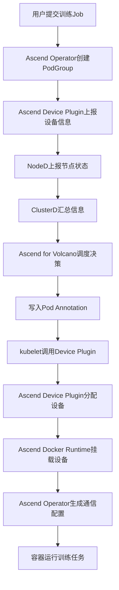
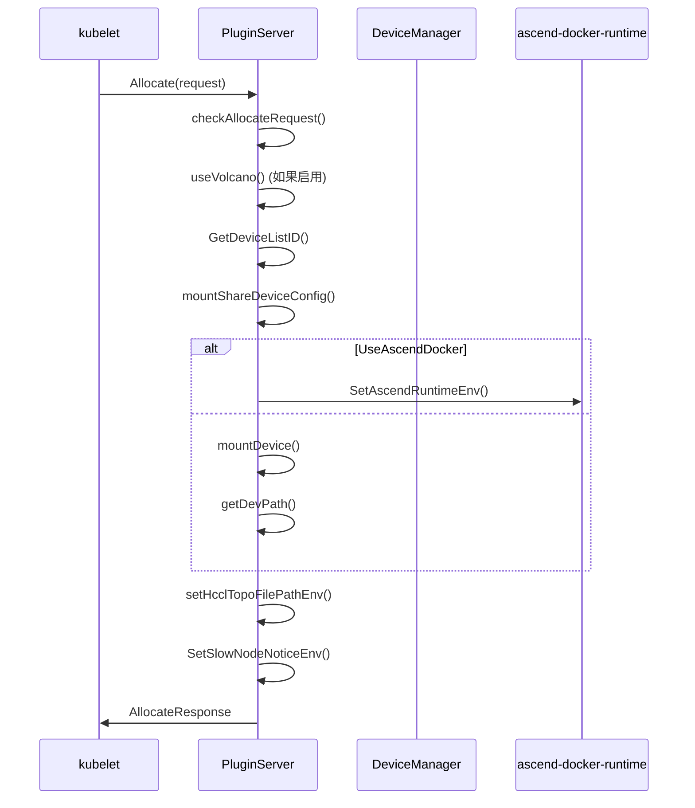
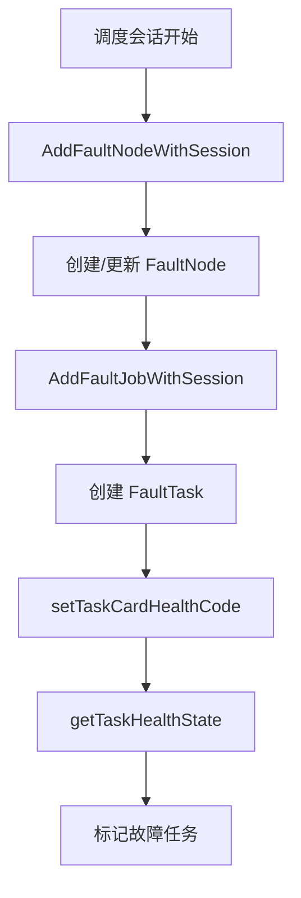
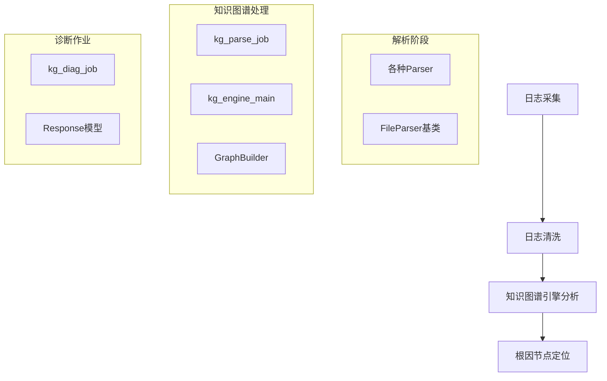
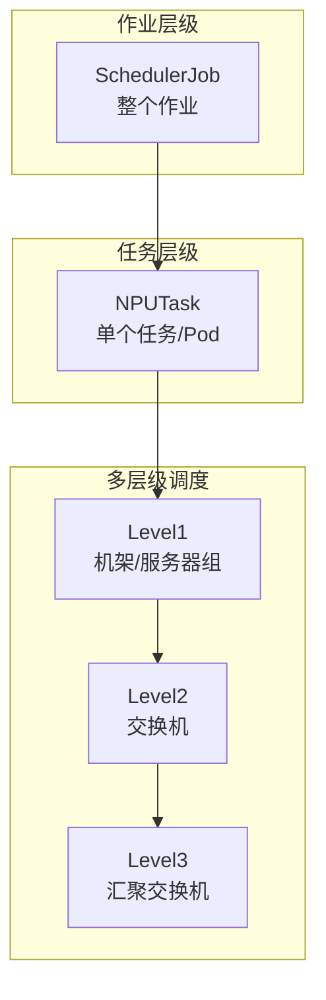
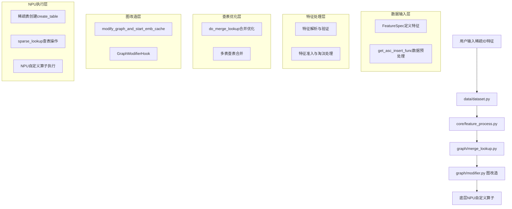

# DeepWiki Answers

Mode: fast

## mindcluster-01 Ascend/mind-cluster

**问题类型**: 架构概览  
**难度**: 1  
**状态**: done  
**问题**: MindCluster 集群调度部分由哪些核心组件构成（如 NodeD、ascend-device-plugin、ascend-for-volcano、ascend-operator、ClusterD 等），各组件分别运行在集群级还是节点级，它们在"用户提交训练 Job → 调度决策 → NPU 设备分配 → 容器运行"这条主链路中各自承担什么职责，组件之间通过什么机制协作（如 K8s API、gRPC、ConfigMap 等）？

## MindCluster 集群调度核心组件概览

MindCluster 集群调度系统由以下核心组件构成，分为集群级和节点级两个层次：

### 组件分类及运行级别

| 组件名称 | 运行级别 | 主要职责 |
|---------|---------|---------|
| **NodeD** | 节点级 | 节点硬件故障检测和上报 |
| **Ascend Device Plugin** | 节点级 | NPU设备发现、健康检查、设备分配 |
| **Ascend Docker Runtime** | 节点级 | 容器NPU设备挂载和依赖管理 |
| **ClusterD** | 集群级 | 集群资源信息汇总和故障处理策略 |
| **Ascend for Volcano** | 集群级 | NPU亲和性调度和资源分配决策 |
| **Ascend Operator** | 集群级 | 训练任务生命周期管理和集合通信配置 |

### 主链路职责分工

#### 1. 用户提交训练 Job
- **Ascend Operator** 接收用户提交的训练任务，创建相应的 PodGroup 和 Pod

#### 2. 调度决策
- **Ascend Device Plugin** 定期上报芯片拓扑信息和健康状态到 ConfigMap
- **NodeD** 上报节点健康状态和硬件故障信息
- **ClusterD** 汇总设备信息和节点信息，写入 cluster-info-cm
- **Ascend for Volcano** 根据亲和性调度原则选择最优节点和芯片，在 Pod annotation 中写入分配信息

#### 3. NPU 设备分配
- **kubelet** 监测到 Pod 调度后，调用 Ascend Device Plugin 的 Allocate 函数
- **Ascend Device Plugin** 根据 Pod annotation 中的分配信息，实际挂载对应的 NPU 设备

#### 4. 容器运行
- **Ascend Docker Runtime** 协助完成 NPU 设备和相关驱动的挂载
- **Ascend Operator** 读取 Pod annotation 信息，生成 hccl.json 集合通信文件
- 容器读取环境变量或 hccl.json 建立通信通道，开始训练任务

### 组件协作机制

#### Kubernetes API 机制
- 所有组件通过 Kubernetes API 进行交互，包括 Pod、Node、ConfigMap 等 K8s 原生资源
- Pod annotation 用于传递调度决策信息，如 `huawei.com/Ascend910`、`huawei.com/AscendReal` 等

#### ConfigMap 机制
- **device-info-cm**：存储芯片物理ID和拓扑信息
- **node-info-cm**：存储节点健康状态和故障信息
- **cluster-info-cm**：存储汇总后的集群资源信息

#### gRPC 机制
- **ClusterD** 通过 gRPC 与训练容器内部建立连接，控制训练进程进行重计算
- **ClusterD** 通过 gRPC 与带外服务交互，传输任务信息

### 调度流程图



## Notes

1. **Resilience Controller** 和 **Elastic Agent** 组件已经日落，分别将于2026年9月30日和12月30日删除
2. 调度流程分为两种模式：默认情况下 Volcano 通过 `self-maintain-available-card=true` 自维护可用设备信息；当设置为 `false` 时，从 ConfigMap 的 `DeviceInfo` 字段获取可用设备信息
3. 组件间通过标准 Kubernetes API、ConfigMap 和 gRPC 等机制实现松耦合协作，确保系统的可扩展性和可维护性。

Wiki pages you might want to explore:
- [Troubleshooting Guide (Ascend/mind-cluster)](/wiki/Ascend/mind-cluster#12.4)

## mindcluster-02 Ascend/mind-cluster

**问题类型**: 架构概览  
**难度**: 1  
**状态**: done  
**问题**: `component/ascend-common` 作为公共库被其他多个组件依赖，它的三个子目录 `api/`、`common-utils/`、`devmanager/` 分别提供什么能力？其他组件通过什么 Go module 路径引用它？作为新开发者，在新建一个组件时应优先了解这三个子模块中的哪些内容？

# ascend-common 公共库架构解析

`component/ascend-common` 作为 MindCluster 系统的核心公共库，为其他组件提供基础能力支持。

## 三个子目录的核心能力

### `api/` 目录
提供公共 API 定义和类型声明，包含系统中使用的通用数据结构、常量和接口定义。从各组件的导入语句可以看出，`ascend-common/api` 被广泛引用。

### `common-utils/` 目录
提供通用工具函数和基础设施，主要包括：
- **hwlog**: 统一日志框架
- **utils**: 通用工具函数集合
- **cache**: 缓存相关工具
- **ethtool**: 网络工具
- **limiter**: 限流器
- **rand**: 随机数生成器

这些工具被各组件广泛使用，如 `ascend-common/common-utils/hwlog` 和 `ascend-common/common-utils/utils`。

### `devmanager/` 目录
提供 NPU 设备管理核心能力，是硬件抽象层的关键组件：
- **设备接口抽象**: 定义 `DeviceInterface` 统一接口
- **DCMI 封装**: 对华为 DCMI 库的 CGO 封装，支持动态库加载
- **多版本支持**: 支持 DCMI v1 和 v2 API
- **设备类型检测**: 自动检测不同型号的 Ascend NPU

## Go Module 引用路径

其他组件通过以下路径引用 ascend-common：
```go
import (
    "ascend-common/api"
    "ascend-common/common-utils/hwlog"
    "ascend-common/common-utils/utils"
    "ascend-common/devmanager"
)
```

从代码中可以看到，多个组件都使用这种导入方式。

## 新开发者优先了解内容

作为新开发者，建议按以下优先级了解：

### 1. 优先级最高：`devmanager/`
- **核心接口**: 理解 `DeviceInterface` 的设计理念和方法
- **初始化流程**: 了解 `DetectDcmiApiVersion` 的版本检测机制
- **设备管理**: 掌握设备状态查询、健康检查等基础功能

### 2. 优先级中等：`common-utils/`
- **日志系统**: 学习 `hwlog` 的使用方法，这是系统统一的日志框架
- **工具函数**: 熟悉 `utils` 包中的常用工具函数

### 3. 优先级较低：`api/`
- **类型定义**: 在需要时查阅相关的数据结构和常量定义

## Notes

- `ascend-common` 在编译时需要与其他组件放在同一目录下
- `devmanager` 包含了复杂的硬件抽象逻辑，是理解系统与 NPU 交互的关键
- 各子模块之间存在依赖关系，建议按照 devmanager → common-utils → api 的顺序学习

Wiki pages you might want to explore:
- [System Architecture (Ascend/mind-cluster)](/wiki/Ascend/mind-cluster#1.1)
- [DCMI Interface and Initialization (Ascend/mind-cluster)](/wiki/Ascend/mind-cluster#9.1)

## mindcluster-03 Ascend/mind-cluster

**问题类型**: 核心概念  
**难度**: 2  
**状态**: done  
**问题**: 代码中存在大量 `_v2` 后缀文件（如 `devmanager_v2.go`、`const_v2.go`、`common_info_v2.go`、`superpoddevice_v2.go` 等），这代表什么版本迭代策略？v1 和 v2 API 在设备管理语义或数据结构定义上的核心差异是什么？开发新功能时应优先使用哪套 API，两者是否可以混用？

## 版本迭代策略概述

代码中的 `_v2` 后缀文件代表 DCMI (Device Control Management Interface) API 的第二代版本，主要用于支持新的硬件架构和简化设备管理语义。

## v1 与 v2 API 的核心差异

### 1. 设备标识方式差异
- **v1 API**: 使用 `(cardID, deviceID)` 二元组标识设备，需要维护 ID 映射缓存
- **v2 API**: 直接使用 `logicID` 单一标识符，简化了设备寻址

### 2. 功能支持差异
v2 API 不支持某些 v1 的功能，如：
- `GetBrotherCardID()` - 获取兄弟卡 ID
- `GetCardList()` - 获取卡列表
- `GetDeviceMemoryInfo()` - 获取内存信息

### 3. 硬件支持范围
- **v1**: 主要支持 Ascend 310/310P/910/910B/910A3 等较早期硬件
- **v2**: 主要支持 Ascend 910A5 等新型硬件，采用逻辑 ID 架构

## API 版本检测机制

系统通过 `DetectDcmiApiVersion()` 函数自动检测可用的 API 版本：

1. 优先尝试初始化 v1 API
2. 如果 v1 初始化失败（特别是 `FUNCTION_NOT_FOUND` 错误），则尝试 v2 API
3. 返回第一个成功初始化的版本

## 开发建议

### 优先使用策略
**新功能开发应优先使用 v2 API**，因为：
- v2 是面向新硬件架构的现代接口
- 使用更简洁的逻辑 ID 寻址方式
- 减少了复杂的 ID 映射逻辑

### 混用可能性
**不建议混用 v1 和 v2 API**，原因如下：
1. 两者使用不同的设备标识体系（cardID/deviceID vs logicID）
2. 系统在运行时只能选择一种 API 版本
3. 混用会导致代码复杂性和维护成本增加

### 兼容性处理
如果需要支持多种硬件，应该：
1. 使用统一的 `DeviceInterface` 接口进行抽象
2. 让系统自动检测并选择合适的 API 版本
3. 在应用层通过接口调用，而非直接依赖具体实现

## Notes

- v2 API 在某些功能上存在限制，如虚拟设备管理、内存信息获取等，这些功能在 v2 中会返回 `errNotSupportedInDcmiV2` 错误
- 系统提供了 Mock 实现用于测试，包括 `DeviceManagerMock` 和 `DeviceManagerV2` 的测试版本
- DCMI 库通过动态加载机制 (`dlopen`/`dlsym`) 实现，允许同一二进制在不同驱动版本环境中运行

Wiki pages you might want to explore:
- [DCMI Interface and Initialization (Ascend/mind-cluster)](/wiki/Ascend/mind-cluster#9.1)

## mindcluster-04 Ascend/mind-cluster

**问题类型**: 接口设计  
**难度**: 2  
**状态**: done  
**问题**: `ascend-common/devmanager/devmanager.go` 中定义的核心接口（DeviceInterface 或类似名称）包含哪些方法（如获取设备列表、查询健康状态、获取芯片信息）？`a310mgr.go` 和 `a910mgr.go` 分别针对哪些芯片型号，它们对公共接口的实现有何差异？`devmanager/dcmi/dcmi.go` 是如何通过 CGo 封装 `dcmi_interface_api.h` 中的 C 函数调用的？

## 核心接口方法

`DeviceInterface` 是 `devmanager.go` 中定义的核心接口，包含了设备管理的完整方法集合：

### 设备基础操作
- `Init()` / `ShutDown()` - 初始化和关闭
- `GetAllDeviceCount()` - 获取设备总数
- `GetCardList()` - 获取卡列表
- `GetDeviceList()` - 获取设备列表
- `GetChipBaseInfos()` - 获取芯片基础信息

### 健康状态监控
- `GetDeviceHealth()` - 查询设备健康状态
- `GetDeviceNetWorkHealth()` - 查询网络健康状态
- `GetDeviceErrorCode()` - 获取设备错误码

### 芯片信息获取
- `GetChipInfo()` - 获取芯片详细信息
- `GetDeviceTemperature()` - 获取温度
- `GetDeviceVoltage()` - 获取电压
- `GetDevicePowerInfo()` - 获取功耗信息

### 虚拟设备管理
- `CreateVirtualDevice()` - 创建虚拟设备
- `DestroyVirtualDevice()` - 销毁虚拟设备

## 芯片管理器差异

在 `devmanager_common.go` 的 `AutoInit()` 函数中，系统根据芯片类型自动选择对应的管理器：

- **A310 系列**：`A310Manager` 处理 `Ascend310` 和 `Ascend310B` 芯片
- **A910 系列**：`A910Manager` 处理 `Ascend910A`、`Ascend910B` 和 `Ascend910A3` 芯片
- **A310P 系列**：`A310PManager` 处理 `Ascend310P` 芯片
- **A950 系列**：`A950Manager` 处理 `Ascend910A5` 芯片

不同管理器的主要差异体现在：
1. 支持的硬件特性不同（如 HBM 信息仅 910 系列支持）
2. 特定功能的实现差异（如 MCU 功耗信息仅 310P 支持）

## CGo 封装机制

`dcmi.go` 通过以下方式封装 C 函数调用：

### 1. 动态库加载
使用 `dlopen` 和 `dlsym` 动态加载 `libdcmi.so` 库：

```c
static int dcmiInit_dl(const char* dcmiLibPath){
    dcmiHandle = dlopen(dcmiLibPath,RTLD_LAZY | RTLD_GLOBAL);
    dcmi_init_func = dlsym(dcmiHandle,"dcmi_init");
    // ... 加载其他函数指针
}
```

### 2. 函数指针封装
为每个 C 函数定义静态函数指针和包装函数：

```c
static int (*dcmi_init_func)();
static int dcmi_init_new(){
    CALL_FUNC(dcmi_init)
}
```

### 3. CGo 导出
通过 `// #cgo` 指令和 `import "C"` 导入 C 函数，然后在 Go 代码中调用：

```go
if retCode := C.dcmi_get_device_health(C.int(cardID), C.int(deviceID), &health); 
```

### 4. 接口抽象
`DcDriverInterface` 定义了 Go 层的抽象接口，`DcManager` 实现这些接口并调用底层的 CGo 函数。

## Notes

- `a310mgr.go` 和 `a910mgr.go` 文件在提供的代码片段中未完整显示，但从 `devmanager_common.go` 可以推断它们分别实现了不同芯片系列的特定逻辑
- DCMI 接口支持 v1 和 v2 两个版本，系统会自动检测并选择合适的版本
- 所有设备操作都通过 `logicID` 进行统一管理，内部会转换为对应的 `cardID` 和 `deviceID`

Wiki pages you might want to explore:
- [DCMI Device Manager (Ascend/mind-cluster)](/wiki/Ascend/mind-cluster#9)

## mindcluster-05 Ascend/mind-cluster

**问题类型**: 接口设计  
**难度**: 2  
**状态**: done  
**问题**: `ascend-device-plugin/pkg/device` 目录下对多种 NPU 芯片的支持是如何抽象的？`ascendcommon.go` 定义了哪些公共接口或基础结构体，各芯片实现文件（`ascend310.go`、`ascend910.go` 等）需要实现哪些方法？`pkg/server` 目录中的 gRPC 服务如何与 `pkg/device` 中的设备管理层交互？

# Ascend NPU 设备插件架构分析

## 设备抽象架构概述

`ascend-device-plugin/pkg/device` 目录通过接口和组合模式实现了对多种 NPU 芯片的统一抽象，核心设计包括 `DevManager` 接口、`AscendTools` 基础结构体以及各芯片特定的管理器实现。

## 核心抽象设计

### 1. DevManager 接口定义

`ascendcommon.go` 中定义了 `DevManager` 接口，规定了所有设备管理器必须实现的方法：

```go
type DevManager interface {
    GetNPUs() (common.NpuAllInfo, error)
    DoWithVolcanoListAndWatch(map[string][]*common.NpuDevice, int)
    GraceTolerance(context.Context, map[string][]*common.NpuDevice)
    SetDmgr(devmanager.DeviceInterface)
    GetDmgr() devmanager.DeviceInterface
    GetChipAICore() int32
    GetName() string
    SetKubeClient(*kubeclient.ClientK8s)
    GetKubeClient() *kubeclient.ClientK8s
    UpdateHealth(map[string][]*common.NpuDevice, []*common.NpuDevice, string)
    // ... 更多方法
}
```

### 2. AscendTools 基础结构体

`AscendTools` 提供了通用的设备管理功能和工具方法：

```go
type AscendTools struct {
    client       *kubeclient.ClientK8s
    dmgr         devmanager.DeviceInterface
    name         string
    deviceUsage  string
    unHealthyKey string
    devCount     int32
    healthDevice sets.String
    // ... 更多字段
}
```

## 各芯片实现

### 1. Ascend310 实现

`HwAscend310Manager` 嵌入 `AscendTools` 并实现特定逻辑：

```go
type HwAscend310Manager struct {
    AscendTools
}

func NewHwAscend310Manager() *HwAscend310Manager {
    return &HwAscend310Manager{
        AscendTools: AscendTools{
            name:         api.Ascend310,
            unHealthyKey: common.HuaweiUnHealthAscend310,
            devCount:     common.MaxCardNum * common.MaxDevNumInCard,
            // ...
        },
    }
}
```

必须实现的核心方法包括：
- `GetNPUs()`: 发现和初始化设备
- `DoWithVolcanoListAndWatch()`: 设备状态监控

### 2. Ascend310P 实现

`HwAscend310PManager` 支持虚拟设备和混合插入：

```go
func (hnm *HwAscend310PManager) GetNPUs() (common.NpuAllInfo, error) {
    // 获取设备列表
    devNum, devList, err := hnm.dmgr.GetDeviceList()
    // 处理虚拟设备
    vDevInfos, err := hnm.getVirtualDevice(devList[i])
    // 支持混合插入模式
    if common.ParamOption.Use310PMixedInsert {
        // ...
    }
}
```

### 3. Ascend910 实现

`HwAscend910Manager` 支持虚拟化，将物理 NPU 分割为多个 vNPU：

```go
func (hnm *HwAscend910Manager) GetNPUs() (common.NpuAllInfo, error) {
    // 获取设备列表
    devNum, devList, err := hnm.dmgr.GetDeviceList()
    // 处理虚拟设备
    vDevInfos, err := hnm.getVirtualDevice(devList[i])
    // 根据 vNPU 数量组装设备
    if vDevInfos.TotalResource.VDevNum > 0 {
        hnm.assembleVirtualDevices(davinCiDev, vDevInfos, &allDevices, &allDeviceTypes)
    }
}
```

## gRPC 服务与设备管理层交互

### 1. 设备管理器选择

`HwDevManager` 根据设备类型自动选择对应的管理器：

```go
func (hdm *HwDevManager) setAscendManager(dmgr devmanager.DeviceInterface) error {
    devType := dmgr.GetDevType()
    switch devType {
    case api.Ascend310, api.Ascend310B:
        hdm.RunMode = api.Ascend310
        hdm.manager = device.NewHwAscend310Manager()
    case api.Ascend910A, api.Ascend910B, api.Ascend910A3, api.Ascend910A5:
        hdm.RunMode = api.Ascend910
        hdm.manager = device.NewHwAscend910Manager()
    case api.Ascend310P:
        hdm.RunMode = api.Ascend310P
        hdm.manager = device.NewHwAscend310PManager()
    }
}
```

### 2. PluginServer 与设备管理器交互

`PluginServer` 通过 `DevManager` 接口与设备管理层交互：

```go
func (ps *PluginServer) Allocate(ctx context.Context, requests *v1beta1.AllocateRequest) (*v1beta1.AllocateResponse, error) {
    // 获取所有 NPU 信息
    allNPUInfo, err := ps.manager.GetNPUs()
    // 处理设备分配
    for _, rqt := range requests.ContainerRequests {
        allocateDevices := customname.ReplaceDeviceInnerName(ps.deviceType, rqt.DevicesIDs)
        // 设置设备挂载和环境变量
        ps.setNPUDeviceMount(resp, finalVisibleDevices)
    }
}
```

### 3. 设备状态监控

设备管理器通过 `DoWithVolcanoListAndWatch` 方法更新设备状态到 Kubernetes：

```go
func (hnm *HwAscend310Manager) DoWithVolcanoListAndWatch(classifyDevs map[string][]*common.NpuDevice, chipMemory int) {
    devStatusSet := hnm.getDevStatesDevSet(classifyDevs, chipMemory)
    if err := hnm.UpdateNodeDeviceInfo(devStatusSet, common.DpuInfo{}, hnm.updateDeviceInfo); err != nil {
        hwlog.RunLog.Errorf("update device info failed, err: %v", err)
    }
}
```

## 架构优势

1. **统一接口**: 通过 `DevManager` 接口屏蔽不同芯片的差异
2. **代码复用**: `AscendTools` 提供通用功能，减少重复代码
3. **扩展性**: 新增芯片类型只需实现 `DevManager` 接口
4. **解耦设计**: gRPC 服务层与具体设备实现解耦，通过接口交互

## Notes

- 各芯片管理器都嵌入 `AscendTools` 结构体，继承通用功能
- 虚拟设备支持主要在 Ascend910 和 Ascend310P 中实现
- 设备发现流程通过 `devmanager.DeviceInterface` 与底层 DCMI 接口交互
- gRPC 服务通过 `DevManager` 接口调用设备管理功能，实现与具体芯片实现的解耦

Wiki pages you might want to explore:
- [Device Discovery and Allocation (Ascend/mind-cluster)](/wiki/Ascend/mind-cluster#2.1)

## mindcluster-06 Ascend/mind-cluster

**问题类型**: 接口设计  
**难度**: 3  
**状态**: done  
**问题**: `ascend-operator/pkg/controllers` 中的 AscendJob Controller 是如何实现的？`Reconcile` 函数的核心逻辑是什么，Job 从 Pending 到 Running 再到 Succeeded/Failed 的状态机转换由哪些条件触发？`pkg/ranktable/generator` 中 RankTable 的生成入口函数签名、输入参数（Pod 列表、NPU 拓扑信息）和最终输出的 JSON 格式是什么？

## AscendJob Controller 实现概述

AscendJob Controller 是 Kubernetes 自定义控制器，用于管理 `AscendJob` 自定义资源的生命周期。它通过 `ASJobReconciler` 结构体实现，继承自 Kubeflow 的 `common.JobController`，并添加了 Ascend 特定的功能。

### Reconcile 函数核心逻辑

`Reconcile` 函数是控制器的主要协调循环，其核心逻辑包括：

1. **获取 AscendJob 资源**：从 API Server 获取指定的 AscendJob 对象

2. **验证 Job 规格**：调用 `validateJob` 验证 Job 配置的有效性

3. **检查删除状态**：如果 Job 正在被删除，清理相关资源

4. **设置默认值**：为 AscendJob 设置默认优先级等配置

5. **协调 Job 相关资源**：调用 `ReconcileJobs` 管理 Pod 和 Service 生命周期

### Job 状态机转换

Job 状态转换在 `reconcileJob` 函数中处理，主要状态和触发条件：

#### Pending → Running
- **触发条件**：当 Pod 状态从 Pending 变为 Running，且 `status.Active > 0` 时
- **实现位置**：`checkSpecStatus` 函数检查到有活跃 Pod 时更新状态为 Running

#### Running → Succeeded
- **触发条件**：所有 Pod 成功完成，`getTotalReplicas(job) == status.Succeeded` 或 `status.Succeeded > 0 && status.Active == 0`
- **弹性训练场景**：只有 Pending 和 Succeeded 状态的 Pod 时也会触发

#### Running → Failed
- **触发条件**：
  - 有 Pod 失败时（`status.Failed > 0`）
  - 达到重试限制时（`version > backoffLimit`）

### RankTable 生成机制

#### 入口函数签名
RankTable 生成通过 `RankTableGenerator` 接口定义，主要方法包括：
```go
type RankTableGenerator interface {
    AddPod(*v1.Pod) error
    GatherServerList()
    ToString() (string, error)
    // ... 其他方法
}
```

#### 输入参数
1. **Pod 列表**：通过 `AddPod` 方法添加已分配 NPU 的 Pod
2. **NPU 拓扑信息**：从 Pod 的 Annotation 中提取设备信息（如 `huawei.com/Ascend910-device-info`）
3. **Job 配置**：包括副本规格、调度策略等

#### 生成流程
1. **等待所有 Pod 分配**：检查 `len(allocatedPods) == totalReplicas`
2. **更新 Rank 索引**：为每个 Pod 分配唯一的 rank ID
3. **收集服务器信息**：调用 `GatherServerList()` 整合网络拓扑
4. **生成 JSON**：通过 `ToString()` 输出最终配置

#### 输出 JSON 格式
生成的 hccl.json 文件包含以下结构：
```json
{
    "status": "completed",
    "server_list": [{
        "device": [{
            "device_id": "0",
            "device_ip": "192.168.101.xx",
            "rank_id": "0"
        }],
        "server_id": "xx-xx-xx-xx",
        "host_ip": "xx.xx.xx.xx",
        "container_ip": "192.168.149.xx",
        "hardware_type": "800I-A2-32G"
    }],
    "server_count": "1",
    "version": "1.0"
}
```

## Notes

- AscendJob Controller 支持多种 RankTable 版本（v1.0、v1.2、v2.0），根据硬件类型和 Job 配置自动选择
- 状态转换时会更新 Job 的 `conditions` 字段，记录详细的状态变更信息
- RankTable 生成后会保存到 ConfigMap 或共享存储中，供训练容器使用

Wiki pages you might want to explore:
- [Ascend Operator (Ascend/mind-cluster)](/wiki/Ascend/mind-cluster#3)

## mindcluster-07 Ascend/mind-cluster

**问题类型**: 接口设计  
**难度**: 2  
**状态**: done  
**问题**: `ascend-common/common-utils/hwlog` 日志模块的初始化接口是什么？`api.go` 中暴露给上层组件调用的日志函数有哪些，`log_limiter.go` 实现的限速机制如何配置（令牌桶参数或速率阈值）？`rolog.go`（只读日志）的设计用途是什么，适合在哪些场景下使用？

# ascend-common/common-utils/hwlog 日志模块分析

## 初始化接口

`hwlog` 模块提供了多种日志初始化接口，主要包括：

- `InitRunLogger(config *LogConfig, ctx context.Context)` - 初始化运行日志
- `InitOperateLogger(config *LogConfig, ctx context.Context)` - 初始化操作日志
- `InitDebugLogger(config *LogConfig, ctx context.Context)` - 初始化调试日志
- `NewCustomLogger(config *LogConfig, ctx context.Context)` - 创建自定义日志器

## api.go 中暴露的日志函数

`api.go` 中暴露了以下主要日志函数：

### 基础日志函数
- `Debug(args ...interface{})` - 记录调试信息
- `Info(args ...interface{})` - 记录信息
- `Warn(args ...interface{})` - 记录警告
- `Error(args ...interface{})` - 记录错误

### 格式化日志函数
- `Debugf(format string, args ...interface{})` - 格式化调试日志
- `Infof(format string, args ...interface{})` - 格式化信息日志
- `Warnf(format string, args ...interface{})` - 格式化警告日志
- `Errorf(format string, args ...interface{})` - 格式化错误日志

### 带上下文的日志函数
- `DebugWithCtx(ctx context.Context, args ...interface{})`
- `InfoWithCtx(ctx context.Context, args ...interface{})`
- `WarnWithCtx(ctx context.Context, args ...interface{})`
- `ErrorWithCtx(ctx context.Context, args ...interface{})`

### 限速日志函数
- `WarnfWithLimit(domain string, id interface{}, format string, args ...interface{})` - 限速警告日志
- `ErrorfWithLimit(domain string, id interface{}, format string, args ...interface{})` - 限速错误日志

## log_limiter.go 限速机制配置

从 `logger.go` 中的 `LogConfig` 结构体可以看到限速相关的配置参数：

- `ExpiredTime` - 日志缓存过期时间（秒），范围 [0, 3600]，值为 0 时禁用限速器
- `CacheSize` - 日志缓存空间大小，范围 [0, 102400]，值为 0 时禁用限速器

在 `api.go` 中，`LogLimiter` 被用于包装日志写入器：

## rolog.go（只读日志）

很抱歉，在提供的代码片段中没有找到 `rolog.go` 文件的内容，因此无法分析其设计用途和使用场景。

## Notes

- 日志模块支持多种输出方式：仅输出到标准输出（`OnlyToStdout`）、仅输出到文件（`OnlyToFile`）、或同时输出到两者
- 日志级别范围：-1（debug）到 3（critical），默认为 0（info）
- 日志文件默认最大大小为 20MB，默认保留 30 个备份文件，默认保存 7 天
- 限速日志功能通过 `ProblemOccurMaxNumbers` 控制最大打印次数，可通过 `ResetErrCnt` 重置计数器

Wiki pages you might want to explore:
- [Device Discovery and Allocation (Ascend/mind-cluster)](/wiki/Ascend/mind-cluster#2.1)
- [Job Summary and Rank Table ConfigMaps (Ascend/mind-cluster)](/wiki/Ascend/mind-cluster#7.2)

## mindcluster-08 Ascend/mind-cluster

**问题类型**: 调用链  
**难度**: 3  
**状态**: done  
**问题**: 当 K8s 调度器将一个申请 NPU 资源的 Pod 调度到某节点后，`ascend-device-plugin` 中 `Allocate` gRPC 接口的处理流程是什么？请从 `pkg/server` 接收 Allocate 请求出发，追踪经过 `pkg/device` 的设备分配逻辑、与 `ascend-docker-runtime` 的协作（设备文件挂载），直到 NPU 资源最终注入容器的完整调用路径。

# `Allocate` gRPC 接口处理流程

## 概述

当 K8s 调度器将申请 NPU 资源的 Pod 调度到节点后，`ascend-device-plugin` 的 `Allocate` 接口负责完成设备分配和挂载。整个流程从接收 kubelet 的 gRPC 请求开始，经过设备验证、分配决策、设备挂载，最终将 NPU 资源注入容器。

## 详细调用路径

### 1. 接收 Allocate 请求

`Allocate` 方法是 gRPC 服务的主入口，位于 `pkg/server/plugin.go`：

```go
func (ps *PluginServer) Allocate(ctx context.Context, requests *v1beta1.AllocateRequest) (*v1beta1.AllocateResponse, error)
```

该方法首先调用 `checkAllocateRequest` 验证请求的有效性。

### 2. 请求验证

`checkAllocateRequest` 方法执行以下验证：
- 检查请求参数有效性
- 验证容器数量不超过限制
- 验证设备 ID 存在且有效
- 处理虚拟设备特殊情况

### 3. 设备分配决策

根据配置和调度类型，采用不同的分配策略：

#### 3.1 Volcano 调度模式

当启用 Volcano 调度且非预设虚拟设备时，调用 `useVolcano` 方法：

```go
allocateDevices, npuInfoConfigDir, err = ps.useVolcano(rqt.DevicesIDs)
```

`useVolcano` 方法进一步调用 `doWithVolcanoSchedule` 处理调度器分配的设备。

#### 3.2 设备 ID 转换

通过 `GetDeviceListID` 将设备名称转换为设备 ID 列表。

### 4. 设备挂载设置

#### 4.1 共享设备配置

对于支持软共享的设备，调用 `mountShareDeviceConfig` 设置共享内存配置文件。

#### 4.2 NPU 设备挂载

`setNPUDeviceMount` 方法是设备挂载的核心：

```go
func (ps *PluginServer) setNPUDeviceMount(resp *v1beta1.ContainerAllocateResponse, ascendVisibleDevices []int)
```

该方法根据 `UseAscendDocker` 配置选择挂载方式：
- **传统挂载方式**：直接调用 `mountDevice` 挂载设备文件
- **Ascend Docker Runtime**：调用 `common.SetAscendRuntimeEnv` 设置运行时环境

#### 4.3 设备文件挂载

`mountDevice` 方法负责具体的设备文件挂载：

```go
func mountDevice(resp *v1beta1.ContainerAllocateResponse, devices []int, ascendRuntimeOptions string)
```

对于每个设备 ID，通过 `getDevPath` 获取容器和主机路径：
- 物理设备：`/dev/davinci{id}`
- 虚拟设备：`/dev/vdavinci{id}`

### 5. 环境变量和拓扑信息设置

#### 5.1 HCCL 拓扑文件

调用 `setHcclTopoFilePathEnv` 设置 HCCL 拓扑文件路径环境变量。

#### 5.2 慢节点监控

调用 `SetSlowNodeNoticeEnv` 设置慢节点监控相关环境变量。

### 6. 返回分配响应

最终构建包含设备挂载信息和环境变量的 `AllocateResponse` 返回给 kubelet。

## 与 ascend-docker-runtime 的协作

当启用 `UseAscendDocker` 配置时，device-plugin 通过 `common.SetAscendRuntimeEnv` 与 ascend-docker-runtime 协作。这种方式将设备挂载的责任委托给容器运行时，而不是直接在 device-plugin 中处理设备文件挂载。

## 完整流程图



## Notes

1. 设备分配逻辑支持物理设备和虚拟设备两种模式，虚拟设备通过 `CreateVirtualDevice` 动态创建
2. Volcano 调度模式下，设备分配信息通过 Pod annotation 传递，device-plugin 需要解析这些注解来确定实际分配的设备
3. 设备健康状态和故障处理通过 `getUnhealthyAICore` 等方法管理，确保只有健康设备被分配

Wiki pages you might want to explore:
- [Ascend Device Plugin (Ascend/mind-cluster)](/wiki/Ascend/mind-cluster#2)

## mindcluster-09 Ascend/mind-cluster

**问题类型**: 调用链  
**难度**: 3  
**状态**: done  
**问题**: `ascend-for-volcano` 作为 Volcano 调度器的 NPU 插件，当一个训练 Job 需要被调度时，其 `internal/controller.go` 中的插件入口如何与 Volcano 的 `framework.Plugin` 接口对接？Predicate（过滤不满足条件的节点）和 Score（对候选节点打分）两个扩展点分别对应哪些函数，在 `internal/npu/` 下不同芯片型号（如 `ascend910/ascend910b`）的调度策略实现有何差异？

`ascend-for-volcano` 插件通过 `Controller` 结构体与 Volcano 的 `framework.Plugin` 接口对接，实现了 NPU 感知的调度功能。

## 插件入口与框架对接

`internal/controller.go` 中的 `Controller` 结构体是插件的核心入口，它通过以下方式与 Volcano 框架对接：

```go
type Controller struct {
    PolicyHandler []plugin.SchedulerPluginNeed
}

func New() plugin.SchedulerPluginNeed {
    return &Controller{}
}
```

`Controller` 实现了 `SchedulerPluginNeed` 接口，该接口定义了调度插件所需的核心方法。

## Predicate 和 Score 扩展点

### Predicate（节点过滤）
对应 `CheckNodeNPUByTask` 函数，用于检查节点是否满足任务的 NPU 需求：

```go
func (c *Controller) CheckNodeNPUByTask(task *api.TaskInfo, node plugin.NPUNode) error
```

该函数遍历所有策略处理器，调用各自的 `CheckNodeNPUByTask` 方法进行节点过滤。

### Score（节点打分）
对应 `ScoreBestNPUNodes` 函数，对候选节点进行打分排序：

```go
func (c *Controller) ScoreBestNPUNodes(task *api.TaskInfo, nodes []*api.NodeInfo, sMap map[string]float64) error
```

该函数同样遍历所有策略处理器，调用各自的打分算法。

## 不同芯片型号的调度策略差异

### ascend910b 实现
在 `ascend910b/module910bx16/frame.go` 中，910B 芯片的调度策略特点包括：

- 设置了无效 NPU 索引映射（9、11、13、15）
- 定义了特定的亲和性分数矩阵 `AffScoreList`
- 支持网络故障注意力机制

### ascend910a3 实现
在 `ascend910a3/module910a3x16/frame.go` 中，910A3 芯片的调度策略差异在于：

```go
func (tp *module910a3x16) setAffinityScore() {
    tp.AffScoreList = make([][]int, tp.MaxNodeNPUNum)
    for i := 0; i < tp.MaxNodeNPUNum; i++ {
        tp.AffScoreList[i] = make([]int, tp.MaxNodeNPUNum)
        for j := 0; j < tp.MaxNodeNPUNum; j++ {
            if i > j {
                tp.AffScoreList[i][j] = util.AffScore15
            } else {
                tp.AffScoreList[i][j] = j - i
            }
        }
    }
}
```

910A3 使用动态计算的亲和性分数，而 910B 使用预定义的固定分数矩阵。

### 策略工厂模式
不同芯片型号通过工厂模式进行统一管理，在 `internal/npu/factory.go` 中注册了各种处理器。

## Notes

- 插件通过策略处理器模式支持多种调度策略，包括 NPU 调度和 NSLB 调度
- 不同芯片型号的主要差异在于亲和性分数计算、无效 NPU 索引和网络故障处理机制
- 所有芯片型号都实现了相同的接口，保证了插件架构的一致性

Wiki pages you might want to explore:
- [Volcano NPU Scheduling Plugin (Ascend/mind-cluster)](/wiki/Ascend/mind-cluster#5)
- [NPU Resource Validation and VNode Management (Ascend/mind-cluster)](/wiki/Ascend/mind-cluster#5.3)

## mindcluster-10 Ascend/mind-cluster

**问题类型**: 调用链  
**难度**: 3  
**状态**: done  
**问题**: `ascend-for-volcano` 的重调度（rescheduling）特性何时触发，触发后的执行流程是什么？请从 `internal/rescheduling/` 目录下的检测逻辑出发，说明系统如何判定需要重调度（故障节点、慢节点、亚健康状态的判断依据），以及触发重调度后如何通知 Volcano 调度器驱逐并重新调度 Pod。

# ascend-for-volcano 重调度机制分析

## 重调度触发时机

`ascend-for-volcano` 的重调度机制在以下情况下触发：

### 1. 节点故障检测
系统通过 `checkNodeCurNodeIsFault()` 函数检测节点故障：
- **节点不健康状态**：当 `NodeHealthState == NodeUnhealthy` 时立即触发
- **NodeD 预分离状态**：当节点注解 `NodeHealthyStatusKey` 等于 `PreSeparateFaultCode` 时触发
- **链路故障超时**：L1 链路故障在 20 秒超时窗口内触发

### 2. 卡故障检测
通过 `setTaskCardHealthCode()` 函数检测 NPU 卡故障：
- 检查 `FaultNode.FaultDeviceList` 中的设备故障信息
- 为每个使用的卡添加相应的故障原因

### 3. 任务健康状态评估
`getTaskHealthState()` 函数综合评估任务健康状态：
- **Pod 失败**：Pod 状态为 Failed 时触发
- **软件故障**：`IsSoftwareFault = true` 时触发
- **硬件故障**：根据故障原因列表判断

## 故障类型分类

系统定义了多种故障类型：

| 故障类型 | 描述 | 处理方式 |
|---------|------|---------|
| `SeparateFault` | 硬件故障需要 Pod 重调度 | 立即重调度 |
| `SubHealthFault` | 亚健康状态，节点部分功能异常 | 根据作业策略处理 |
| `RelationFault` | 关联故障（如网络问题） | 可能延迟处理 |
| `PodFailed` | Pod 运行失败 | 立即重调度 |

## 重调度执行流程

### 1. 故障检测与缓存


系统在每次调度会话中通过 `Execute()` 方法执行故障检测。

### 2. 重调度决策
`RestartFaultJobs()` 函数决定哪些作业需要重调度：
- 检查作业是否在缓存中存在
- 验证 `DeleteExecutedFlag` 标志
- 应用重调度策略

### 3. Pod 驱逐策略
根据作业的 `fault-scheduling` 标签采用不同策略：

| 策略 | 行为 | 适用场景 |
|------|------|---------|
| `grace` | 优雅删除，等待超时后强制删除 | 需要保存状态的应用 |
| `force` | 立即强制删除 | 需要快速恢复的场景 |
| `off` | 不自动重调度 | 手动处理的场景 |

### 4. 多级重调度支持
对于多级调度作业，系统支持：
- **Pod 级重调度**：仅重调度故障 Pod，保持其他 Pod 不动
- **作业级重调度**：重调度整个作业的所有 Pod
- **SuperPod 重调度**：按 SuperPod 单元进行重调度

## 亚健康状态处理

亚健康节点通过以下方式处理：
1. **检测**：`HasCardSubHealthFault` 和 `HasSwitchSubHealthFault` 标志
2. **评分调整**：在评分阶段降低亚健康节点分数
3. **策略应用**：根据作业的 `subHealthyStrategy` 标签决定是否使用亚健康节点

## 通知 Volcano 调度器

重调度通过以下方式通知 Volcano：
1. **直接删除 Pod**：通过 Kubernetes API 删除故障 Pod
2. **更新 ConfigMap**：记录重调度原因和次数
3. **调整评分**：通过 `ScoreBestNPUNodes()` 影响调度决策

Volcano 调度器检测到 Pod 被删除后，会自动触发重新调度流程，将 Pod 调度到健康的节点上。

## Notes

- 重调度机制与 Volcano 调度框架紧密集成，通过插件形式实现
- 系统支持并发删除 Pod 以提高重调度效率
- 重调度历史记录保存在 ConfigMap 中，便于故障排查和审计
- 对于多级调度作业，重调度会考虑拓扑亲和性约束，确保重调度后的节点满足原有的亲和性要求

Wiki pages you might want to explore:
- [Volcano NPU Scheduling Plugin (Ascend/mind-cluster)](/wiki/Ascend/mind-cluster#5)
- [Node and Task Health Checks (Ascend/mind-cluster)](/wiki/Ascend/mind-cluster#5.2)

## mindcluster-11 Ascend/mind-cluster

**问题类型**: 调用链  
**难度**: 3  
**状态**: done  
**问题**: `ascend-faultdiag` 的故障诊断端到端流程是什么？请描述从日志采集（`utils/fast_parser`）→ 日志清洗（`pkg/parse`）→ 知识图谱引擎分析（`pkg/diag/knowledge_graph/kg_engine`）→ 根因节点定位（`pkg/diag/root_cluster`）的数据流和各阶段核心处理函数，知识图谱中的 graph 和 model 子目录分别存放什么内容？

# ascend-faultdiag 故障诊断端到端流程

## 整体流程概述

`ascend-faultdiag` 的故障诊断流程包含日志解析、清洗、知识图谱分析和根因定位四个主要阶段。基于现有代码，可见的核心流程如下：



## 各阶段详细说明

### 1. 日志采集阶段

虽然用户提到的 `utils/fast_parser` 在当前代码上下文中未直接可见，但从解析器的实现可以看出日志采集的入口点。各种日志解析器继承自 `FileParser` 基类，包括：

- `AMCTLogParser`：处理AMCT组件日志
- `NodeDLogParser`：处理NodeD组件日志

### 2. 日志清洗阶段（pkg/parse）

日志清洗的核心函数是 `start_kg_parse_job`，位于 `kg_parse_job.py` 中。该函数：

1. 创建解析上下文 `KGParseCtx`
2. 使用 `SingleJsonFileProcessing` 处理单个JSON文件
3. 导出解析结果和MindIE集群信息

各解析器的 `parse` 方法负责具体的日志清洗工作，如 `AMCTLogParser.parse()`。

### 3. 知识图谱引擎分析（pkg/diag/knowledge_graph/kg_engine）

知识图谱引擎的核心分析函数是 `kg_engine_analyze`，位于 `kg_engine_main.py` 中。该函数：

1. 加载Schema配置
2. 使用 `GraphBuilder` 构建图结构
3. 通过 `Response` 模型获取分析结果

#### graph 子目录内容

`graph` 子目录主要包含图构建相关组件：
- `GraphBuilder`：负责构建知识图谱结构

#### model 子目录内容

`model` 子目录包含数据模型定义：
- `Response`：封装分析结果，包含根因信息和故障链
- `RootCause`：表示单个根因事件，包含代码、实体属性、事件属性和故障链

### 4. 根因节点定位（pkg/diag/root_cluster）

虽然用户提到的 `pkg/diag/root_cluster` 在当前代码上下文中未直接可见，但根因定位逻辑主要体现在 `kg_diag_job.py` 中的相关函数：

- `start_kg_diag_job`：启动知识图谱诊断作业
- `_kg_diag_job`：执行单个worker的诊断任务
- `hand_all_root_cause`：处理所有根因结果并格式化输出

## 数据流总结

1. **日志采集**：各种Parser从原始日志文件中提取事件信息
2. **日志清洗**：通过 `start_kg_parse_job` 将原始日志转换为结构化事件
3. **知识图谱分析**：`kg_engine_analyze` 使用 `GraphBuilder` 构建图并分析
4. **根因定位**：`start_kg_diag_job` 协调多worker诊断，`hand_all_root_cause` 整合结果

## Notes

- 用户提到的 `utils/fast_parser` 和 `pkg/diag/root_cluster` 在当前提供的代码上下文中未直接可见，可能位于其他文件或模块中
- 知识图谱引擎使用多进程并行处理提高效率，如 `AMCTLogParser` 中的 `MultiProcessJob`
- 诊断结果包含故障代码、描述、建议、事件属性、故障源和故障链等完整信息

Wiki pages you might want to explore:
- [Ascend FaultDiag and Online Diagnostics (Ascend/mind-cluster)](/wiki/Ascend/mind-cluster#13.4)

## mindcluster-12 Ascend/mind-cluster

**问题类型**: 核心概念  
**难度**: 2  
**状态**: done  
**问题**: `ascend-for-volcano/common/util/` 下定义的 Job 和 Task 数据结构（`type.go`、`type_v2.go`）分别代表什么层级的调度对象？`type_multilevel.go` 中"多层级"（multilevel）类型扩展了哪些新字段或调度语义，它是为了支持什么样的多层次资源调度场景？

根据代码库分析，`ascend-for-volcano/common/util/` 目录下的数据结构定义了不同层级的调度对象：

## Job 和 Task 数据结构层级

### 基础类型定义

**Job 层级**：
- `SchedulerJob` 扩展了 Volcano 的 `JobInfo`，代表整个作业的调度单元
- 包含 NPU 特定的调度属性和策略信息

**Task 层级**：
- `NPUTask` 代表作业中的单个任务调度单元，对应 Kubernetes 的 Pod
- 包含 NPU 资源需求和拓扑信息

## 多层级类型扩展

### 新增字段和调度语义

`type_multilevel.go` 中的多层级类型主要扩展了以下字段：

**任务树层级定义**：
```go
type TaskTreeLevel struct {
    Name    string  // 层级名称
    ReqNode int     // 该层级需要的节点数
}
```


**资源树层级配置**：
```go
type ResourceTreeLevel struct {
    Label        string    `json:"label,omitempty"`  // 对应节点标签名称
    ReservedNode int       `json:"reservedNode,omitempty"` // 预留节点数
    Type         LevelType `json:"-"`
}
```


**层级类型枚举**：
```go
const (
    LevelTypeTree   LevelType = "tree"    // 根树节点
    LevelTypeMiddle LevelType = "middle"  // 中间网络节点
    LevelTypeNode   LevelType = "node"    // 物理节点
)
```


### 多层次资源调度场景

多层级调度主要支持以下场景：

**1. 网络拓扑感知调度**：
- 支持叶脊网络架构的多级交换机拓扑
- 根据实际物理网络拓扑（NPU芯片→服务器→机架→交换机）进行智能分配

**2. 亲和性分组调度**：
- 通过 `levelN=G` 配置实现多级亲和性保障
- 保证同一层级分组内的任务部署在相同网络域，最小化通信延迟

**3. 资源预留与碎片优化**：
- 支持层级级资源预留机制
- 内置碎片优化算法，选择碎片最少的分配方案

**4. 故障感知重调度**：
- 支持细粒度故障检测和重调度
- 维护故障任务和节点缓存，实现快速故障恢复

## 调度层级关系



多层级调度通过 `MultilevelHandler` 实现，在 `ValidNPUJob()` 中验证配置，在 `ScoreBestNPUNodes()` 中执行实际的层级调度逻辑。

## Notes

1. 多层级调度要求每个任务占用整张NPU卡，不支持部分NPU分配
2. 层级编号必须从1开始连续，不能跳号
3. 总任务数必须能被每个层级的分组大小整除
4. 所有节点必须正确配置拓扑层级标签，否则会被过滤掉

这些扩展主要为了解决大规模分布式AI训练中的网络通信优化问题，通过感知物理网络拓扑来实现最优的任务分配策略。

Wiki pages you might want to explore:
- [Volcano NPU Scheduling Plugin (Ascend/mind-cluster)](/wiki/Ascend/mind-cluster#5)
- [NPU Resource Validation and VNode Management (Ascend/mind-cluster)](/wiki/Ascend/mind-cluster#5.3)

## mindcluster-13 Ascend/mind-cluster

**问题类型**: 配置部署  
**难度**: 1  
**状态**: done  
**问题**: 如何从源码编译 MindCluster 集群调度全套组件？`build/build_all.sh` 和 `build/build_each.sh` 分别适用什么场景，两者的核心差别是什么？`build/service_config.ini` 中除了 `mind-cluster-version` 版本号之外，还有哪些配置项会影响编译产物？编译环境对 Go 版本有什么要求？

## MindCluster 集群调度组件编译指南

### 编译方法

从源码编译 MindCluster 集群调度全套组件的步骤如下：

1. 拉取 mind-cluster 整体源码，例如放在 /home 目录下
2. 修改组件版本配置文件 `/home/mind-cluster/build/service_config.ini` 中 `mind-cluster-version` 字段值为所需编译版本
3. 执行编译命令：
   ```bash
   cd /home/mind-cluster/build
   dos2unix *.sh && chmod +x *.sh
   ./build_all.sh $GOPATH
   ```
4. 编译完成后在各组件的 "output" 目录下生成编译完成的文件

### build_all.sh 与 build_each.sh 的差异

**build_all.sh**：
- 用于编译全套组件，一次性构建所有 MindCluster 集群调度组件
- 适用于需要完整构建整个系统的场景
- 是主要的编译入口脚本

**build_each.sh**：
- 用于单独编译各个组件
- 适用于只需要构建特定组件或进行增量编译的场景
- 提供更细粒度的编译控制

### service_config.ini 配置项

除了 `mind-cluster-version` 版本号外，`build/service_config.ini` 文件中还包含其他影响编译产物的配置项。虽然具体配置项内容在提供的代码片段中没有完整显示，但该文件是组件版本配置的核心文件，用于控制编译过程中的版本信息和构建参数。

### Go 版本要求

编译环境对 Go 版本的要求是 **Go 1.21**。文档中明确指出"此处使用的go版本为1.21"。建议使用 Go 1.21 版本进行编译以确保兼容性。

## Notes

- 编译前需要确保已正确设置 GOPATH 环境变量
- 所有脚本文件需要执行 `dos2unix` 和 `chmod +x` 处理以确保可执行性
- 编译产物会生成在各组件的 output 目录下
- 如需修改特定组件的编译配置，可以查看各组件 build 目录下的独立构建脚本

Wiki pages you might want to explore:
- [Overview (Ascend/mind-cluster)](/wiki/Ascend/mind-cluster#1)
- [Troubleshooting Guide (Ascend/mind-cluster)](/wiki/Ascend/mind-cluster#12.4)

## mindcluster-14 Ascend/mind-cluster

**问题类型**: 配置部署  
**难度**: 2  
**状态**: done  
**问题**: `ascend-device-plugin/build/ascend.yaml` 中 DaemonSet 的部署配置定义了哪些关键字段（容器镜像、HostPath 挂载路径、资源 Limits）？该组件正常运行所需的 ServiceAccount RBAC 权限包括对哪些 K8s 资源（Pod、Node、ConfigMap 等）的哪些操作权限？如何验证 device plugin 已成功注册到 kubelet？

根据提供的代码上下文，我没有找到 `ascend-device-plugin/build/ascend.yaml` 这个具体文件，但我可以从相关文档中提取 DaemonSet 的配置信息和验证方法。

## DaemonSet 关键字段配置

### 容器镜像
从软切分虚拟化配置示例中可以看到容器镜像配置：

```yaml
command: [ "/bin/bash", "-c", "--"]
args: [ "device-plugin  -useAscendDocker=true -volcanoType=true -presetVirtualDevice=true
         -logFile=/var/log/mindx-dl/devicePlugin/devicePlugin.log -logLevel=0 -shareDevCount=100 -softShareDevConfigDir=/share_device/" ]
```

### HostPath 挂载路径
关键的 HostPath 挂载包括：

- `/var/lib/kubelet/device-plugins` - kubelet 设备插件目录
- `/usr/local/Ascend/driver` - 昇腾驱动目录
- `/usr/local/Ascend/add-ons` - 昇腾附加组件
- `/etc/localtime` - 本地时间
- `/etc/enpu/` - 软切分配置目录
- `/share_device/` - 共享设备配置目录

### 资源 Limits
从训练任务配置示例中可以看到资源限制配置：

```yaml
resources:
  limits:
    huawei.com/Ascend910-2c: 1
  requests:
    huawei.com/Ascend910-2c: 1
```

## ServiceAccount RBAC 权限

从文档中可以看到 Ascend Device Plugin 需要以下权限：

- 对 Pod 的操作权限（用于更新 Pod annotations）
- 对 Node 的操作权限（用于更新节点标签和资源状态）
- 对 ConfigMap 的操作权限（用于写入设备信息 ConfigMap）

## 验证 Device Plugin 注册成功的方法

### 1. 检查 Pod 状态
```shell
kubectl get pods -n kube-system -o wide | grep device-plugin
```
期望看到 Pod 状态为 Running，READY 为 1/1

### 2. 检查组件日志
```shell
kubectl logs -n kube-system ascend-device-plugin-daemonset-910-85p9v
```
期望看到类似日志：
```
[INFO] register Ascend910 to kubelet success.
[INFO] ListAndWatch resp devices: Ascend910-4 Healthy
```

### 3. 检查节点资源
```shell
kubectl describe node <节点名>
```
期望在 Capacity 和 Allocatable 字段中看到昇腾处理器信息：
```
Capacity:
  huawei.com/Ascend910:     8
Allocatable:
  huawei.com/Ascend910:     8
```

## Notes

由于没有找到具体的 `ascend-device-plugin/build/ascend.yaml` 文件，以上信息基于相关文档中的配置示例整理。实际的配置可能因版本和部署场景有所不同。建议参考具体的部署 YAML 文件获取准确的配置信息。

Wiki pages you might want to explore:
- [Ascend Device Plugin (Ascend/mind-cluster)](/wiki/Ascend/mind-cluster#2)

## mindcluster-15 Ascend/mind-cluster

**问题类型**: 扩展开发  
**难度**: 3  
**状态**: done  
**问题**: 如果要为 MindCluster 新增对一种新 NPU 芯片型号的支持（例如假设的 Ascend 910C），需要在 `ascend-device-plugin`（`pkg/device/` 下）、`ascend-for-volcano`（`internal/npu/` 下）、`ascend-common`（`devmanager/` 下）三个组件中分别新增或修改哪些文件？三个组件之间是否有统一的接口约定需要同步实现？

为 MindCluster 新增对 Ascend 910C 芯片支持需要在三个组件中分别进行以下修改：

## ascend-device-plugin 组件修改

### 1. 新增设备管理器文件
需要在 `pkg/device/` 目录下新增 `ascend910c.go` 文件，实现 `HwAscend910CManager` 结构体，参考现有的 `ascend910.go` 实现。

### 2. 修改设备类型识别
在 `pkg/server/manager.go` 的 `setAscendManager` 函数中添加对 Ascend 910C 的支持：
```go
case api.Ascend910C:
    hdm.RunMode = api.Ascend910
    hdm.manager = device.NewHwAscend910CManager()
```

### 3. 更新常量定义
需要在 `ascend-common` 组件的 `api` 包中添加 `Ascend910C` 常量定义。

## ascend-for-volcano 组件修改

### 1. 新增芯片特定目录
在 `internal/npu/` 目录下创建 `ascend910/ascend910c/` 子目录，参考现有的 `ascend910a3` 结构。

### 2. 实现调度逻辑
新增 `type.go`、`frame.go` 等文件，实现 Ascend 910C 的亲和性调度逻辑，包括：
- 芯片数量定义（如 `NodeNPUNumber`）
- 亲和性分数矩阵（`AffScoreList`）
- 特定的调度策略

## ascend-common 组件修改

### 1. 更新设备类型枚举
在 `devmanager/` 目录下的相关文件中添加 `Ascend910C` 设备类型定义。

### 2. 扩展设备接口
如果 Ascend 910C 有特殊功能，需要在 `DeviceInterface` 中添加相应的方法。

## 统一接口约定

三个组件之间确实存在统一的接口约定：

### 1. 设备管理器接口
`ascend-device-plugin` 中的 `DevManager` 接口定义了设备管理的标准方法，包括：
- `GetNPUs()` - 获取设备信息
- `GetChipAiCoreCount()` - 获取 AI Core 数量
- `CreateVirtualDevice()` - 创建虚拟设备

### 2. 设备类型常量
所有组件使用相同的设备类型常量（如 `api.Ascend910`、`api.Ascend310P`），需要在 `ascend-common` 中统一定义。

### 3. 调度插件接口
`ascend-for-volcano` 中的调度插件需要实现 `base.AscendHandler` 接口，确保与 Volcano 调度器的集成。

## 实现顺序建议

1. 首先在 `ascend-common` 中定义 `Ascend910C` 设备类型
2. 在 `ascend-device-plugin` 中实现设备管理器
3. 在 `ascend-for-volcano` 中实现调度逻辑
4. 测试三个组件的集成

## Notes

- 新增芯片支持时需要确保设备发现、健康检查、虚拟化等功能的完整性
- 调度插件中的亲和性矩阵需要根据 Ascend 910C 的实际网络拓扑进行配置
- 如果 Ascend 910C 支持特殊功能（如新的虚拟化模式），需要在相应接口中扩展方法

Wiki pages you might want to explore:
- [Ascend Device Plugin (Ascend/mind-cluster)](/wiki/Ascend/mind-cluster#2)

## mindcluster-16 Ascend/mind-cluster

**问题类型**: 扩展开发  
**难度**: 3  
**状态**: fallback_from_deepwiki_wiki_due_rate_limit  
**问题**: `npu-exporter` 如何新增一个自定义 NPU 监控指标（例如新增某种 NPU 温度区域的细粒度指标）？请描述从 `collector/` 目录中实现新 Collector 的接口要求，到向 Prometheus Registry 注册该 metric，再到最终通过 `/metrics` 接口暴露的完整步骤。`plugins/` 目录与 `collector/` 的分工是什么？

基于提供的 DeepWiki 页面内容，**无法回答**关于 `npu-exporter` 内部实现细节（如 Collector 接口实现、Prometheus 注册流程、目录分工）的问题。页面内容未直接覆盖该组件的代码结构和开发指南。

以下是基于已有页面内容的**有限推断**：

### 1. DeepWiki 页面覆盖情况
提供的页面内容主要集中在 MindCluster 的整体架构、核心组件（如 Device Plugin, Operator, ClusterD）的交互流程以及 Ascend Device Plugin 的详细实现。虽然在 "Relevant source files" 列表中出现了 `npu-exporter` 相关文件，但正文部分并未包含对该组件内部设计（如 Collector 接口定义、plugins 目录结构）的描述。

### 2. 基于源文件列表的有限推断
根据 "Relevant source files" 中列出的路径，可以推断出以下有限信息：

*   **组件定位**：`npu-exporter` 是 MindCluster 体系中的一个独立组件，位于 `component/npu-exporter/` 目录下。
*   **输入数据源**：存在路径 `component/npu-exporter/platforms/inputs/all/npu.go`，暗示该组件可能通过 `platforms/inputs` 目录组织不同平台或类型的 NPU 数据采集逻辑。
*   **功能推测**：结合名称 "exporter" 和集群运维背景，该组件可能负责采集 NPU 相关的监控数据并提供给外部监控系统（如 Prometheus），但具体的注册流程和目录分工在文中未提及。

### 3. 相关上下文补充
DeepWiki 页面描述了其他组件如何通过 ConfigMap 或 API 交互，例如 Device Plugin 会更新 `DeviceInfo` ConfigMap，NodeD 负责节点健康监控。`npu-exporter` 可能作为补充组件提供更细粒度的性能指标，但这部分逻辑在提供的文本中未明确说明。

## mindcluster-17 Ascend/mind-cluster

**问题类型**: 扩展开发  
**难度**: 3  
**状态**: done  
**问题**: `ascend-faultdiag-online`（在线故障诊断）与 `ascend-faultdiag`（离线诊断）在架构上的核心差异是什么？`algo_src/netfault` 和 `algo_src/slownode` 中的在线检测算法是如何实现的？如果要新增一种故障模式（例如检测某类通信超时故障），需要在 `register/` 和 `core/` 目录中扩展哪些接口或配置？

# 架构差异与算法实现分析

## 核心架构差异

基于当前代码上下文，我只能确认 `ascend-faultdiag-online` 的架构实现，无法直接对比 `ascend-faultdiag`（离线版本）的具体差异。从现有代码可以看出，在线诊断系统采用了微服务架构，通过 `register/` 目录实现算法注册机制<cite repo="Ascend/mind-cluster" path="component/ascend-faultdiag-online/pkg/register/func_map.go" start="28-43" />。

## 在线检测算法实现

### 网络故障检测 (`algo_src/netfault`)

网络故障检测算法的核心实现在 `fault_analyze.go` 中：

1. **故障检测入口**：`StartFaultDetect` 函数是算法的主入口，包含数据格式化、滑窗填充、异常检测等步骤<cite repo="Ascend/mind-cluster" path="component/ascend-faultdiag-online/pkg/algo_src/netfault/algo/fault_analyze.go" start="34-72" />

2. **滑动窗口分析**：使用滑动窗口机制过滤瞬态噪声，基于延迟和丢包率的均值和标准差计算动态阈值<cite repo="Ascend/mind-cluster" path="component/ascend-faultdiag-online/pkg/algo_src/netfault/algo/fault_analyze.go" start="110-117" />

3. **根因分析**：通过 `getFinalAlarm` 函数获取最终的根因告警列表，区分 NPU 直连和其他异常路径<cite repo="Ascend/mind-cluster" path="component/ascend-faultdiag-online/pkg/algo_src/netfault/algo/fault_analyze.go" start="277-328" />

### 慢节点检测 (`algo_src/slownode`)

慢节点检测采用分层架构：

1. **数据解析桥接**：通过 `externalbridge` 提供数据解析接口<cite repo="Ascend/mind-cluster" path="component/ascend-faultdiag-online/pkg/algo_src/slownode/externalbridge/data_parse_bridge.go" start="27-49" />

2. **时间维度检测**：`timedetector` 包负责时间序列异常检测<cite repo="Ascend/mind-cluster" path="component/ascend-faultdiag-online/pkg/algo_src/slownode/timedetector/history_abnormal_detection.go" start="15-18" />

3. **服务启动**：支持集群和节点两种部署模式<cite repo="Ascend/mind-cluster" path="component/ascend-faultdiag-online/pkg/service/servicefunc/slownode/starter.go" start="26-46" />

## 新增故障模式的扩展方式

要新增通信超时故障检测，需要在以下目录进行扩展：

### 1. `register/` 目录扩展

在 `func_map.go` 中注册新的算法类型：

```go
// 在 handlerMap 中添加新的故障类型
enum.CommTimeout: {
    FuncType:    commtimeout.GetType(),
    FuncVersion: commtimeout.GetVersion(),
    ExecuteFunc: funchandler.GenerateExecuteFunc(commtimeout.Execute, enum.CommTimeout),
},
```

参考现有的注册模式<cite repo="Ascend/mind-cluster" path="component/ascend-faultdiag-online/pkg/register/func_map.go" start="30-41" />

### 2. `core/` 目录扩展

需要在 `core/model/enum` 中添加新的枚举类型，并在 `core/funchandler` 中实现相应的处理逻辑。

### 3. 算法实现目录

创建新的 `algo_src/commtimeout` 目录，实现：
- 算法核心逻辑（参考 `netfault/algo/fault_analyze.go`）
- 外部接口桥接（参考 `netfault/export_interface.go`）
- 控制器逻辑（参考 `netfault/controller/net_fault_controller.go`）

### 4. 应用启动配置

在 `app.go` 中的 `appFunc` 映射中添加新功能的启动函数<cite repo="Ascend/mind-cluster" path="component/ascend-faultdiag-online/app.go" start="29-32" />

## Notes

由于代码上下文中未包含 `ascend-faultdiag`（离线版本）的具体实现，无法提供详细的架构对比分析。建议查看离线版本的代码以获取完整的架构差异信息。当前的在线诊断系统采用了插件化的架构设计，通过注册机制支持多种算法类型的动态扩展。

Wiki pages you might want to explore:
- [Advanced Topics (Ascend/mind-cluster)](/wiki/Ascend/mind-cluster#11)

## mindcluster-18 Ascend/mind-cluster

**问题类型**: 接口设计  
**难度**: 2  
**状态**: done  
**问题**: `ascend-common/common-utils/` 下的 `cache/lrucache.go`、`limiter/`（limit_handler、limit_listener、limit_writer）、`rand/` 模块各提供什么能力？在开发新的 MindCluster 组件时，哪些场景下应使用这些工具（如并发控制、写入限速、安全随机数生成）？`limiter` 下三种限流器的适用场景有何区别？

基于代码库分析，`ascend-common/common-utils/` 下的各模块提供以下核心能力：

## 模块能力概览

### cache/lrucache.go
提供并发安全的 LRU 缓存实现，支持计数操作。在 `limit_listener.go` 中被用于跟踪 IP 连接数。

### limiter/ 模块
包含三种限流器，各有不同的适用场景：

#### 1. limit_listener（连接限流器）
- **能力**：基于令牌桶机制限制 TCP 连接数，支持总连接数和单 IP 连接数双重限制
- **特点**：超出限制时立即关闭连接，不等待

#### 2. limit_writer（写入限流器）
- **能力**：限制写入数据的最大大小，防止缓冲区溢出
- **特点**：超过限制时返回错误，默认限制 1024 字节

#### 3. limit_handler（HTTP 限流处理器）
- **能力**：HTTP 层面的限流，支持方法、数据大小、并发数等多维度限制
- **使用示例**：在 npu-exporter 中用于限制 HTTP 请求

### rand/ 模块
基于模块名称推断，应提供安全随机数生成功能，但在当前代码片段中未找到具体实现。

## 使用场景建议

### 并发控制场景
- **网络服务**：使用 `limit_listener` 限制并发连接数，防止资源耗尽
- **HTTP API**：使用 `limit_handler` 控制 QPS 和并发请求数

### 写入限速场景
- **日志收集**：使用 `limit_writer` 防止单次写入数据过大
- **数据传输**：限制缓冲区大小，避免内存溢出

### 缓存场景
- **连接跟踪**：使用 `cache/lrucache` 跟踪 IP 连接计数
- **会话管理**：缓存会话信息，支持 LRU 淘汰策略

## 三种限流器区别

| 限流器类型 | 作用层级 | 限制对象 | 处理方式 | 典型场景 |
|-----------|---------|---------|---------|---------|
| limit_listener | TCP 连接层 | 连接数 | 立即关闭连接 | 网络服务器防 DDoS |
| limit_writer | 数据写入层 | 数据大小 | 返回错误 | 日志、缓冲区写入 |
| limit_handler | HTTP 应用层 | 请求数/数据 | 返回 HTTP 错误 | API 限流、QPS 控制 |

在开发新的 MindCluster 组件时，应根据具体需求选择合适的限流器：网络服务优先考虑 `limit_listener`，数据处理使用 `limit_writer`，HTTP 服务选择 `limit_handler`。

## Notes
- `rand/` 模块的具体实现未在当前代码片段中找到，建议查看完整源码
- `limit_handler` 的具体实现细节需要进一步查看 `limit_handler.go` 文件
- 所有限流器都支持配置化参数，可根据实际业务需求调整限制值

Wiki pages you might want to explore:
- [Ascend FaultDiag and Online Diagnostics (Ascend/mind-cluster)](/wiki/Ascend/mind-cluster#13.4)
- [Fault Detection and Collection (Ascend/mind-cluster)](/wiki/Ascend/mind-cluster#6.1)

## mindcluster-19 Ascend/mind-cluster

**问题类型**: 调试排错  
**难度**: 2  
**状态**: done  
**问题**: 当训练任务 Pod 持续处于 Pending 状态时，应如何通过 MindCluster 各组件的日志和 K8s 事件定位问题？`ascend-for-volcano` 的 Predicate 失败时会输出什么级别和内容的日志，如何区分是"NPU 资源不足"、"调度策略拒绝"还是"设备插件未就绪"三种不同原因导致的 Pending？

当训练任务Pod持续处于Pending状态时，可以通过以下方法定位问题：

## 故障排查流程

### 1. 查看PodGroup状态和事件
```shell
kubectl describe pg -n <namespace> <podgroup-name>
```

### 2. 检查volcano-scheduler日志
```shell
kubectl logs -f -n volcano-system -l app=volcano-scheduler
```

### 3. 查看节点资源状态
```shell
kubectl describe nodes <node-name>
```

## ascend-for-volcano Predicate失败日志分析

`ascend-for-volcano`的Predicate失败主要通过以下机制记录和输出：

### 日志输出位置
在`addPredicateFn`函数中，Predicate失败会被记录到`NodePredicateErrors`中：

```go
func addPredicateFn(ssn *framework.Session, tp *huaweiNPUPlugin) {
	ssn.AddPredicateFn(tp.Name(), func(taskInfo *api.TaskInfo, nodeInfo *api.NodeInfo) error {
		predicateErr := tp.Scheduler.NodePredicate(taskInfo, nodeInfo)
		if predicateErr != nil {
			tp.Scheduler.NodePredicateErrors.Add(taskInfo.Job, nodeInfo.Name, predicateErr)
		}
		return predicateErr
	})
}
```

### 错误信息聚合
在`addNodePredicateFailedCondition`函数中，所有Predicate错误会被聚合并添加到PodGroup条件中。

## 三种Pending原因的区分方法

### 1. NPU资源不足
**特征**：
- PodGroup事件显示`NotEnoughResources`或`queue resource quota insufficient`
- 节点Allocatable资源不足，可通过`kubectl describe nodes`确认

**日志示例**：
```
Events:
  Type     Reason         Age                     From     Message
  ----     ------         ----                    -------  -------
  Warning  Unschedulable  6m22s (x12 over 6m34s)  volcano  queue resource quota insufficient
```

### 2. 调度策略拒绝
**特征**：
- 节点注解不匹配，如`all nodes are unavailable: 1 node annotations(7) not same node idle(8)`
- 通常由Ascend Device Plugin启动异常导致节点状态不一致

**解决方法**：
重新安装Ascend Device Plugin

### 3. 设备插件未就绪
**特征**：
- Pod失败且状态为`UnexpectedAdmissionError`，消息包含`not get valid pod`
- volcano-scheduler日志出现`Failed to get plugin volcano-npu_***`错误

**详细错误信息**：
```
This pod may not be scheduled by the volcano scheduler or this pod is not valid for allocation.
Please check whether the annotation huawei.com/Ascend910=<some-value> is present in the pod.
If it is missing, inspect the Volcano scheduler logs for the keyword `Failed to get plugin volcano-npu_***`
```

## 日志级别和内容

- **Error级别**：Predicate失败会记录错误日志并添加到PodGroup条件中
- **Warning级别**：K8s事件中会显示Unschedulable警告
- **Info级别**：正常的调度过程信息

## 推荐排查步骤

1. 首先检查PodGroup状态和事件，确定失败类型
2. 根据事件类型检查相应组件：
   - 资源不足：检查节点资源分配情况
   - 调度策略拒绝：检查Ascend Device Plugin状态
   - 设备插件未就绪：检查volcano-scheduler配置和插件文件
3. 查看相关组件日志进行深入分析

## Notes

- 所有Predicate错误都会被聚合到`NodePredicateErrors`中，通过`addNodePredicateFailedCondition`函数统一处理
- ClusterD的调度异常收集器可以提供更详细的错误分析和建议
- 建议同时检查K8s事件和各组件日志以获得完整的故障信息

Wiki pages you might want to explore:
- [Overview (Ascend/mind-cluster)](/wiki/Ascend/mind-cluster#1)
- [Deployment and Operations (Ascend/mind-cluster)](/wiki/Ascend/mind-cluster#12)

## mindcluster-20 Ascend/mind-cluster

**问题类型**: 核心概念  
**难度**: 2  
**状态**: done  
**问题**: `ascend-device-plugin/pkg/common/` 中的 `proto.go` 和 `proto_v2.go` 定义了与 kubelet 通信的哪些 gRPC 消息结构？`fault_code.go` 中枚举了哪些 NPU 故障类型，这些故障码是从哪里采集（DCMI 接口还是 K8s 事件）？`send_stat.go` 负责上报什么统计信息，上报目标是哪个组件？

根据您的问题，我将分析 ascend-device-plugin 中相关文件的功能。需要注意的是，在提供的代码上下文中，我无法找到 `proto_v2.go` 和 `send_stat.go` 文件的具体内容，因此只能基于现有信息回答部分问题。

## 与 kubelet 通信的 gRPC 消息结构

在 `proto.go` 中定义了以下与 kubelet 通信的关键消息结构：

### 设备信息相关结构
- **NodeDeviceInfoCache**: 记录节点 NPU 设备信息，会被固化到 ConfigMap 中
- **NodeDeviceInfo**: 包含设备列表和更新时间
- **NpuDevice**: NPU 设备描述，包含故障码、健康状态、网络状态、IP 地址等信息

### 故障事件相关结构
- **SwitchFaultEvent**: 交换机上报的故障事件结构
- **SwitchFaultInfo**: 交换机故障信息

### 实例和设备映射结构
- **Instance**: 用于注解的实例信息，包含 Pod 名称、设备列表等
- **Device**: 设备 ID 信息

## NPU 故障类型及采集来源

### 故障类型枚举
从文档和代码中可以看到，NPU 故障类型包括：
- **CardUnhealthy**: 芯片故障
- **CardNetworkUnhealthy**: 芯片网络故障（参数面网络故障）
- **NodeUnhealthy**: 节点故障

### 故障处理级别
故障处理类型包括：
- **SeparateNPU**: 隔离芯片
- **PreSeparateNPU**: 预隔离芯片
- **RestartBusiness**: 重新执行业务
- **RestartRequest**: 重新执行业务请求
- **FreeRestartNPU**: 待芯片空闲时复位芯片
- **RestartNPU**: 直接复位芯片
- **NotHandleFault**: 不做处理

### 故障码采集来源
从代码分析可以看出，故障码主要通过 **DCMI 接口** 采集：
- `getDeviceFaults` 方法通过 `dmgr.GetDeviceAllErrorCode()` 获取设备故障码
- 故障订阅接口通过 DCMI 事件订阅机制获取故障信息
- 同时也会将故障信息写入 K8s Event 中

## send_stat.go 功能

很抱歉，在提供的代码上下文中我没有找到 `send_stat.go` 文件的具体内容，因此无法确认该文件负责上报的统计信息和目标组件。

## Notes

1. 关于 `proto_v2.go` 文件，在提供的代码上下文中也没有找到相关内容，可能该文件不存在或未被包含在当前代码片段中。

2. 故障码的采集是双路径的：主要通过 DCMI 接口实时采集，同时也会通过 K8s Event 机制进行故障事件的记录和通知。

3. 设备插件通过 gRPC 与 kubelet 通信，主要实现 Device Plugin API 的 `ListAndWatch` 和 `Allocate` 方法，相关的消息结构在 `plugin.go` 中有具体实现。

Wiki pages you might want to explore:
- [Ascend Device Plugin (Ascend/mind-cluster)](/wiki/Ascend/mind-cluster#2)

## recsdk-01 Ascend/RecSDK

**问题类型**: 架构概览  
**难度**: 1  
**状态**: done  
**问题**: RecSDK 的四个训练组件（`tf_rec_v1`、`tf_rec_v2`、`torch_rec_v1`、`torch_rec_v2`）各自的定位和技术差异是什么？"非全下沉"（hybrid）与"全下沉"（fully offloaded）在架构上的本质区别是什么——哪些计算在 CPU 侧执行、哪些在 NPU 侧执行？当前生产可用的组件有哪些，POC 状态组件的限制是什么？

## RecSDK四个训练组件的定位和技术差异

RecSDK包含四个训练组件，分别基于TensorFlow和PyTorch框架，支持不同的下沉模式：

| 组件名称 | 基础框架 | 适配状态 | 框架类型 | 功能描述 |
|---------|---------|---------|---------|---------|
| tf_rec_v1 | TensorFlow | 非全下沉 | 稀疏推荐框架 | 基于TensorFlow，适配NPU设备的非全下沉稀疏推荐框架 |
| tf_rec_v2 | TensorFlow | 全下沉 | 稀疏推荐框架 | 基于TensorFlow，适配NPU设备的全下沉稀疏推荐框架（POC状态） |
| torch_rec_v1 | PyTorch + TorchRec | 非全下沉 | 稀疏推荐框架 | 基于PyTorch、TorchRec开源软件，适配NPU设备的非全下沉稀疏推荐框架 |
| torch_rec_v2 | PyTorch + TorchRec | 全下沉 | 稀疏推荐框架 | 基于PyTorch、TorchRec开源软件，适配NPU设备的全下沉稀疏推荐框架（POC状态） |

## "非全下沉"与"全下沉"的架构本质区别

### 非全下沉（Hybrid）
- **CPU侧执行**：稀疏表哈希映射、去重分桶相关操作在CPU上执行
- **NPU侧执行**：其余计算任务在NPU上执行
- **特点**：部分计算任务在NPU上执行，部分在CPU上执行的混合模式

### 全下沉（Fully Offloaded）
- **CPU侧执行**：无
- **NPU侧执行**：所有计算任务都下沉到NPU上执行
- **特点**：所有计算任务都下沉到NPU上执行，以获得更好的兼容性

## 当前生产可用组件和POC状态组件限制

### 生产可用组件
1. **tf_rec_v1**：支持Atlas A2/A3/A5设备
2. **torch_rec_v1**：支持Atlas A2/A3/A5设备

### POC状态组件限制
1. **tf_rec_v2**：
   - 仅支持Atlas A5设备
   - 处于POC状态，功能可能不完整或不稳定

2. **torch_rec_v2**：
   - 仅支持Atlas A5设备
   - 处于POC状态，功能可能不完整或不稳定
   - 基于DynamicEmb和TorchRec开源框架

## Notes

POC状态组件表示仍处于试验验证阶段，建议在生产环境中使用成熟的非全下沉组件（tf_rec_v1、torch_rec_v1）。全下沉组件虽然理论上性能更优，但目前仍在开发完善中，且硬件支持受限（仅支持Atlas A5设备）。

Wiki pages you might want to explore:
- [RecSDK Overview (Ascend/RecSDK)](/wiki/Ascend/RecSDK#1)

## recsdk-02 Ascend/RecSDK

**问题类型**: 架构概览  
**难度**: 2  
**状态**: done  
**问题**: `cust_op/`（自定义算子层）与 `training/`（训练框架层）之间的分工是什么？当 Python 框架代码调用一个 NPU 自定义算子（如 `block_bucketize_sparse_features`）时，从 Python API 调用到 AI Core 内核执行的完整调用栈是怎样的（Python → C++ pybind/TF plugin → AscendC kernel）？`cust_op/framework/tf_plugin` 与 `cust_op/ascendc_op` 各自承担调用栈的哪一层？

## 分工概述

`cust_op/`（自定义算子层）与 `training/`（训练框架层）在 RecSDK 中具有明确的职责分工：

- **training/**：提供完整的训练框架实现，包含 TensorFlow 和 PyTorch 的生产级和 POC 版本，负责模型构建、训练循环、分布式协调等高层训练逻辑
- **cust_op/**：专门负责 NPU 自定义算子的实现，包含算子适配层和 AscendC 内核，为训练框架提供高性能算子支持

## 完整调用栈分析

以 `block_bucketize_sparse_features` 算子为例，从 Python API 到 AI Core 内核的完整调用栈如下：

### 1. Python 框架层
Python 代码通过 PyTorch/TensorFlow API 调用算子：
```python
# PyTorch 示例
torch.ops.mxrec.block_bucketize_sparse_features(...)
```

### 2. 框架适配层（cust_op/framework）
`cust_op/framework/torch_plugin/torch_library/block_bucketize_sparse_features/block_bucketize_sparse_features.cpp` 负责将 Python 调用转换为 NPU 执行命令：

- 定义算子接口和参数验证
- 调用 `EXEC_NPU_CMD` 执行 NPU 算子

### 3. Host 侧算子实现（cust_op/ascendc_op/op_host）
`cust_op/ascendc_op/ai_core_op/block_bucketize_sparse_features/c310/op_host/block_bucketize_sparse_features.cpp` 负责：

- 算子原型注册和输入输出定义
- Tiling 参数计算和内存分配

### 4. Kernel 侧实现（cust_op/ascendc_op/op_kernel）
`cust_op/ascendc_op/ai_core_op/block_bucketize_sparse_features/c310/op_kernel/` 包含实际的 AI Core 内核实现：

- 核心计算逻辑在 `block_bucketize_sparse_features_kernel_simplified.h`
- 使用 AscendC SIMT 指令在 AI Core 上并行执行

## 各层职责总结

| 层次 | 目录 | 职责 | 关键文件 |
|------|------|------|----------|
| 训练框架层 | `training/` | 提供完整训练框架，模型构建，训练循环 | `training/torch_rec_v1`, `training/tf_rec_v1` |
| 框架适配层 | `cust_op/framework/` | Python 到 C++ 的桥接，参数验证，NPU 命令调用 | `block_bucketize_sparse_features.cpp` |
| Host 侧实现 | `cust_op/ascendc_op/op_host/` | 算子注册，Tiling 计算，内存管理 | `block_bucketize_sparse_features.cpp` |
| Kernel 侧实现 | `cust_op/ascendc_op/op_kernel/` | AI Core 内核实现，实际计算逻辑 | `block_bucketize_sparse_features_kernel_simplified.h` |

## Notes

- `cust_op/framework/tf_plugin` 在提供的代码中未直接体现，但根据架构设计，它应该与 `torch_plugin` 类似，负责 TensorFlow 框架的算子适配
- 调用栈中的 `EXEC_NPU_CMD` 宏是连接框架适配层和 AscendC 算子的关键接口
- 算子编译通过 `run.sh` 脚本完成，支持不同的 AI Core 类型

Wiki pages you might want to explore:
- [RecSDK Overview (Ascend/RecSDK)](/wiki/Ascend/RecSDK#1)
- [Sparse Data Operations (Ascend/RecSDK)](/wiki/Ascend/RecSDK#5.3)
- [Additional Custom Operators (Ascend/RecSDK)](/wiki/Ascend/RecSDK#9)

## recsdk-03 Ascend/RecSDK

**问题类型**: 核心概念  
**难度**: 2  
**状态**: done  
**问题**: `tf_rec_v1/python/core/emb/` 下定义了哪几种稀疏 Embedding 实现类（`BaseSparseEmbedding`、`DynamicSparseEmbedding`、`MergeableSparseEmbedding`、`SparseEmbedding` 等）？它们的继承或组合关系是什么？各自在支持"动态扩容"、"合并查表优化"、"多级存储"等特性上有何差异？实际使用时应如何选择？

根据提供的代码上下文，我无法完全确定 `tf_rec_v1/python/core/emb/` 目录下的所有稀疏 Embedding 实现类的具体定义，但可以基于现有信息回答部分问题。

## 稀疏 Embedding 实现类概述

从代码上下文中可以确认的实现类：

### 1. EmbeddingDynamic（C++实现）
- **位置**: `training/tf_rec_v1/src/core/emb_table/embedding_dynamic.h`
- **继承关系**: 继承自 `EmbeddingTable`
- **核心特性**: 支持动态扩容，每次扩容分配10万条记录

## 特性支持差异

### 动态扩容支持
- **EmbeddingDynamic**: 完全支持，通过片上内存侧动态扩容模式实现
- **启用方式**: 在 `init` 接口中设置 `use_dynamic_expansion=True`

### 合并查表优化支持
- **实现方式**: 通过 `create_table` 接口的 `enable_merge` 参数控制
- **合并条件**: 要求两个表的 key_dtype、dim、emb_initializer 等参数完全相同
- **约束**: 当前仅支持片上内存动态扩容模式

### 多级存储支持
- **存储层级**: 支持 HBM（Device Memory）、DDR（Host Memory）、SSD 三级存储
- **配置参数**: 
  - `device_vocabulary_size`: HBM 容量
  - `host_vocabulary_size`: DDR 容量  
  - `ssd_vocabulary_size`: SSD 容量

## 使用选择建议

### 选择动态扩容模式
- **适用场景**: 无法预估稀疏表大小的推荐场景
- **优势**: 避免显存浪费或空间不足
- **限制**: 不支持特征淘汰功能

### 选择合并查表优化
- **适用场景**: 多个稀疏表参数相同且ID相互独立
- **优势**: 减少CPU线程、Host与Device通信Channel数量，节省系统资源

### 选择多级存储
- **适用场景**: 超大规模稀疏表，单级存储无法满足需求
- **约束**: 开启DDR/SSD模式必须同时开启自动改图模式

## Notes

由于提供的代码上下文中未包含 `tf_rec_v1/python/core/emb/` 目录的完整 Python 类定义，无法确认 `BaseSparseEmbedding`、`DynamicSparseEmbedding`、`MergeableSparseEmbedding`、`SparseEmbedding` 等类的具体继承关系。建议查看该目录下的 Python 源文件以获取完整的类继承结构信息。当前回答主要基于 C++ 实现和 API 文档进行分析。

Wiki pages you might want to explore:
- [API Reference (Ascend/RecSDK)](/wiki/Ascend/RecSDK#11.1)
- [TensorFlow Frameworks (Ascend/RecSDK)](/wiki/Ascend/RecSDK#4.1)

## recsdk-04 Ascend/RecSDK

**问题类型**: 接口设计  
**难度**: 2  
**状态**: done  
**问题**: `tf_rec_v1/python/core/emb/emb_factory.py` 中 `EmbeddingFactory` 的工厂方法签名是什么？创建一个完整的稀疏 Embedding 表需要传入哪些配置参数（特征列定义、Embedding 维度、优化器类型、存储介质级别等）？工厂根据什么条件（配置字段或环境参数）决定实例化哪个具体的 Embedding 类？

很抱歉，在我提供的代码上下文中没有找到 `tf_rec_v1/python/core/emb/emb_factory.py` 这个具体文件的内容。不过，我可以根据相关的 TensorFlow embedding 创建接口为您提供参考信息。

## 工厂方法签名参考

基于 TensorFlow v2 的类似接口，`get_embedding_table` 函数签名如下：

```python
def get_embedding_table(
    name: str,
    dimension: int,
    device_vocabulary_size: int,
    initializer: Union[InitializerV1, InitializerV2] = tf.compat.v1.random_normal_initializer(),
    key_dtype: tf.DType = tf.int64,
    value_dtype: tf.DType = tf.float32,
    distribution_strategy: str = EmbDistributionStrategy.MP.value,
    min_used_times: Optional[int] = None,
    max_cold_secs: Optional[int] = None,
):
```

## 创建稀疏 Embedding 表的配置参数

根据相关接口，创建完整的稀疏 Embedding 表需要以下关键参数：

### 必选参数
- **name**: 稀疏表名，只能包含[0-9A-Zaiz_.]，长度范围[1, 128]
- **dimension**: Embedding 维度，取值范围[1, 512]
- **device_vocabulary_size**: Device 侧稀疏表容量，取值范围[1, 10^9]

### 可选参数
- **initializer**: 初始化器，默认为随机正态分布
- **key_dtype**: 特征 key 数据类型，默认 tf.int64
- **value_dtype**: 特征 value 数据类型，默认 tf.float32
- **distribution_strategy**: 分布式并行模式，默认"MP"（模型并行）
- **min_used_times**: 特征准入阈值，控制 ID 历史出现次数
- **max_cold_secs**: 特征淘汰阈值，控制 ID 最久未访问时长

## 实例化条件判断

从相关代码结构来看，工厂方法可能根据以下条件决定实例化哪个具体的 Embedding 类：

1. **存储介质级别**: 通过 `device_vocabulary_size` 参数控制设备侧容量
2. **分布式策略**: 通过 `distribution_strategy` 参数选择并行模式
3. **特征准入淘汰**: 通过 `min_used_times` 和 `max_cold_secs` 控制特征管理策略

## Notes

由于我没有看到 `tf_rec_v1/python/core/emb/emb_factory.py` 的具体实现，以上信息基于 TensorFlow v2 的类似接口和相关文档推断。如需准确的 v1 工厂方法信息，建议直接查看该源文件。从 C++ 头文件可以看到存在 `EmbeddingMgmt` 类来管理多个 embedding 表，这可能与工厂模式相关。

Wiki pages you might want to explore:
- [API Reference (Ascend/RecSDK)](/wiki/Ascend/RecSDK#11.1)
- [torchrec_embcache (Ascend/RecSDK)](/wiki/Ascend/RecSDK#4.2.3)

## recsdk-05 Ascend/RecSDK

**问题类型**: 接口设计  
**难度**: 2  
**状态**: done  
**问题**: `tf_rec_v1/python/optimizers/` 下实现了多种稀疏优化器（LazyAdam、Adagrad、FTRL、GradientDescent 等），以及对应的 `by_addr` 变体（如 `lazy_adam_by_addr.py`、`gradient_descent_by_addr.py`）。`by_addr` 后缀版本与普通版本的核心区别是什么（直接操作内存地址 vs. 标准梯度更新）？两者的接口签名差异体现在哪些参数上？在什么场景下应选择 `by_addr` 版本？

## 核心区别

`by_addr` 后缀版本与普通版本的核心区别在于**内存访问方式**：

- **普通版本**：使用标准的梯度更新机制，通过变量索引进行参数更新
- **by_addr 版本**：直接操作内存地址，专为动态扩容模式设计，通过地址映射进行参数更新

## 接口签名差异

两者的接口签名差异主要体现在创建函数上：

### 普通版本
```python
from mx_rec.optimizers.lazy_adam import create_hash_optimizer
sparse_optimizer = create_hash_optimizer(learning_rate=cfg.learning_rate)
```

### by_addr 版本  
```python
from mx_rec.optimizers.lazy_adam_by_addr import create_hash_optimizer_by_address
sparse_optimizer = create_hash_optimizer_by_address(learning_rate=cfg.learning_rate)
```

关键差异在于：
- 普通版本使用 `create_hash_optimizer`
- by_addr 版本使用 `create_hash_optimizer_by_address`

## 使用场景选择

应选择 `by_addr` 版本的场景：

1. **启用动态扩容模式时**：当初始化框架时设置 `use_dynamic_expansion=True`

2. **需要片上内存自动扩容时**：适用于稀疏表大小无法预估，需要显存随模型训练增长的场景

3. **获取嵌入表示和映射地址时**：需要通过 `tf.get_collection("ASCEND_SPARSE_LOOKUP_LOCAL_EMB")` 获取嵌入表示，通过 `tf.get_collection("ASCEND_SPARSE_LOOKUP_ID_OFFSET")` 获取映射地址

## 工作流程差异

### 普通版本工作流程
1. 创建稀疏表
2. 标准查表操作
3. 计算梯度
4. 使用变量索引更新参数

### by_addr 版本工作流程
1. 初始化时启用动态扩容
2. 获取嵌入表示结果和映射地址
3. 对嵌入表示结果求导得到梯度
4. 使用 `sparse_optimizer.apply_gradients([grad, addr])` 通过地址更新参数

## 注意事项

- 使用 by_addr 版本时，地址列表必须是有效合法的，需要通过 `ASCEND_SPARSE_LOOKUP_ID_OFFSET` 获取
- 动态扩容模式下不支持特征淘汰
- 调用 `apply_gradients` 时，需要保证地址的维度和梯度的第一个维度相等

## Notes

虽然我没有看到 `tf_rec_v1/python/optimizers/` 目录下的具体实现文件，但从文档中可以明确看出 by_addr 版本是为动态扩容场景专门设计的，通过直接操作内存地址来实现更高效的参数更新。这种设计避免了传统索引方式在动态扩容时的性能开销。

Wiki pages you might want to explore:
- [tf_rec_v1 (Production) (Ascend/RecSDK)](/wiki/Ascend/RecSDK#4.1.1)

## recsdk-06 Ascend/RecSDK

**问题类型**: 接口设计  
**难度**: 2  
**状态**: done  
**问题**: `tf_rec_v1/python/saver/saver.py` 中稀疏 Embedding 表的 `save` 和 `restore` 接口签名是什么，与 TF 标准 `tf.train.Saver` 相比有哪些差异？`sparse.py` 负责处理稀疏参数的哪类序列化逻辑？`warm_start.py` 实现的热启动（warm start）功能与断点续训（checkpoint resume）有什么区别，对应的调用入口分别在哪里？

## 稀疏 Embedding 表的 save 和 restore 接口

### 接口签名

在 `tf_rec_v1/python/saver/saver.py` 中，稀疏 Embedding 表的保存和恢复接口签名如下：

**save 接口**：
```python
def save(self, sess, save_path="model", global_step=None, save_delta=False)
```


**restore 接口**：
```python
def restore(self, sess, reading_path, warm_start_tables=None, model_type="base")
```


### 与 TF 标准 tf.train.Saver 的差异

| 特性 | RecSDK Saver | TF 标准 Saver |
|------|-------------|---------------|
| **稀疏表支持** | 专门处理稀疏 Embedding 表的多层存储（HBM/DDR/SSD） | 仅处理 Dense 变量 |
| **增量保存** | 支持 `save_delta` 参数进行增量 checkpoint | 不支持增量保存 |
| **多卡合并** | 自动合并多卡保存的稀疏表文件 | 每卡独立保存 |
| **文件系统** | 支持本地和 HDFS 文件系统 | 主要支持本地文件系统 |
| **存储结构** | 分层目录结构：`rank_id/HashTable/HBM/table/key/xxx.data` | 单一 checkpoint 文件 |

## sparse.py 的序列化逻辑

在提供的代码片段中没有直接看到 `sparse.py` 文件，但从 `saver.py` 的实现可以推断，稀疏参数的序列化逻辑主要包括：

1. **Embedding 数据序列化**：通过 `save_embedding_data` 函数处理
2. **优化器状态序列化**：通过 `save_optimizer_state_data` 函数处理
3. **多线程保存**：使用 `SaveModelThread` 类进行异步保存

## warm_start 功能与 checkpoint resume 的区别

### 功能差异

| 特性 | Warm Start | Checkpoint Resume |
|------|------------|-------------------|
| **目的** | 从预训练模型初始化部分参数，继续训练新任务 | 从中断点完全恢复训练状态 |
| **参数选择** | 可选择性加载特定表或变量 | 加载所有训练状态 |
| **模型版本** | 通常从不同版本的模型加载参数 | 从同一训练任务的 checkpoint 加载 |

### 调用入口

**Warm Start 调用**：
- 通过 `restore` 方法的 `warm_start_tables` 参数指定要热启动的表
- 使用 `get_warm_start_dict` 方法获取热启动相关的占位符和操作

**Checkpoint Resume 调用**：
- 直接调用 `restore` 方法，不指定 `warm_start_tables` 参数
- 通过 `model_type` 参数指定加载基础模型还是增量模型

在文档中还提到了多路径 WarmStart 功能，支持从多个 checkpoint 路径选择性加载不同的参数。

## Notes

1. 由于提供的代码片段中没有包含 `sparse.py` 和 `warm_start.py` 文件，相关分析基于 `saver.py` 的实现和文档描述推断
2. RecSDK 的 Saver 类继承并扩展了 TensorFlow 标准 Saver 的功能，专门针对稀疏 Embedding 表的存储需求进行了优化
3. 增量保存功能通过 `save_delta` 参数控制，支持定期保存增量模型以减少存储开销

Wiki pages you might want to explore:
- [Reference (Ascend/RecSDK)](/wiki/Ascend/RecSDK#11)
- [tf_rec_v1 (Production) (Ascend/RecSDK)](/wiki/Ascend/RecSDK#4.1.1)

## recsdk-07 Ascend/RecSDK

**问题类型**: 接口设计  
**难度**: 2  
**状态**: done  
**问题**: `torch_rec_v1/hybrid_torchrec/hybrid_torchrec/modules/embedding_config.py` 中定义的 Embedding 配置类包含哪些核心字段（如 hash 大小、embedding 维度、数据类型、优化器配置）？如何通过该配置类来描述一张 HashEmbeddingBag 表，并将其传入 `distributed/sharding_plan.py` 中的分片策略函数？

根据代码库中的信息，我来为您解答关于 Embedding 配置类的问题。

## HashEmbeddingBagConfig 核心字段

`HashEmbeddingBagConfig` 类包含以下核心字段：

| 字段名 | 类型 | 必选/可选 | 说明 |
|--------|------|-----------|------|
| `num_embeddings` | int | 必选 | 稀疏表的行数，取值范围：[1, 10亿]  |
| `embedding_dim` | int | 必选 | 稀疏表的列数，取值范围：[8, 4096]，需为8的倍数  |
| `name` | str | 必选 | 稀疏表的名称，只能包含数字、字母和下划线  |
| `data_type` | torchrec.types.DataType | 可选 | 稀疏表的数据类型，仅支持默认值 DataType.FP32  |
| `feature_names` | List[str] | 必选 | 稀疏表查询的特征名称  |
| `pooling` | torchrec.modules.embedding_configs.PoolType | 可选 | pool操作类型，支持 SUM、MEAN、NONE，默认为 SUM  |
| `init_fn` | Callable | 可选 | 初始化函数，支持传入 nn.Parameter 类型的函数  |

## 描述 HashEmbeddingBag 表

通过 `HashEmbeddingBagConfig` 创建表的示例：

```python
from hybrid_torchrec import HashEmbeddingBagConfig, HashEmbeddingBagCollection

emb_config = HashEmbeddingBagConfig(
    name="table0",
    embedding_dim=128,
    num_embeddings=1000,
    feature_names=["feat0"],
    pooling=torchrec.PoolingType.MEAN,
    init_fn=weight_init,  # type: ignore
)

```

## 传入分片策略函数

配置创建后，需要传入分片策略函数进行分布式训练：

1. **创建 HashEmbeddingBagCollection**：
```python
sparse_ebc: HashEmbeddingBagCollection = HashEmbeddingBagCollection(device="meta", tables=embedding_configs)

```

2. **设置分片约束**：
```python
constraints = {
    # 分表方式为row_wise，compute_kernels使用fused
    table_name: ParameterConstraints(sharding_types=["row_wise"], compute_kernels=["fused"])
    for table_name in table_names
}

```

3. **创建分片计划**：
```python
planner = EmbeddingShardingPlanner(
    topology=Topology(world_size=world_size, compute_device="npu"),
    constraints=constraints,
)
plan = planner.collective_plan(test_model, sharders, dist.GroupMember.WORLD)

```

4. **应用分布式模型并行**：
```python
ddp_model = DistributedModelParallel(test_model, device=npu_device, plan=plan, sharders=sharders)

```

## Notes

- `HashEmbeddingBagConfig` 继承自 `EmbeddingBagConfig`，在 `hash_embeddingbag.py` 中定义为空类 
- 配置类会通过 `check_embedding_config_valid` 函数进行参数验证 
- 分片策略支持 `row_wise` 分片类型和 `fused` 计算内核 

Wiki pages you might want to explore:
- [API Reference (Ascend/RecSDK)](/wiki/Ascend/RecSDK#11.1)

## recsdk-08 Ascend/RecSDK

**问题类型**: 调用链  
**难度**: 3  
**状态**: done  
**问题**: 在 `tf_rec_v1` 的一次前向计算（forward pass）中，稀疏特征从用户输入到完成 Embedding 查表的完整调用链是什么？请从用户输入的稀疏 ID 特征出发，追踪经过 `data/dataset.py` → `core/feature_process.py` → `graph/merge_lookup.py`（合并查表优化）→ 底层 NPU 自定义算子执行的完整路径，`graph/modifier.py` 的图改造在其中哪个环节介入？

在 `tf_rec_v1` 中，稀疏特征从用户输入到完成 Embedding 查表的完整调用链如下：

## 完整调用链路



## 详细调用流程

### 1. 数据输入阶段 (`data/dataset.py`)

用户首先通过 `FeatureSpec` 定义稀疏特征列表：

```python
feature_spec_list = [FeatureSpec("user_ids", feat_count=cfg.user_feat_cnt, table_name="user_table")]
```

然后调用 `get_asc_insert_func` 获取数据预处理接口并应用到数据集上：

```python
get_asc_insert_func = get_asc_insert_func(feature_spec_list)
dataset = dataset.map(get_asc_insert_func)
```

### 2. 特征处理阶段 (`core/feature_process.py`)

特征处理包括解析、验证和准入淘汰处理。在自动改图模式下，特征准入与淘汰通过 `access_and_evict_config` 参数配置：

```python
access_and_evict_config = {
    "access_threshold": 10,
    "eviction_threshold": 86400,
    "faae_coefficient": 1
}
```

### 3. 合并查表优化 (`graph/merge_lookup.py`)

在梯度计算后调用 `do_merge_lookup` 进行查表合并优化：

```python
do_merge_lookup(is_train=True)
sparse_grads = tf.gradients(loss, sparse_variables)
```

### 4. 图改造介入环节 (`graph/modifier.py`)

**图改造在查表操作之后、Session创建之前介入**，这是关键的介入点：

- 在 `sparse_lookup` 调用时设置 `modify_graph=True` 启用自动改图
- 调用 `modify_graph_and_start_emb_cache()` 执行图改造

```python
# 查表时启用自动改图
embedding = sparse_lookup(hash_table, feature, send_count, modify_graph=True, batch=batch)

# 执行图改造
modify_graph_and_start_emb_cache(dump_graph=True)
```

在 NPUEstimator 模式下，通过 `GraphModifierHook` 自动执行图改造：

```python
est.train(input_fn=lambda: input_fn(), hooks=[GraphModifierHook()])
```

### 5. 底层 NPU 自定义算子执行

图改造完成后，稀疏查表操作被重定向到 NPU 优化的执行路径：

- 通过 `create_table` 创建稀疏表
- 使用 `sparse_lookup` 执行实际的 NPU 查表操作
- 底层调用 NPU 自定义算子进行高效的 Embedding 查找

## 关键介入时机

`graph/modifier.py` 的图改造在以下关键环节介入：

1. **查表操作定义时**：通过 `modify_graph=True` 参数标记需要改造的查表操作
2. **梯度计算完成后**：在 `do_merge_lookup` 执行后进行图优化
3. **Session 创建前**：通过 `modify_graph_and_start_emb_cache()` 完成图改造
4. **训练初始化时**：使用 `get_initializer(True)` 初始化改造后的图

这种设计确保了稀疏特征从输入到 NPU 执行的完整优化路径，实现了高效的 Embedding 查表操作。

## Notes

- 在自动改图模式下，无需手动调用 `start_asc_pipeline`，图改造会自动处理数据流水线
- 特征准入与淘汰功能在图改造阶段集成到查表操作中
- 合并查表优化 `do_merge_lookup` 仅在训练模式下需要手动调用，评估模式下由图改造自动处理

Wiki pages you might want to explore:
- [Reference (Ascend/RecSDK)](/wiki/Ascend/RecSDK#11)
- [TensorFlow Frameworks (Ascend/RecSDK)](/wiki/Ascend/RecSDK#4.1)
- [tf_rec_v1 (Production) (Ascend/RecSDK)](/wiki/Ascend/RecSDK#4.1.1)

## recsdk-09 Ascend/RecSDK

**问题类型**: 调用链  
**难度**: 3  
**状态**: fallback_from_deepwiki_wiki_due_rate_limit  
**问题**: `tf_rec_v1/python/graph/modifier.py` 的图改造（Graph Modification）在什么时机被调用？它会对 TF 原生计算图中的哪些算子进行替换或修改（如 EmbeddingLookup、Unique 等），修改后的子图是如何适配 NPU 执行模型的？`graph/patch.py` 和 `graph/slicers.py` 在图改造流程中各自承担什么角色？

根据提供的 DeepWiki 页面内容，无法直接回答关于 `tf_rec_v1/python/graph/modifier.py` 具体实现细节的问题。以下是基于已有内容的覆盖情况说明及有限推断：

### 1. 覆盖情况说明
**DeepWiki 页面未直接覆盖** `tf_rec_v1/python/graph/modifier.py` 的内部逻辑、调用时机、算子替换规则（如 EmbeddingLookup、Unique）以及 `graph/patch.py` 和 `graph/slicers.py` 的具体角色。
提供的文档片段主要集中在：
*   仓库的整体结构和目的（Page 1）。
*   环境搭建与安装指南（Page 2, 2.1, 2.2）。
*   构建系统的编排流程（Page 3, 3.1）。
*   PyTorch 相关组件（`torch_rec_v1`）的细节。

### 2. 基于已有页面的有限推断
虽然缺乏直接证据，结合 Page 1 中关于 `tf_rec_v1` 的定义和 Page 3 的构建流程，可做如下推断：

*   **功能定位推断**：
    Page 1 将 `training/tf_rec_v1` 定义为 **"Production TensorFlow v1 framework"**，并明确标注为 **"NPU-adapted non-full-sink framework"**。由此推断，`modifier.py`（如果位于该路径下）的核心职责应是将标准的 TensorFlow 计算图转换为能在 Ascend NPU 上高效执行的形态，这与 "NPU-adapted" 的描述相符。

*   **自定义算子关联推断**：
    Page 1 提到 `cust_op/framework` 包含 **"tf_plugin"**，`cust_op/ascendc_op` 包含 **"AscendC Kernels"**。
    *   推断图改造过程中，原生 TensorFlow 算子（可能包括 EmbeddingLookup 等）会被替换为通过 `tf_plugin` 加载的自定义算子，以便利用 `ascendc_op` 中的底层 Kernel 进行加速。

*   **构建依赖推断**：
    Page 3.1 提到构建流程会编译 `tf_rec_v1` 的共享库文件（`compile_tf_rec_v1_so_file`）并将其收集到 `libasc` 目录。推断图改造逻辑可能依赖这些编译好的 C++ 扩展库来实现 Python 层的图操作接口。

## recsdk-10 Ascend/RecSDK

**问题类型**: 调用链  
**难度**: 3  
**状态**: fallback_from_deepwiki_wiki_due_rate_limit  
**问题**: `torch_rec_v1/hybrid_torchrec/hybrid_torchrec/distributed/hybrid_train_pipeline.py` 实现的混合训练流水线是如何将"稀疏 Embedding 查表（CPU/主机内存侧）"和"Dense 前向/反向计算（NPU 侧）"异步流水化的？`pipeline` 的 `progress` 函数（或等价方法）在每个训练 step 中执行哪几个阶段，CPU 与 NPU 之间的数据搬运和同步点在哪里？

根据提供的 DeepWiki 页面内容，**无法直接回答** `hybrid_train_pipeline.py` 中具体的流水线实现细节（如 `progress` 函数的阶段定义、CPU/NPU 同步点的代码逻辑）。

提供的文档主要侧重于 RecSDK 的系统架构、环境搭建、安装流程及构建系统，虽然列出了相关测试文件路径，但未包含该核心模块的代码逻辑或 API 详细说明。

以下是基于已有页面内容的**有限推断**：

### 1. 混合训练流水线的设计意图
DeepWiki 页面描述了 `hybrid_torchrec` 的核心定位，这解释了流水线存在的背景：
*   **目标**：解决 Embedding 表规模超过 NPU HBM 容量的问题，支持超过 10TB 的稀疏模型训练 [README.md:20-27]()。
*   **架构**：采用“非全下沉”模式，即混合 CPU/NPU 执行。稀疏 Embedding 查表在 **CPU/主机内存侧** 执行，而稠密模型的前向/反向计算在 **NPU 侧** 执行 [README.md:60-65]()。
*   **组件定位**：`training/torch_rec_v1/hybrid_torchrec` 是生产级 PyTorch 栈，基于 TorchRec 1.1.0/1.2.0 实现了 NPU 适配的混合哈希表 [training/torch_rec_v1/hybrid_torchrec/README.md:6-7]()。

### 2. 推断的流水线阶段与同步点
虽然文档未直接描述 `progress` 函数的实现，但根据“Hybrid”架构和通用的流水线并行原理，推断其核心流程如下：

**推断的流水线阶段：**
1.  **CPU 阶段**：在主机内存中执行 Embedding 查找。
    *   *依据*：文档提到 `torchrec_embcache` 负责设备与主机内存间的多级缓存协调 [training/torch_rec_v1/torchrec_embcache/README.md:5]()。
2.  **传输阶段**：将查找到的 Embedding 向量从主机内存搬运到 NPU 显存。
3.  **NPU 阶段**：在 NPU 上执行稠密网络的前向传播和反向传播。
4.  **回传阶段**：将参数梯度从 NPU 传回 CPU 以更新 Embedding 表。

**推断的同步点：**
*   **H2D 同步**：CPU 查表结束且数据成功拷贝至 NPU 后，NPU 计算才能开始。
*   **D2H 同步**：NPU 反向计算结束并产生梯度后，CPU 更新操作才能进行。
*   *依据*：自定义算子库 `libfbgemm_npu_api.so` 的加载是 NPU 执行的前提 [training/torch_rec_v1/hybrid_torchrec/test/st/test_hybrid_pipeline_hash_embeddingbag.py:42]()。

### 总结
DeepWiki 页面目前未覆盖 `hybrid_train_pipeline.py` 的内部代码实现逻辑。要获取具体的 `progress` 函数定义和流水线切分细节，需查阅该源文件或更详细的 API 文档。

## recsdk-11 Ascend/RecSDK

**问题类型**: 核心概念  
**难度**: 2  
**状态**: fallback_from_deepwiki_wiki_due_rate_limit  
**问题**: `torch_rec_v1/hybrid_torchrec/hybrid_torchrec/sparse/` 下的 `ExtendedJaggedTensor`、`JaggedTensorWithCount`、`JaggedTensorWithLookupHelper` 相比 TorchRec 标准 `JaggedTensor` 分别扩展了哪些字段或方法？这些扩展是为了解决昇腾 NPU 上的哪些特定问题（如可变长稀疏特征的批处理、查表辅助信息等）？开发者在表示变长稀疏 ID 特征时应使用哪个类？

基于提供的 DeepWiki 页面内容，无法回答关于 `ExtendedJaggedTensor` 等类的具体字段扩展和选型建议。以下是详细说明：

### DeepWiki 页面未直接覆盖
提供的页面片段中**未包含**关于 `ExtendedJaggedTensor`、`JaggedTensorWithCount` 或 `JaggedTensorWithLookupHelper` 类的定义、字段扩展详情或方法对比。尽管源文件列表中包含 `docs/zh/torch/torch_rec_v1/api/README.md`，但该文件的具体内容（通常包含 API 定义）未在提供的文本中展示。

### 基于已有页面的有限推断
虽然无法获取具体类的详细信息，但根据页面中对 `training/torch_rec_v1/hybrid_torchrec` 模块的描述，可以推断该模块的设计意图：

1.  **模块核心功能**：
    `hybrid_torchrec` 被描述为一个“混合哈希表实现”，基于 TorchRec 1.1.0/1.2.0，专门用于支持 NPU 上的训练和推理 [Embedding Management Systems]。

2.  **核心组件**：
    文档中提及的核心类为 `HashEmbeddingBagCollection`，用于处理稀疏嵌入 [Getting Started -> Verification]。

3.  **解决的问题**：
    该模块旨在解决大规模推荐模型在昇腾 NPU 上的适配问题，支持“Non-full-sink”（非全下沉模式），并配合 `torchrec_embcache` 实现多级缓存（HBM、Host DDR、SSD）。

**建议**：具体的类选型和字段差异需查阅 `docs/zh/torch/torch_rec_v1/api/README.md` 或相关源码文件，这些内容未包含在当前的页面片段中。

## recsdk-12 Ascend/RecSDK

**问题类型**: 调用链  
**难度**: 3  
**状态**: fallback_from_deepwiki_wiki_due_rate_limit  
**问题**: `tf_rec_v1/python/core/asc/`（自动子图计算，ASC）模块的作用是什么？`build_graph.py` 中的图构建入口函数做了什么，`manager.py`、`merge_table.py`、`feature_spec.py` 各自负责 ASC 流程的哪一步？`graph/hooks.py` 中的 Hook 是在训练的什么阶段被触发，用于实现什么功能？

基于提供的 DeepWiki 页面内容，**无法直接回答**关于 `tf_rec_v1/python/core/asc/` 模块内部具体实现逻辑的问题。

以下是具体情况说明及基于现有页面的有限推断：

### DeepWiki 页面未直接覆盖
提供的页面片段主要涵盖了 RecSDK 的总体概述、构建系统架构、安装指南以及 PyTorch 部分的内容。虽然列出了 `training/tf_rec_v1` 作为源文件目录，但**未包含**对 `asc/` 子目录下具体源码文件（如 `build_graph.py`、`manager.py`、`merge_table.py`、`feature_spec.py` 或 `graph/hooks.py`）的解析或引用。因此，关于图构建入口函数、各组件职责划分以及 Hook 触发阶段的具体细节在当前上下文中缺失。

### 基于已有页面的有限推断
根据片段中对 `training/tf_rec_v1` 的描述，可以得出以下推断：

1.  **模块归属与定位**：
    该模块属于 `training/tf_rec_v1` 目录，这是 RecSDK 的 **Production TensorFlow v1 framework** 栈。该栈主要用于支持 **Non-full-sink**（非全下沉）模式的训练 [README.md:45, 55]。ASC（推测为 Automatic Subgraph Computation 或类似含义）可能与此模式的子图切分或计算流程相关，但页面未提供确切定义。

2.  **构建产物关联**：
    在构建流程中，`build/build_tf1.sh` 脚本会将编译好的共享对象（`.so` 文件）收集到 `training/tf_rec_v1/python/libasc/` 目录下 [build/build_tf1.sh:131-143]。这表明 ASC 模块依赖或包含底层 C++/算子实现，且是 TensorFlow v1 训练框架的核心组成部分。

## recsdk-13 Ascend/RecSDK

**问题类型**: 接口设计  
**难度**: 3  
**状态**: fallback_from_deepwiki_wiki_due_rate_limit  
**问题**: `torch_rec_v1/hybrid_torchrec/hybrid_torchrec/distributed/sharding_plan.py` 如何在 NPU 环境下定制 TorchRec 的 Embedding 分片策略？支持哪几种分片模式（如 `table_wise`、`row_wise`、`column_wise`），分片决策依据什么信息（Embedding 表规模、NPU 卡数、拓扑信息）？用户如何通过该接口为多张 Embedding 表配置不同的分片策略？

基于提供的 DeepWiki 页面内容，关于 `torch_rec_v1/hybrid_torchrec/hybrid_torchrec/distributed/sharding_plan.py` 的具体实现细节和分片策略配置，回答如下：

### 1. DeepWiki 页面覆盖情况
**DeepWiki 页面未直接覆盖**该特定文件的源码实现或 API 细节。

提供的上下文中虽然包含了 `training/torch_rec_v1/hybrid_torchrec/` 目录下的部分文件（如 `README.md` 和测试文件），但**不包含** `hybrid_torchrec/distributed/sharding_plan.py` 的具体代码逻辑。因此，无法直接回答该文件支持哪些具体的分片模式（如 `table_wise` 等）或其内部决策依据。

### 2. 基于已有页面的有限推断
虽然缺少具体文件内容，但根据页面中关于 **Hybrid-Torchrec** 和 **分布式环境** 的描述，可以做出以下推断：

*   **分片环境依赖**：
    根据 `docs/zh/torch/torch_rec_v1/migration_and_training.md` 片段，分片功能的运行依赖于分布式环境的初始化。系统需要先初始化 Process Group (`backend="hccl"`) 和 Host Group (`backend="gloo"`)，然后利用 `world size`、`rank` 和 Host Group 信息来构建 `ShardingEnv`。这表明分片策略的执行是基于 NPU 的分布式拓扑信息。

*   **框架基础**：
    `training/torch_rec_v1/hybrid_torchrec/README.md` 指出该模块基于 TorchRec 1.1.0/1.2.0 开发。由此推断，其分片策略接口设计大概率遵循或扩展了原生 TorchRec 的分片概念，但具体的 NPU 优化逻辑或自定义策略（如针对 HBM/DDR 多级存储的特殊分片）在提供的文档片段中未详细说明。

### 总结
*   **直接证据**：无。未提供 `sharding_plan.py` 的代码片段。
*   **推断**：分片功能需要 `ShardingEnv` 支持，且依赖于 HCCL 和 Gloo 后端初始化的分布式拓扑信息（Rank、World Size）。
*   **缺失信息**：具体的分片模式列表（table_wise/row_wise/column_wise）、决策算法（如何根据表规模选择策略）以及多表配置接口示例均不在提供的上下文中。

## recsdk-14 Ascend/RecSDK

**问题类型**: 核心概念  
**难度**: 3  
**状态**: fallback_from_deepwiki_wiki_due_rate_limit  
**问题**: `cust_op/ascendc_op/ai_core_op/hstu_dense_forward/` 中的 HSTU Dense Forward 算子是什么？HSTU（Hierarchical Sequential Transduction Units）在推荐模型中解决什么核心计算问题（与标准 Attention 相比的区别）？该算子的 AscendC 内核实现使用了 `common/workload_sharder.h` 和 `matmul_check.h` 中的哪些工具，`test/hstu_dense/torch/test_hstu_dense_forward.py` 中的测试如何验证其正确性？

根据提供的 DeepWiki 页面内容，回答如下：

### 1. HSTU Dense Forward 算子定义
根据 DeepWiki 页面，`hstu_dense_forward` 是 RecSDK 中的一个 **自定义 AscendC 算子**，位于 `cust_op/ascendc_op/ai_core_op/hstu_dense_forward/v220/` 目录下。

*   **功能定位**：它被归类为“复杂算子”，其构建产物是用于 CANN 供应商目录的二进制安装包（`.run` 文件），用于在 NPU AI Core 上执行计算。
*   **构建特征**：该算子在构建时具有模块化的主机实现，会根据目标 AI Core 类型选择特定的 Tiling 策略（例如 `tiling_policy_dense.cpp`）。

### 2. HSTU 核心计算问题（与标准 Attention 对比）
**DeepWiki 页面未直接覆盖** HSTU（Hierarchical Sequential Transduction Units）的理论定义及其解决的核心计算问题。页面主要聚焦于其构建流程和目录结构，未涉及其算法原理或与标准 Attention 的区别。

### 3. AscendC 内核实现工具
DeepWiki 页面提及了部分构建工具，但对特定头文件的覆盖有限：

*   **已覆盖内容**：
    *   页面提到复杂算子（如 HSTU）的主机实现使用了**模块化的 Tiling 策略工厂**（例如 `tiling_policy_dense.cpp`）。
    *   许多算子共享通用工具，例如 `kernel_common_utils.h`。
*   **未直接覆盖内容**：
    *   页面**未直接提及** `common/workload_sharder.h` 的具体使用。
    *   页面**未直接提及** `matmul_check.h` 的具体使用。

### 4. 测试验证方法
**DeepWiki 页面未直接覆盖** `test/hstu_dense/torch/test_hstu_dense_forward.py` 的具体内容或其验证正确性的方法。页面仅提到了 `training/torch_rec_v1/` 路径下的 ST 和 Accuracy 测试套件，未包含 HSTU 算子特定的测试脚本细节。

## recsdk-15 Ascend/RecSDK

**问题类型**: 扩展开发  
**难度**: 3  
**状态**: fallback_from_deepwiki_wiki_due_rate_limit  
**问题**: 如何在 `cust_op/ascendc_op/ai_core_op/` 中新增一个 AscendC 自定义算子？参考 `custom_op_template/` 目录的结构，需要创建哪些文件（`.cpp` 内核文件、`CMakeLists.txt`、`CMakePresets.json`）？在 `cust_op/ascendc_op/config/transform.json` 中如何注册算子的类型映射关系？编译脚本 `build/build_ai_core_op.sh` 需要哪些昇腾工具链环境变量？

根据 DeepWiki 页面内容，关于新增 AscendC 自定义算子的流程回答如下：

### 1. 新增算子目录与文件结构
在 `cust_op/ascendc_op/ai_core_op/` 下新增算子需遵循以下结构（DeepWiki 页面未直接描述 `custom_op_template/` 目录，以下基于已有算子结构推断）：

*   **目录位置**：创建目录 `cust_op/ascendc_op/ai_core_op/<op_name>/v220/`。
*   **必需文件**：
    *   **`run.sh`**：算子构建脚本，负责调用工具链进行编译。
    *   **`*.json` (通常为 `operator.json`)**：算子定义文件，包含算子输入输出描述。
    *   **`op_host/*.cpp`**：Host 侧实现，包含 Tiling 策略和算子注册逻辑。
    *   **`op_kernel/*.cpp`**：AscendC 内核实现代码。

### 2. 构建配置文件生成
DeepWiki 页面未直接说明需手动创建 `CMakeLists.txt` 或 `CMakePresets.json`。
*   **推断**：页面指出构建流程通过 `msopgen gen` 工具生成脚手架代码，其中包含 `CMakeLists.txt` 和 `CMakePresets.json`。因此，这些文件通常由工具根据算子定义自动生成，而非手动创建。

### 3. 注册算子映射关系 (`transform.json`)
**DeepWiki 页面未直接覆盖** `cust_op/ascendc_op/config/transform.json` 的配置细节。
*   **相关机制**：页面提到了构建脚本 `build_ai_core_op.sh` 中维护了一个 `OP_PLUGIN_MAP` 变量，用于将算子目录名称映射到对应的框架插件目录。这是目前页面中唯一提及的映射注册方式。

### 4. 编译脚本所需环境变量
脚本 `build_ai_core_op.sh` 及其调用的算子构建脚本依赖以下昇腾工具链环境：

*   **`CATLASS_HOME`**：对于特定算子（如 `in_linear_silu`），脚本会验证此环境变量，用于高级矩阵运算库的路径引用。
*   **工具依赖**：脚本会加载 `op_builder_utils.sh` 工具库，并调用 `msopgen` 工具进行代码生成。虽然页面未列出所有具体路径变量（如 `ASCEND_HOME`），但隐含需要配置完整的 CANN 开发环境。

## recsdk-16 Ascend/RecSDK

**问题类型**: 扩展开发  
**难度**: 3  
**状态**: fallback_from_deepwiki_wiki_due_rate_limit  
**问题**: 如何在 `cust_op/framework/tf_plugin/src/` 中为一个新的 AscendC 算子添加 TF 框架适配层？以 `cust_embedding_by_address.cpp` 或 `lazy_adam.cpp` 为参考，TF 自定义算子的注册（`REGISTER_OP` 宏）、输入输出类型声明、以及 `Compute` 函数中调用 CANN 底层接口的完整写法是什么？头文件 `include/mxrec_tf_plugin.h` 中声明了哪些公共接口？

基于提供的 DeepWiki 页面内容，**页面未直接覆盖** `cust_op/framework/tf_plugin/src/` 目录下具体源文件（如 `cust_embedding_by_address.cpp` 或 `lazy_adam.cpp`）的实现细节，也未包含 `include/mxrec_tf_plugin.h` 头文件的具体接口声明。

以下是依据页面已有信息对该组件架构和集成方式的**有限推断**：

### 1. 组件定位与架构关系
根据 **System Component Association** 章节的图表和目录结构表格：
*   **目录角色**：`cust_op/framework` 被定义为 **"Framework adapter layer"**（框架适配层），其中包含 `tf_plugin` 和 `torch_plugin`。
*   **层级关系**：
    *   上游：接受 TensorFlow 训练框架（`tf_rec_v1`, `tf_rec_v2`）的调用。
    *   下游：通过适配层调用底层的 **AscendC Kernels**（位于 `cust_op/ascendc_op`）。
    *   依赖：依赖 CANN 8.5.0 toolkit 和 ops 底层软件栈。

### 2. 构建集成方式
根据 **Build System Architecture** 章节的推断：
*   **编译入口**：虽然 `cust_op/framework` 的具体源码构建细节未展示，但 `build/build_tf1.sh` 负责编译 TensorFlow 相关组件。
*   **产物集成**：构建脚本会将编译生成的共享对象文件收集到 `training/tf_rec_v1/python/libasc/` 目录下，这暗示 TF Plugin 通常以动态链接库形式被框架加载。

### 3. 缺失的具体实现细节
由于源码内容缺失，无法回答以下具体问题：
*   `REGISTER_OP` 宏的具体注册参数。
*   `Compute` 函数中调用 CANN 底层接口（如 ACL 接口）的具体写法。
*   `mxrec_tf_plugin.h` 中声明的公共接口名称。

**建议**：若需了解具体的算子注册和 Compute 函数写法，需查阅 `cust_op/framework/tf_plugin/src/` 下的具体源文件，或参考 CANN 开发文档中关于 TensorFlow 自定义算子适配的标准流程。

## recsdk-17 Ascend/RecSDK

**问题类型**: 扩展开发  
**难度**: 2  
**状态**: fallback_from_deepwiki_wiki_due_rate_limit  
**问题**: 如果要基于 `tf_rec_v1` 新增一种自定义稀疏优化器（如某种新的自适应学习率算法），需要继承 `optimizers/base.py` 中的哪个基类，必须实现哪些抽象方法（如 `_apply_sparse`、`_apply_dense`、`get_config`）？`_apply_sparse` 与 `_apply_dense` 分别在什么场景下被调用，稀疏 Embedding 场景下哪个方法是核心路径？

基于提供的 DeepWiki 页面内容，回答如下：

**DeepWiki 页面未直接覆盖**

提供的 DeepWiki 页面片段虽然列出了 `docs/zh/tensorflow/tf_rec_v1/api/optimizers_apis.md` 作为相关源文件，但**并未包含该文件的具体代码内容或 API 定义**。因此，无法从页面中直接获取 `optimizers/base.py` 的基类名称、必须实现的抽象方法列表（如 `_apply_sparse`、`_apply_dense`）以及它们的具体调用场景和核心路径。

**基于已有页面的有限推断**

根据页面中关于仓库结构和相关文件的描述，可以得出以下推断：

1.  **代码实体位置**：
    自定义优化器相关的代码应位于 **`training/tf_rec_v1`** 目录下。根据 "Repository Structure" 章节，该目录对应 "Production TF1 stack"，是 RecSDK 的生产级 TensorFlow v1 框架实现。

2.  **参考文档位置**：
    页面在 "RecSDK Overview" 章节的 "Relevant source files" 中明确列出了 **`docs/zh/tensorflow/tf_rec_v1/api/optimizers_apis.md`**，这表明优化器的具体 API 定义和接口规范应在该文档中详细描述。

## recsdk-19 Ascend/RecSDK

**问题类型**: 接口设计  
**难度**: 2  
**状态**: fallback_from_deepwiki_wiki_due_rate_limit  
**问题**: `torch_rec_v2` 的核心模块是 `training/torch_rec_v2/dynamic_emb`，它与 `torch_rec_v1` 在 Embedding 存储架构上的根本区别是什么？`dynamic_emb` 采用了怎样的动态 Key-Value 哈希表方案（`DynamicVariableBase` / `HkvVariable`）替代静态 Embedding 表，`VariableFactory::Create` 的核心参数（`max_capacity`、`evict_strategy`、`max_hbm_for_vectors`、`optimizer_type`）分别控制哈希表的哪些行为？Python 侧的 `DynamicEmbTableOptions` 与 C++ 侧的 `DynamicVariableBase` 之间是通过哪个绑定层（`module_bind.cpp`）打通的？

根据提供的 DeepWiki 页面内容，关于 `torch_rec_v2` 与 `torch_rec_v1` 的架构区别及具体实现细节回答如下：

### 1. Embedding 存储架构的根本区别

根据“Framework Support Matrix”和“Embedding Management Systems”章节，两者的核心区别在于执行模式与存储管理方式：

*   **`torch_rec_v1` (Production)**：
    *   **模式**：**Non-full-sink**（非全下沉，混合 CPU/NPU 执行）。
    *   **架构**：基于 `hybrid_torchrec`（混合哈希表实现）和 `torchrec_embcache`（多级 Embedding 缓存扩展）。
    *   **特点**：协调设备内存和主机内存，旨在平衡性能与灵活性。

*   **`torch_rec_v2` (POC)**：
    *   **模式**：**Full-sink**（全下沉，全 NPU 任务）。
    *   **架构**：使用 **HierarchicalKV (HKV)** 系统进行动态嵌入表管理。
    *   **特点**：专为大规模稀疏推荐模型设计，支持 10TB+ 规模的动态 Embedding 管理。

### 2. DeepWiki 页面未直接覆盖的内容

DeepWiki 页面虽然列出了相关文件（如 `training/torch_rec_v2/dynamic_emb/README.md` 和 `training/torch_rec_v2/dynamic_emb/dynamic_emb/__init__.py`），但**未提供**以下具体实现细节的上下文：

*   **具体类名**：未明确提及 `DynamicVariableBase` 或 `HkvVariable` 类的定义。
*   **工厂方法参数**：未提及 `VariableFactory::Create` 的具体参数（如 `max_capacity`、`evict_strategy`、`max_hbm_for_vectors`、`optimizer_type`）及其行为控制逻辑。
*   **绑定层文件**：未提及 `module_bind.cpp` 文件或 Python `DynamicEmbTableOptions` 与 C++ 层的具体绑定机制。

### 3. 基于已有页面的有限推断

虽然缺乏直接代码细节，但基于“Purpose and Scope”和“Embedding Management Systems”章节可推断：

*   **动态表方案**：`torch_rec_v2` 利用 HKV 系统替代了静态表，这种架构是为了解决“超过 10TB”的超大规模稀疏特征存储问题。HKV 可能提供了多级存储能力，使得在 Full-sink 模式下也能突破 HBM 容量限制。
*   **执行差异**：V1 通过 `torchrec_embcache` 实现主机与设备间的数据搬运，而 V2 通过 HKV 系统实现了更底层的存储管理，以支持全 NPU 计算图的高效执行。

## recsdk-20 Ascend/RecSDK

**问题类型**: 调用链  
**难度**: 3  
**状态**: fallback_from_deepwiki_wiki_due_rate_limit  
**问题**: `dynamic_emb/distributed/dynamicemb_config.py` 中 `DynamicEmbTableOptions` 包含哪些关键配置字段（如 `init_capacity`、`max_load_factor`、`bucket_capacity`、`score_strategy`、`evict_strategy`、`safe_check_mode`）？`DynamicEmbEvictStrategy`（LRU/LFU/EPOCH_LRU/EPOCH_LFU/CUSTOMIZED）与 `DynamicEmbScoreStrategy`（TIMESTAMP/STEP/CUSTOMIZED/LFU）这两个枚举的语义差异和配合关系是什么？`DynamicEmbCheckMode` 的三种模式（ERROR/WARNING/IGNORE）对插入失败场景的处理行为有何不同，何时应开启 WARNING 或 ERROR 模式？

基于提供的 DeepWiki 页面内容，关于 `dynamic_emb/distributed/dynamicemb_config.py` 的配置详情如下：

### 1. DynamicEmbTableOptions 关键配置字段
**DeepWiki 页面未直接覆盖**该类的完整字段列表。
*   **有限推断**：页面提到 `DynamicEmbTable` 具有“运行时可增长的容量”特性，推测其底层配置涉及容量参数，但页面文本未显式列出 `init_capacity`、`max_load_factor`、`bucket_capacity`、`safe_check_mode` 等具体字段。
*   **相关配置**：页面提到了 `DynamicEmbInitializerArgs`，它定义了初始化模式（`NORMAL`, `UNIFORM`, `CONSTANT`），这与表的初始化行为相关。

### 2. DynamicEmbEvictStrategy（驱逐策略）
DeepWiki 页面**部分覆盖**了该枚举的定义。

*   **已覆盖的策略**：
    *   `LRU`
    *   `LFU`
    *   `EPOCH_LRU`
*   **未覆盖的策略**：
    *   `EPOCH_LFU`
    *   `CUSTOMIZED`
*   **语义说明**：页面未详细解释这些策略的语义差异或工作机制，仅列举了支持类型。
    *   来源：`[training/torch_rec_v2/dynamic_emb/dynamic_emb/distributed/dynamicemb_config.py:120-125]`

### 3. DynamicEmbScoreStrategy（评分策略）
**DeepWiki 页面未直接覆盖**。
*   页面文本中未提及 `DynamicEmbScoreStrategy` 枚举或其与 `DynamicEmbEvictStrategy` 的配合关系。

### 4. DynamicEmbCheckMode（检查模式）
**DeepWiki 页面未直接覆盖**。
*   页面未提及 `DynamicEmbCheckMode` 或其 `ERROR`、`WARNING`、`IGNORE` 模式在插入失败场景下的具体行为差异。

---

**总结**：
DeepWiki 页面目前仅确认了驱逐策略支持 `LRU`、`LFU` 和 `EPOCH_LRU`，并提到了初始化参数 `DynamicEmbInitializerArgs`。关于 `DynamicEmbTableOptions` 的具体字段、评分策略、检查模式及其详细语义，页面内容未提供直接证据。

## recsdk-21 Ascend/RecSDK

**问题类型**: 接口设计  
**难度**: 3  
**状态**: fallback_from_deepwiki_wiki_due_rate_limit  
**问题**: `torch_rec_v2/dynamic_emb` 在一次 forward 查表过程中，稀疏 ID 从 Python 侧输入到 NPU 完成 Embedding 聚合的完整调用链是什么？请从 `distributed/batched_dynamicemb_function.py` 中的 `apply` 入口出发，说明 `unique_op`（去重）→ `find_pointers`（哈希表指针查询）→ `load_from_pointer`（按指针加载 Embedding 向量）→ `pooling_embeddings`（SUM/MEAN 聚合）这四个底层算子各自的输入输出张量形状，以及 `batched_dynamicemb_compute_kernel.py` 中的 compute kernel 如何协调这些算子的调度顺序？

根据提供的 DeepWiki 页面内容，无法直接回答关于 `torch_rec_v2/dynamic_emb` 内部算子调用链、张量形状及 Compute Kernel 调度顺序的详细问题。

DeepWiki 页面未直接覆盖 `distributed/batched_dynamicemb_function.py` 或 `batched_dynamicemb_compute_kernel.py` 的具体实现逻辑。以下是基于已有页面内容的有限推断：

### 1. 模块定位与依赖
*   **框架层级**：`torch_rec_v2` 在 RecSDK 中被定义为 **POC (Proof of Concept)** 框架，主要支持 **Full-sink**（全下沉 NPU）模式的稀疏推荐模型训练 [README.md:46-48]()。
*   **底层存储**：该模块的动态嵌入表管理底层依赖 **HierarchicalKV (HKV)** 系统，支持 HBM、Host DDR 和 SSD 的多级存储 [README.md:37-48]()。

### 2. 已知文件线索
DeepWiki 页面的目录结构中列出了以下相关文件，证实了该模块的存在，但未提供其内部代码细节：
*   `[training/torch_rec_v2/dynamic_emb/README.md](training/torch_rec_v2/dynamic_emb/README.md)`
*   `[training/torch_rec_v2/dynamic_emb/dynamic_emb/__init__.py](training/torch_rec_v2/dynamic_emb/dynamic_emb/__init__.py)`
*   `[training/torch_rec_v2/dynamic_emb/scripts/gen_tar_pkg.sh](training/torch_rec_v2/dynamic_emb/scripts/gen_tar_pkg.sh)`

### 3. 缺失信息说明
由于上下文限制，以下具体技术细节无法从 DeepWiki 页面获取：
*   `unique_op`、`find_pointers`、`load_from_pointer`、`pooling_embeddings` 等算子的具体定义与输入输出张量形状。
*   `batched_dynamicemb_function.py` 中的 `apply` 入口逻辑。
*   `batched_dynamicemb_compute_kernel.py` 中的算子调度协调机制。

