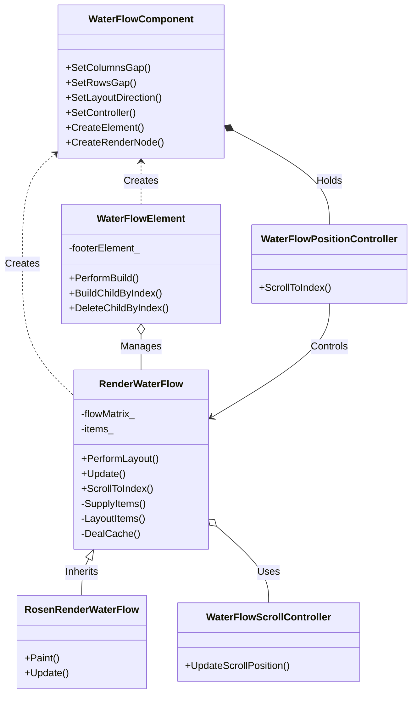
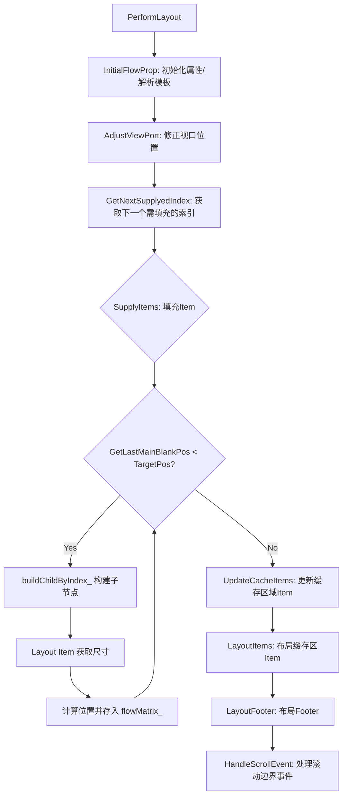
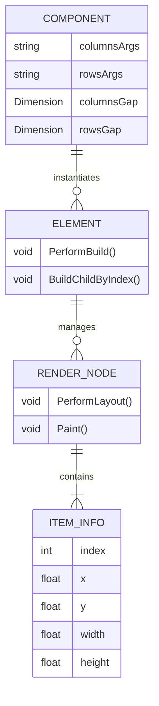

# WaterFlow Component 技术文档

## 1. 项目概览

WaterFlow Component 是 ACE (ArkUI Cross-platform Engine) 框架中的核心 UI 组件，专注于解决大数据量、异构内容（如图片墙、商品列表）的高性能渲染与布局问题。该组件基于 C++ 实现，通过自定义 `RenderNode` 实现了瀑布流/砌体布局算法。

项目的核心架构思路是将**组件定义**、**元素实例化**与**渲染逻辑**解耦：
- **组件层**：负责属性配置与声明式描述。
- **元素层**：负责组件树的生命周期管理与懒加载调度。
- **渲染层**：负责具体的布局计算、视口管理与绘制。

该组件通过懒加载和缓存回收机制，有效解决了长列表场景下的内存瓶颈，同时支持滚动交互、编程式滚动及动画特性，是构建高性能不规则网格界面的基础设施。

## 2. 功能列表

| 功能名称 | 所属模块 | 简要描述 |
|----------|----------|----------|
| 瀑布流布局 | WaterFlow Core | 支持垂直和水平方向，根据列/行模板动态计算 Item 尺寸与位置。 |
| 懒加载与缓存 | WaterFlow Core | 仅在可视区域及缓存区域创建 Item，离开缓存区域的 Item 会被回收，优化内存。 |
| 滚动交互 | WaterFlow Core | 内置 Scrollable 组件处理触摸滑动，支持滚动条显示与交互。 |
| 编程式滚动 | WaterFlow Core | 提供控制器支持滚动到指定索引的 Item。 |
| 布局约束 | WaterFlow Core | 支持设置 Item 的最大、最小宽高约束。 |
| Footer 支持 | WaterFlow Core | 支持在瀑布流末尾添加自定义 Footer 组件。 |
| 事件回调 | WaterFlow Core | 支持滚动到起点和终点的事件回调。 |

## 3. 实现模型

项目采用典型的 ACE 引擎分层架构，核心逻辑位于 `WaterFlow Core` 模块。

### 3.1 架构类图
以下 Mermaid 类图展示了核心类之间的依赖与继承关系：



### 3.2 渲染与布局流程
核心渲染逻辑在 `RenderWaterFlow` 中执行，采用“按需填充”的策略。



## 4. 接口设计

本章节描述 WaterFlow 组件对外暴露的核心 C++ API，主要用于 ACE 框架上层或应用前端通过 JS Bridge 调用。

### 4.1 WaterFlowComponent (组件定义接口)

用于声明瀑布流组件的属性和行为。

| 接口名称 | 输入参数 | 输出/描述 | 关键说明 |
| :--- | :--- | :--- | :--- |
| `SetColumnsGap` | `const Dimension& columnsGap` | void | 设置列间距。 |
| `SetRowsGap` | `const Dimension& rowsGap` | void | 设置行间距。 |
| `SetLayoutDirection` | `FlexDirection direction` | void | 设置布局方向（垂直/水平）。 |
| `SetController` | `const RefPtr<...>& controller` | void | 注入滚动位置控制器。 |
| `SetColumnsArgs` | `const std::string& columnsArgs` | void | 设置列模板参数（如 "1fr 1fr"）。 |
| `SetRowsArgs` | `const std::string& rowsArgs` | void | 设置行模板参数。 |
| `SetScrollBarDisplayMode` | `DisplayMode displayMode` | void | 设置滚动条显示模式。 |

### 4.2 WaterFlowPositionController (滚动控制接口)

提供编程式控制滚动位置的能力。

| 接口名称 | 输入参数 | 输出/描述 | 关键说明 |
| :--- | :--- | :--- | :--- |
| `ScrollToIndex` | `int32_t index`, `bool smooth`, `ScrollAlign align`, `std::optional<float> extraOffset` | void | 滚动到指定索引的 Item，支持平滑滚动和对齐方式设置。 |

### 4.3 RenderWaterFlow (渲染节点内部接口)

主要供框架内部布局引擎调用。

| 接口名称 | 输入参数 | 输出/描述 | 关键说明 |
| :--- | :--- | :--- | :--- |
| `ScrollToIndex` | `int32_t index` | void | 内部实现滚动逻辑，计算目标偏移量。 |
| `AddChildByIndex` | `size_t index`, `const RefPtr<RenderNode>&` | void | 按索引添加子渲染节点，支持懒加载插入。 |

## 5. 数据模型

WaterFlow 组件的核心数据模型围绕布局计算结果与子项管理展开。

### 5.1 核心实体关系

- **WaterFlowComponent**: 持有配置信息（间距、方向、控制器）。
- **RenderWaterFlow**: 持有运行时布局状态。
    - `flowMatrix_`: 存储每个 Item 计算后的坐标位置信息。
    - `items_`: 维护当前活跃的渲染节点集合。
- **WaterFlowElement**: 持有 ElementProxyHost，负责按需生成子组件实例。

### 5.2 布局数据流

1.  **配置输入**: `WaterFlowComponent` 接收列模板、间距等参数。
2.  **视口计算**: `RenderWaterFlow` 根据视口大小和模板参数，计算出当前可见区域的 Item 索引范围。
3.  **动态构建**: `WaterFlowElement` 收到请求，通过 `BuildChildByIndex` 构建对应的 UI 描述。
4.  **位置记录**: `RenderWaterFlow` 计算 Item 尺寸，寻找最短列/行进行放置，并将坐标存入 `flowMatrix_`。



## 6. 快速上手

本节提供基于 C++ 层构建 WaterFlow 组件的基本示例，演示如何配置属性并创建实例。

### 环境要求
- 需在 ACE 引擎编译环境中构建。
- 依赖 `AceType`、`RenderNode` 等基础框架类型。

### 最小可运行示例

```cpp
// 1. 创建 WaterFlowComponent
auto waterFlowComponent = AceType::MakeRefPtr<V2::WaterFlowComponent>(std::list<RefPtr<Component>>());

// 设置布局方向为垂直瀑布流
waterFlowComponent->SetLayoutDirection(FlexDirection::COLUMN);

// 设置两列等宽布局模板
waterFlowComponent->SetColumnsArgs("1fr 1fr");

// 设置间距
waterFlowComponent->SetRowsGap(Dimension(10.0, DimensionUnit::VP));
waterFlowComponent->SetColumnsGap(Dimension(10.0, DimensionUnit::VP));

// 2. 设置控制器 (支持编程式滚动)
auto controller = AceType::MakeRefPtr<V2::WaterFlowPositionController>();
waterFlowComponent->SetController(controller);

// 3. 配置滚动条 (可选)
auto scrollBarProxy = AceType::MakeRefPtr<ScrollBarProxy>();
waterFlowComponent->SetScrollBarProxy(scrollBarProxy);
waterFlowComponent->SetScrollBarDisplayMode(DisplayMode::AUTO);

// 4. 子组件添加 (实际开发中通常通过 ElementProxyHost 懒加载)
// 此处省略静态子组件添加代码...

// 5. 后续由框架调用 CreateElement 和 CreateRenderNode 完成渲染
```

### 常见配置说明
- **懒加载**: 实际使用时，数据源通常通过 `WaterFlowElement` 的 `ElementProxyHost` 机制提供，通过覆写 `BuildChildByIndex` 实现动态加载，避免一次性构建大量节点。
- **布局方向**: 支持 `FlexDirection::COLUMN` (垂直) 和 `FlexDirection::ROW` (水平)。

## 7. 安全与部署

*本项目文档中未包含显式的安全策略（如 CSRF/XSS 防护）或特定部署方式（如 Docker/Serverless）的相关信息，该组件属于底层 UI 渲染组件，其安全性依赖于宿主应用框架的实现。*