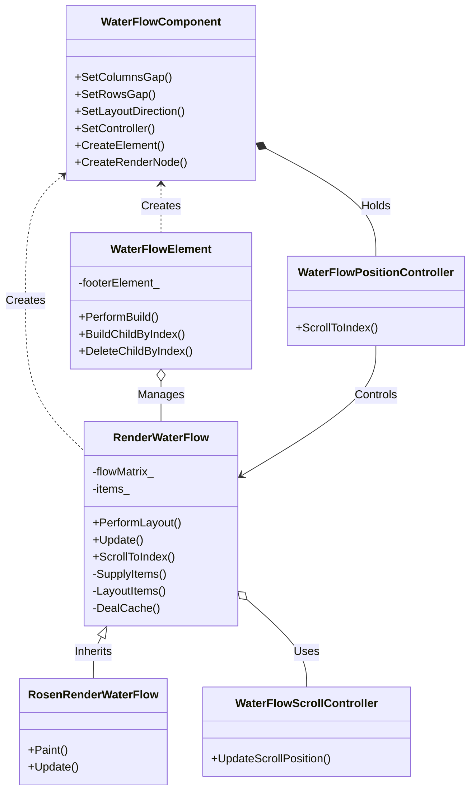
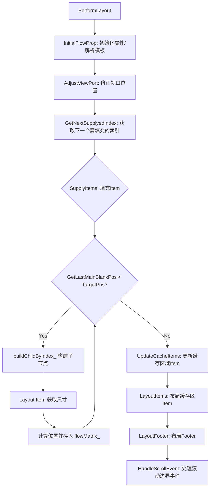

# WaterFlow V2 组件设计文档

## 1. 模块简介
WaterFlow V2 是 ACE 引擎中的高性能瀑布流布局组件。该模块实现了 `RenderNode` 的自定义布局与渲染，支持垂直和水平方向的瀑布流排列，具备按需加载、缓存管理、滚动控制及动画等特性。它通过懒加载机制优化了大数据量场景下的内存占用与性能表现，适用于图片墙、商品列表等不规则布局场景。

## 2. 功能描述
*   **瀑布流布局**：支持垂直和水平方向，根据列/行模板动态计算 Item 尺寸与位置。
*   **懒加载与缓存**：仅在可视区域及缓存区域内创建和布局 Item，离开缓存区域的 Item 会被回收，极大降低内存消耗。
*   **滚动交互**：内置 `Scrollable` 组件处理触摸滑动，支持滚动条显示与交互。
*   **编程式滚动**：支持通过 `ScrollToIndex` 方法滚动到指定索引的 Item。
*   **布局约束**：支持设置 Item 的最大、最小宽高约束。
*   **Footer 支持**：支持在瀑布流末尾添加 Footer 组件。
*   **事件回调**：支持滚动到起点和终点的事件回调。

## 3. 目录结构
```
.
├── BUILD.gn                        # 构建配置文件
├── render_water_flow.cpp           # 瀑布流渲染节点核心逻辑实现
├── render_water_flow.h             # 瀑布流渲染节点定义
├── render_water_flow_creator.cpp   # 渲染节点工厂方法
├── render_water_flow_item.cpp      # 瀑布流子项渲染节点实现
├── render_water_flow_item.h        # 瀑布流子项渲染节点定义
├── rosen_render_water_flow.cpp      # Rosen 渲染引擎后端实现
├── rosen_render_water_flow.h        # Rosen 渲染引擎后端定义
├── water_flow_component.cpp         # 瀑布流组件定义，封装属性
├── water_flow_component.h           # 瀑布流组件声明
├── water_flow_element.cpp           # 瀑布流 Element，负责组件实例化与子节点管理
├── water_flow_element.h             # 瀑布流 Element 声明
├── water_flow_item_component.cpp    # 子项组件定义
├── water_flow_item_component.h      # 子项组件声明
├── water_flow_item_element.cpp      # 子项 Element 实现
├── water_flow_item_element.h        # 子项 Element 声明
├── water_flow_item_generator.h      # Footer 生成器接口
├── water_flow_position_controller.cpp # 滚动位置控制器实现
├── water_flow_position_controller.h # 滚动位置控制器声明
├── water_flow_scroll_controller.cpp # 滚动条控制器实现
└── water_flow_scroll_controller.h   # 滚动条控制器声明
```

## 4. 架构图



## 5. 公共 API

### WaterFlowComponent
主要负责属性设置和创建 Element/RenderNode。

*   `void SetColumnsGap(const Dimension& columnsGap)`: 设置列间距。
*   `void SetRowsGap(const Dimension& rowsGap)`: 设置行间距。
*   `void SetLayoutDirection(FlexDirection direction)`: 设置布局方向（横向/纵向）。
    *   引用：[frameworks/core/components_v2/water_flow/water_flow_component.cpp#L55-L61](https://gitcode.com/openharmony/arkui_ace_engine/blob/921b268f57eedfb68126fe0bdedd91a3f01a8047/frameworks/core/components_v2/water_flow/water_flow_component.cpp#L55-L61)
*   `void SetController(const RefPtr<V2::WaterFlowPositionController>& controller)`: 设置滚动控制器。
*   `void SetColumnsArgs(const std::string& columnsArgs)`: 设置列模板参数。
*   `void SetRowsArgs(const std::string& rowsArgs)`: 设置行模板参数。
*   `void SetScrollBarDisplayMode(DisplayMode displayMode)`: 设置滚动条显示模式。

### WaterFlowPositionController
提供编程式滚动控制。

*   `void ScrollToIndex(int32_t index, bool smooth, ScrollAlign align, std::optional<float> extraOffset)`: 滚动到指定索引。
    *   引用：[frameworks/core/components_v2/water_flow/water_flow_position_controller.cpp#L21-L29](https://gitcode.com/openharmony/arkui_ace_engine/blob/921b268f57eedfb68126fe0bdedd91a3f01a8047/frameworks/core/components_v2/water_flow/water_flow_position_controller.cpp#L21-L29)

### RenderWaterFlow
核心渲染逻辑接口。

*   `void ScrollToIndex(int32_t index)`: 内部实现滚动到指定 Item。
    *   引用：[frameworks/core/components_v2/water_flow/render_water_flow.cpp#L561-L585](https://gitcode.com/openharmony/arkui_ace_engine/blob/921b268f57eedfb68126fe0bdedd91a3f01a8047/frameworks/core/components_v2/water_flow/render_water_flow.cpp#L561-L585)
*   `void AddChildByIndex(size_t index, const RefPtr<RenderNode>& renderNode)`: 按索引添加子节点。
    *   引用：[frameworks/core/components_v2/water_flow/render_water_flow.cpp#L109-L118](https://gitcode.com/openharmony/arkui_ace_engine/blob/921b268f57eedfb68126fe0bdedd91a3f01a8047/frameworks/core/components_v2/water_flow/render_water_flow.cpp#L109-L118)

## 6. 渲染流程

`RenderWaterFlow` 的核心布局逻辑在 `PerformLayout` 中执行，采用懒加载策略。布局算法寻找当前高度最低的列（或宽度最小的行）来放置下一个 Item。



**核心步骤解析：**

1.  **初始化**：`Update` 方法解析组件属性，初始化滚动条和 `Scrollable` 对象。
    *   引用：[frameworks/core/components_v2/water_flow/render_water_flow.cpp#L44-L63](https://gitcode.com/openharmony/arkui_ace_engine/blob/921b268f57eedfb68126fe0bdedd91a3f01a8047/frameworks/core/components_v2/water_flow/render_water_flow.cpp#L44-L63)
2.  **布局执行**：`PerformLayout` 是布局入口。
    *   引用：[frameworks/core/components_v2/water_flow/render_water_flow.cpp#L65-L106](https://gitcode.com/openharmony/arkui_ace_engine/blob/921b268f57eedfb68126fe0bdedd91a3f01a8047/frameworks/core/components_v2/water_flow/render_water_flow.cpp#L65-L106)
3.  **填充子项**：`SupplyItems` 循环调用 `buildChildByIndex_` 创建 Item，根据 `GetLastMainBlankCross`（最短列）计算位置，直到填满视口目标区域。
    *   引用：[frameworks/core/components_v2/water_flow/render_water_flow.cpp#L215-L258](https://gitcode.com/openharmony/arkui_ace_engine/blob/921b268f57eedfb68126fe0bdedd91a3f01a8047/frameworks/core/components_v2/water_flow/render_water_flow.cpp#L215-L258)
4.  **缓存管理**：`UpdateCacheItems` 和 `DealCache` 管理视口外的缓存 Item，提升滑动流畅度。
5.  **Element 交互**：`WaterFlowElement` 实现了 `BuildChildByIndex` 回调，通过 `ElementProxyHost` 按需创建子 Element。
    *   引用：[frameworks/core/components_v2/water_flow/water_flow_element.cpp#L70-L87](https://gitcode.com/openharmony/arkui_ace_engine/blob/921b268f57eedfb68126fe0bdedd91a3f01a8047/frameworks/core/components_v2/water_flow/water_flow_element.cpp#L70-L87)

## 7. 滚动控制

滚动控制由 `RenderWaterFlow` 中的 `Scrollable` 对象和辅助控制器共同完成。

*   **手势处理**：`CreateScrollable` 创建 `Scrollable` 对象，注册回调函数处理滑动偏移量。
    *   引用：[frameworks/core/components_v2/water_flow/render_water_flow.cpp#L120-L143](https://gitcode.com/openharmony/arkui_ace_engine/blob/921b268f57eedfb68126fe0bdedd91a3f01a8047/frameworks/core/components_v2/water_flow/render_water_flow.cpp#L120-L143)
*   **位置更新**：`UpdateScrollPosition` 负责计算新的视口起始位置 `viewportStartPos_`，并触发重新布局。
    *   引用：[frameworks/core/components_v2/water_flow/render_water_flow.cpp#L145-L178](https://gitcode.com/openharmony/arkui_ace_engine/blob/921b268f57eedfb68126fe0bdedd91a3f01a8047/frameworks/core/components_v2/water_flow/render_water_flow.cpp#L145-L178)
*   **预测布局**：`OnPredictLayout` 在空闲时提前构建视口外 Item，减少滑动时的卡顿。
    *   引用：[frameworks/core/components_v2/water_flow/render_water_flow.cpp#L597-L621](https://gitcode.com/openharmony/arkui_ace_engine/blob/921b268f57eedfb68126fe0bdedd91a3f01a8047/frameworks/core/components_v2/water_flow/render_water_flow.cpp#L597-L621)
*   **滚动条**：`WaterFlowScrollController` 处理滚动条的拖动与显示逻辑，将滚动条位置映射为内容偏移量。
    *   引用：[frameworks/core/components_v2/water_flow/water_flow_scroll_controller.cpp#L30-L48](https://gitcode.com/openharmony/arkui_ace_engine/blob/921b268f57eedfb68126fe0bdedd91a3f01a8047/frameworks/core/components_v2/water_flow/water_flow_scroll_controller.cpp#L30-L48)

## 8. 事件处理

*   **触摸事件**：`OnTouchTestHit` 将触摸事件分发给 `scrollable_` 或 `scrollBar_`。
    *   引用：[frameworks/core/components_v2/water_flow/render_water_flow.cpp#L180-L195](https://gitcode.com/openharmony/arkui_ace_engine/blob/921b268f57eedfb68126fe0bdedd91a3f01a8047/frameworks/core/components_v2/water_flow/render_water_flow.cpp#L180-L195)
*   **到达边界事件**：在 `PerformLayout` 中检测 `reachHead_` 和 `reachTail_` 状态，并通过 `HandleScrollEvent` 触发 `OnReachStart` 和 `OnReachEnd` 回调。
    *   引用：[frameworks/core/components_v2/water_flow/render_water_flow.cpp#L822-L844](https://gitcode.com/openharmony/arkui_ace_engine/blob/921b268f57eedfb68126fe0bdedd91a3f01a8047/frameworks/core/components_v2/water_flow/render_water_flow.cpp#L822-L844)
*   **鼠标滚轮事件**：`HandleAxisEvent` 将鼠标滚轮输入转换为滚动偏移量。
    *   引用：[frameworks/core/components_v2/water_flow/render_water_flow.cpp#L638-L648](https://gitcode.com/openharmony/arkui_ace_engine/blob/921b268f57eedfb68126fe0bdedd91a3f01a8047/frameworks/core/components_v2/water_flow/render_water_flow.cpp#L638-L648)

## 9. 使用示例

以下代码片段展示了如何在 C++ 层构建一个简单的 WaterFlow 组件：

```cpp
// 1. 创建 WaterFlowComponent
auto waterFlowComponent = AceType::MakeRefPtr<V2::WaterFlowComponent>(std::list<RefPtr<Component>>());
waterFlowComponent->SetLayoutDirection(FlexDirection::COLUMN); // 设置为垂直瀑布流
waterFlowComponent->SetColumnsArgs("1fr 1fr"); // 两列等宽
waterFlowComponent->SetRowsGap(Dimension(10.0, DimensionUnit::VP)); // 行间距
waterFlowComponent->SetColumnsGap(Dimension(10.0, DimensionUnit::VP)); // 列间距

// 2. 设置控制器 (可选)
auto controller = AceType::MakeRefPtr<V2::WaterFlowPositionController>();
waterFlowComponent->SetController(controller);

// 3. 设置滚动条 (可选)
auto scrollBarProxy = AceType::MakeRefPtr<ScrollBarProxy>();
waterFlowComponent->SetScrollBarProxy(scrollBarProxy);
waterFlowComponent->SetScrollBarDisplayMode(DisplayMode::AUTO);

// 4. 添加子组件 (通常通过 ElementProxyHost 懒加载，此处演示添加静态子组件)
// 实际使用中 WaterFlowElement 会通过 BuildChildByIndex 回调动态构建

// 5. 创建 RenderNode (通常由框架自动调用)
// RefPtr<RenderNode> renderNode = waterFlowComponent->CreateRenderNode();
```

**注意**：实际场景中，数据源通常通过 `WaterFlowElement` 的 `ElementProxyHost` 机制提供，通过覆写 `BuildChildByIndex` 实现动态加载。