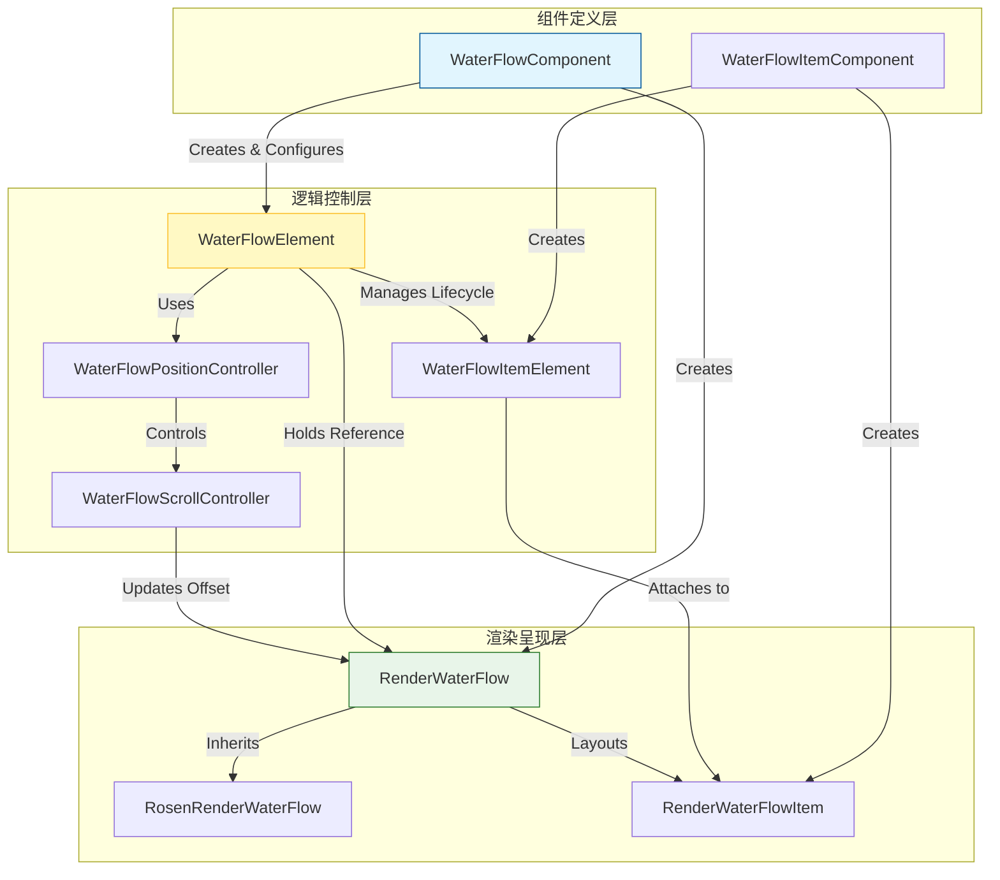
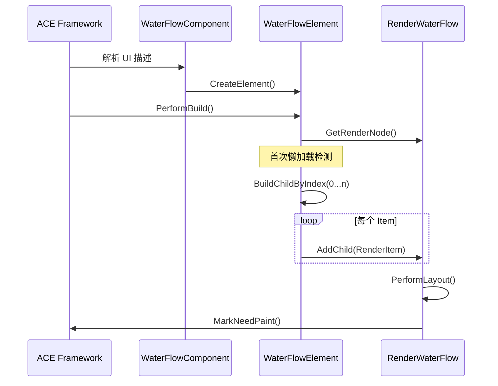
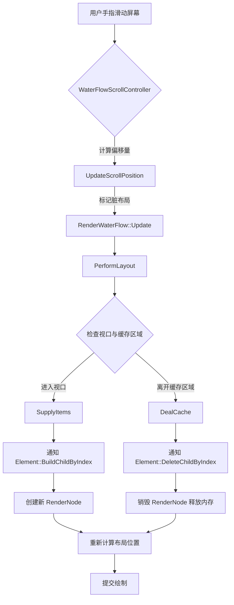

# WaterFlow Component QA 导航指南

## 1. 项目概要

WaterFlow Component 是 ACE (ArkUI Cross-platform Engine) 框架中的核心 UI 组件，专注于解决大数据量、异构内容（如图片墙、商品列表）的高性能渲染与布局问题。该项目基于 C++ 实现，通过自定义 `RenderNode` 实现了高效的瀑布流/砌体布局算法，核心架构将**组件定义**、**元素实例化**与**渲染逻辑**三层解耦，以提升代码的可维护性与扩展性。该组件通过懒加载、视口剪裁和缓存回收机制，有效解决了长列表场景下的内存瓶颈与掉帧问题，同时支持滚动交互、编程式滚动及动画特性，是构建高性能不规则网格界面的基础设施。

## 2. 入口点

由于 WaterFlow 是一个 UI 组件库而非独立应用，其入口点主要体现在组件的构建流程和构建系统中。

| 入口类型 | 文件名/位置 | 作用说明 | 触发方式 |
| :--- | :--- | :--- | :--- |
| **组件构建入口** | `water_flow_component.cpp` | 组件定义的起点。负责接收前端传递的属性配置（如列间距、滚动控制器），并触发 Element 和 RenderNode 的创建。 | 由 ACE 框架在解析 UI 描述树时实例化。 |
| **渲染节点创建入口** | `render_water_flow_creator.cpp` | 工厂方法入口。专门用于创建具体的渲染节点对象，将渲染层与组件层解耦。 | 由 `WaterFlowComponent::CreateRenderNode` 调用。 |
| **子组件构建入口** | `water_flow_item_component.cpp` | 单个 Item 子组件的构建入口。 | 由 `WaterFlowElement` 在懒加载过程中动态调用。 |
| **构建脚本入口** | `BUILD.gn` | GN (Generate Ninja) 构建配置文件。定义了编译单元、依赖关系和编译标志。 | 编译系统通过 `gn` 命令解析，生成 `ninja` 构建文件。 |

## 3. 模块地图

项目逻辑结构清晰，遵循 ACE 框架的标准分层模型。以下是核心模块划分：

| 模块名称 | 路径 | 核心职责 | 关键文件 |
| :--- | :--- | :--- | :--- |
| **Component 组件层** | `./` | 负责声明式描述 UI 结构与属性。提供对外的 API 接口（如设置列数、间距），并负责创建对应的 Element 和 RenderNode。 | `water_flow_component.h` `water_flow_item_component.h` |
| **Element 元素层** | `./` | 负责组件树的生命周期管理。处理懒加载逻辑（按需创建/销毁子节点），连接 Component 与 RenderNode。 | `water_flow_element.h` `water_flow_item_element.h` |
| **Render 渲染层** | `./` | 负责具体的布局计算（瀑布流算法）、视口管理、绘制指令生成以及触摸事件处理。 | `render_water_flow.h` `rosen_render_water_flow.h` |
| **Controller 控制层** | `./` | 负责处理交互逻辑。封装滚动控制 API，处理滚动偏移量计算与动画驱动。 | `water_flow_scroll_controller.h` `water_flow_position_controller.h` |
| **辅助工具** | `./` | 提供 Item 生成器抽象，用于支持不同数据源到 UI Item 的映射。 | `water_flow_item_generator.h` |

## 4. 核心抽象

项目中定义了几个贯穿全局的核心抽象，理解它们是阅读代码的关键：

### 4.1 WaterFlowComponent (组件抽象)
这是最顶层的抽象，代表了“瀑布流容器”的声明。
- **作用**：持有用户配置的属性（如 `columnsGap`, `rowsGap`, `layoutDirection`），但不包含状态逻辑。
- **关键接口**：`CreateElement()` 和 `CreateRenderNode()`，通过工厂模式将实例化延迟到运行时。

### 4.2 WaterFlowElement (元素抽象)
代表了组件在运行时的实例，是连接 Component 和 RenderNode 的“胶水层”。
- **作用**：管理子节点（Item）的生命周期。核心职责是实现**懒加载**，即只在需要显示时才调用 `BuildChildByIndex()`，并在不可见时调用 `DeleteChildByIndex()`。
- **关键数据结构**：`footerElement_`，用于特殊处理尾部组件的挂载与布局。

### 4.3 RenderWaterFlow (渲染抽象)
这是整个组件最核心的布局引擎，继承自基础渲染节点。
- **作用**：执行具体的 `PerformLayout()` 算法。它维护了一个 `flowMatrix_` 数据结构来记录每个 Item 的位置信息，并通过 `SupplyItems()` 和 `DealCache()` 方法管理可视区域与缓存区域的 Item 状态。
- **继承关系**：`RosenRenderWaterFlow` 继承自 `RenderWaterFlow`，在基础布局能力之上增加了具体的绘制（`Paint()`）实现，对接底层图形库。

### 4.4 WaterFlowPositionController (控制抽象)
- **作用**：提供编程式滚动能力的接口封装，如 `ScrollToIndex()`。它将复杂的偏移量计算逻辑从渲染层剥离，保持单一职责。

## 5. 架构分层

WaterFlow Component 严格遵循 ACE 框架的三层架构模式，依赖方向为单向依赖（从上到下）。

**分层职责说明：**
1.  **组件定义层**：纯数据模型，仅描述 UI 结构，无业务逻辑，不依赖底层实现。
2.  **逻辑控制层**：负责状态管理、事件分发和生命周期调度。Element 层不直接处理绘制，但控制何时绘制。
3.  **渲染呈现层**：纯粹的数学计算与图形绘制。`RenderWaterFlow` 负责计算每个 Item 的坐标，`RosenRenderWaterFlow` 负责将计算结果提交给图形引擎绘制。

## 6. 关键数据流

理解数据流对于 QA 定位 Bug（如布局错乱、内存泄漏、滚动失效）至关重要。

### 6.1 组件初始化与构建流程
描述组件从被声明到首次渲染完成的过程。

### 6.2 滚动交互与懒加载数据流
这是 WaterFlow 性能优化的核心流程，涉及动态创建和销毁节点。

### 6.3 编程式滚动流程
描述代码调用 `ScrollToIndex` 的内部执行路径。

1.  **触发**：外部业务代码调用 `WaterFlowPositionController::ScrollToIndex(index)`。
2.  **计算**：Controller 根据 index 查询或计算目标位置坐标。
3.  **驱动**：Controller 调用 `WaterFlowScrollController::ScrollTo`，传入目标偏移量。
4.  **动画**：ScrollController 启动动画曲线计算。
5.  **更新**：每帧动画回调触发 `RenderWaterFlow::Update`，更新当前偏移量。
6.  **渲染**：触发 `PerformLayout`，根据新偏移量重新判定可视 Item，最终绘制。

## 7. 外部依赖

项目主要依赖 ACE 框架的基础设施和图形后端。

| 依赖名称 | 版本 | 用途 | 在代码中的使用位置 |
| :--- | :--- | :--- | :--- |
| **ACE Framework Core** | N/A | 提供基础组件基类、渲染节点基类、上下文环境。 | 所有 `.h` 文件中的类继承（如 `RenderNode`, `Component`）。 |
| **Rosen Render Engine** | N/A | 具体的 2D 图形绘制引擎，负责光栅化。 | `rosen_render_water_flow.cpp` 中的 `Paint` 方法调用。 |
| **GN Build System** | N/A | 编译构建工具链，管理依赖图谱。 | `BUILD.gn` 文件。 |
| **C++ STL** | C++11/14 | 标准库，用于数据结构存储与算法实现。 | 头文件引用如 `<vector>`, `<memory>`, `<map>`。 |

## 8. 代码约定

为了保持代码库的一致性，请遵循以下约定：

### 8.1 文件命名与组织
- **命名风格**：全小写字母，单词间用下划线分隔（snake_case）。例如 `water_flow_element.cpp`。
- **成对出现**：声明与实现分离。`.h` 文件负责类声明，`.cpp` 文件负责实现。
- **层级前缀**：文件名通常带有层级前缀，如 `render_` 前缀表示渲染层，`water_flow_` 前缀表示核心模块。

### 8.2 类与函数命名
- **类名**：大驼峰命名，需体现层级归属。例如 `WaterFlowElement`, `RenderWaterFlow`。
- **成员变量**：使用下划线后缀表示私有成员。例如 `items_`, `flowMatrix_`, `footerElement_`。
- **函数名**：大驼峰命名，动词开头。例如 `PerformLayout()`, `BuildChildByIndex()`。
- **接口函数**：ACE 框架基类定义的虚函数通常以 `On` 开头（虽然本项目代码中多为直接重写基类方法，如 `Update`），或者特定的生命周期方法如 `PerformBuild`。

### 8.3 错误处理与日志
- **返回值**：布局相关函数通常不抛出异常，而是通过返回值或状态位表示成功/失败。
- **断言**：在核心算法逻辑中使用 `ACE_ASSERT` 或类似宏来验证布局计算的边界条件（根据 ACE 框架通用惯例）。

### 8.4 内存管理
- **智能指针**：广泛使用 `RefPtr`（ACE 框架自带的引用计数智能指针）或 `std::shared_ptr` 来管理 RenderNode 和 Element 的生命周期，避免内存泄漏。
- **对象销毁**：Element 负责销毁其管理的子 Element，RenderNode 负责销毁其子 RenderNode。

## 9. 已知设计决策

以下是项目中关键架构决策的记录，理解它们有助于解释代码中的某些“为什么”。

### 决策：三层架构解耦
- **背景**：为了适应不同平台（Android、iOS、Windows 等）的渲染后端，并允许 UI 描述与业务逻辑分离。
- **选择**：强制分离 Component（描述）、Element（控制）、Render（绘制）。
- **权衡**：增加了代码量和类的数量，导致初学者理解路径变长。但收益是极高的可维护性和跨平台复用能力（例如只需替换 RosenRender 层即可适配新图形库）。

### 决策：基于索引的懒加载机制
- **背景**：瀑布流场景通常包含大量数据（成百上千条），如果一次性创建所有 DOM 节点，会导致严重的内存溢出和卡顿。
- **选择**：在 `WaterFlowElement` 中实现 `BuildChildByIndex`，仅在需要时创建；在 `RenderWaterFlow` 中实现 `DealCache`，主动回收不可见节点。
- **权衡**：增加了滚动时的 CPU 计算开销（需要频繁创建/销毁对象），但换取了恒定且低廉的内存占用。这意味着 QA 在测试时，应重点关注快速滚动时的帧率和 GC（垃圾回收）抖动情况。

### 决策：布局与绘制分离
- **背景**：某些场景下（如仅滚动偏移量变化），不需要重新计算每个 Item 的宽高，只需重新绘制它们的位置。
- **选择**：`RenderWaterFlow` 专注于数学布局计算，`RosenRenderWaterFlow` 专注于调用图形 API 绘制。
- **权衡**：允许框架进行优化（例如仅重绘脏区域），但也要求开发者必须正确标记“布局脏”和“绘制脏”标志位。如果 Bug 表现为“视图不更新”，通常是因为未正确调用 `MarkNeedLayout` 或 `MarkNeedPaint`。