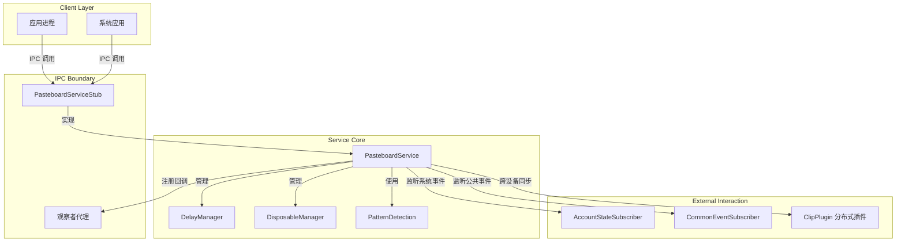
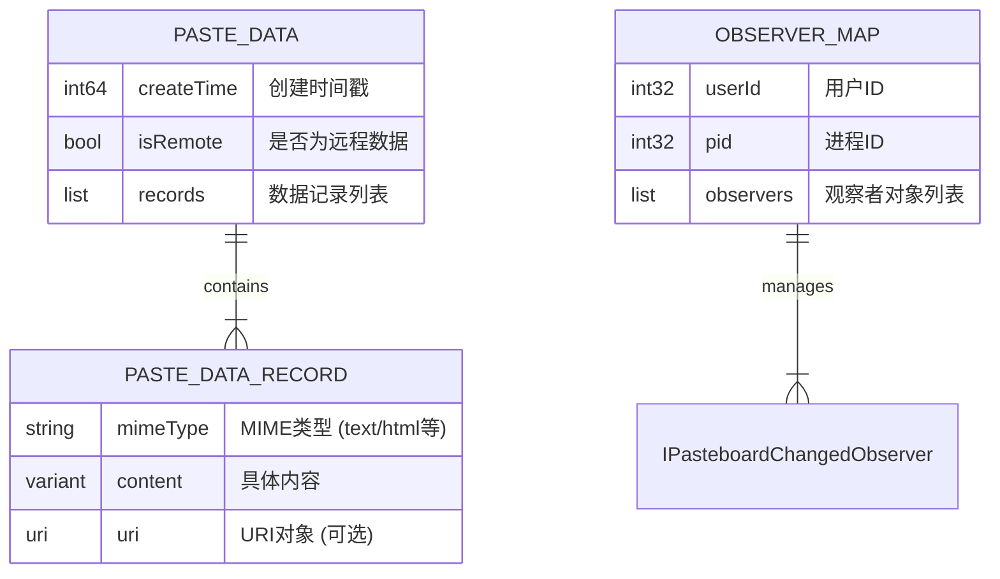

# PasteboardService 技术文档

## 1. 项目概览
PasteboardService 是 OpenHarmony 系统中的核心剪贴板管理服务，主要解决跨应用、跨设备的复制粘贴与数据同步问题。该项目基于 C++ 开发，采用系统服务架构，通过 IPC 机制对外暴露能力。

该服务不仅提供基础的剪贴板数据存取功能，还实现了分布式数据同步（支持 P2P 链路）、权限管控、延迟数据加载、内容模式检测（如识别链接、电话号码）以及生命周期管理等高级特性。架构上，项目分为接口定义层、核心服务层与支撑管理层：
- **接口定义层**：定义了观察者接口、IPC 接口码及各类回调接口。
- **核心服务层**：实现了 `PasteboardService` 主服务，负责业务逻辑编排、分布式同步与权限校验。
- **支撑管理层**：包含了模式检测工具、延迟数据管理、一次性数据处理及系统事件订阅等辅助模块。

## 2. 功能列表

| 功能名称 | 所属模块 | 简要描述 |
|----------|----------|----------|
| 核心数据管理 | Core Service | 提供剪贴板数据的增删改查，支持文本、富文本、URI 等格式。 |
| 分布式同步 | Core Service | 支持跨设备剪贴板数据同步，包含 P2P 链路建立与数据传输优化。 |
| 观察者订阅 | Observer & IPC Interfaces | 允许应用监听剪贴板内容变化，支持远程数据监听与特定事件回调。 |
| 权限与安全 | Core Service | 实现跨应用访问控制、URI 权限临时授权及系统应用校验。 |
| 延迟数据获取 | Data & System Managers | 支持大数据的延迟加载机制，避免一次性加载导致的性能瓶颈。 |
| 一次性数据处理 | Data & System Managers | 提供特定场景下的“复制即销毁”或单次粘贴消费模式。 |
| 实体与模式识别 | Pattern Detection / Observer | 自动识别剪贴板内容中的 URL、邮箱、电话号码等特定模式。 |
| 系统事件响应 | Data & System Managers | 监听账号状态变更、系统公共事件，调整服务行为。 |

## 3. 实现模型

## 4. 接口设计

PasteboardService 通过 IPC 机制对外暴露服务接口，核心接口定义在 `PasteboardServiceStub` 及相关的 IPC 接口码枚举中。

### 4.1 核心 IPC 接口
主要接口定义如下（基于 `pasteboard_serv_ipc_interface_code.h`）：

| 接口名称 | 接口码 | 功能描述 | 输入参数 | 输出/响应 |
| :--- | :--- | :--- | :--- | :--- |
| **GetPasteData** | 0 | 获取剪贴板数据 | 无（或用户ID） | `PasteData` 对象 |
| **SetPasteData** | 2 | 设置剪贴板数据 | `PasteData` 对象 | 操作结果状态 |
| **SubscribeObserver** | 4 | 订阅剪贴板变化 | Observer 对象 | 订阅结果 |
| **HasPasteData** | - | 检查是否有数据 | 无 | Boolean |
| **IsRemoteData** | 7 | 检查数据来源 | 无 | Boolean (是否来自远程) |
| **PasteStart** | 15 | 粘贴操作开始通知 | 无 | 无 |
| **PasteComplete** | 16 | 粘贴操作完成通知 | 无 | 无 |

### 4.2 观察者回调接口
客户端需实现以下观察者接口以接收服务端回调：

- **IPasteboardChangedObserver**：剪贴板内容变化通知。
  - `OnPasteboardChanged()`: 通用变化通知。
  - `OnPasteboardEvent()`: 携带包名、状态、用户ID的详细通知。
- **IEntityRecognitionObserver**：实体识别结果回调。
  - 用于接收文本中识别出的特定实体（如电话、链接）。
- **IPasteboardDisposableObserver**：一次性数据处理结果回调。

### 4.3 认证与约束
- **权限校验**：服务端通过 `VerifyPermission` 和 `IsPermissionGranted` 方法校验调用者权限。
- **URI 权限**：当数据包含 URI（如文件、图片）时，服务通过 `GrantPermission` 临时授权给目标应用，确保跨应用 URI 访问的安全性。

## 5. 数据模型

### 5.1 核心实体关系
剪贴板服务的核心数据实体是 `PasteData`，它包含多种数据记录。服务内部维护了观察者映射表以处理事件分发。

### 5.2 数据流转过程
1.  **本地复制**：应用调用 `SetPasteData`，数据被封装为 `PasteData` 对象，存入服务端内存/数据库，并触发观察者通知。
2.  **远程同步**：`PasteData` 序列化后，通过 `ClipPlugin` 传输至对端设备；对端通过 `RemotePasteboardChange` 回调接收并缓存。
3.  **权限附加**：若 `PasteData` 包含 URI，服务端会生成临时 URI 权限令牌，随数据一同传输或授权给目标进程。

## 6. 安全与部署

### 6.1 安全策略
- **访问控制**：实现了严格的权限管理机制，确保只有授权应用才能读写特定剪贴板数据。
- **URI 权限管理**：针对文件或多媒体数据，提供临时 URI 授权机制（`GrantPermission`），防止永久性权限泄露。
- **进程死亡监听**：服务端注册了 `PasteboardDeathRecipient`，当客户端进程意外终止时，自动清理其注册的观察者，防止无效回调。

### 6.2 部署与运行
- **系统服务集成**：`PasteboardService` 继承自 `SystemAbility`，随系统启动而加载，属于核心系统服务进程。
- **分布式依赖**：服务依赖分布式硬件管理组件，需在支持分布式组网的 OpenHarmony 设备上运行以实现跨设备同步功能。
- **P2P 链路**：在进行大数据量同步前，服务会调用 `EstablishP2PLink` 建立点对点高速连接，以优化传输性能。