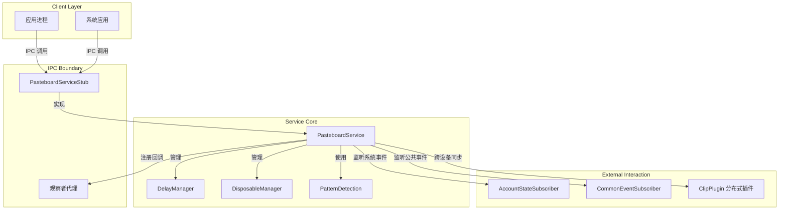
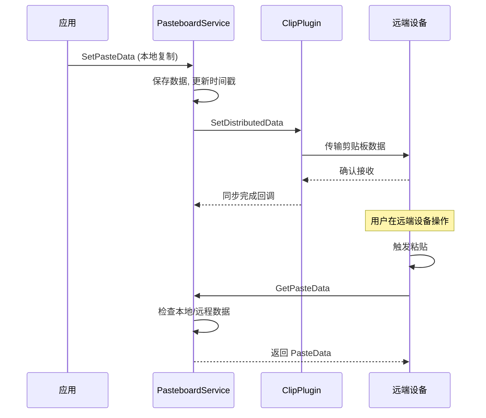

# 剪贴板服务模块设计文档

## 1. 模块简介

剪贴板服务模块是 OpenHarmony 系统中的核心系统服务，主要负责管理系统剪贴板数据，提供跨应用、跨设备的复制粘贴功能。该模块实现了标准的系统能力接口，支持普通文本、富文本、URI 等多种数据格式的存储与传输。作为系统底层服务，它不仅处理本地的剪贴板读写请求，还负责跨设备分布式数据同步、权限校验、数据生命周期管理以及与其他系统服务（如账户管理、窗口管理）的交互。

## 2. 功能描述

### 2.1 核心数据管理
提供剪贴板数据的增删改查接口，支持 `SetPasteData`、`GetPasteData`、`HasPasteData`、`Clear` 等基本操作。支持大数据的延迟获取机制，避免一次性加载大量数据导致性能问题。

### 2.2 分布式同步
支持跨设备剪贴板数据同步。当设备组网且满足同步条件时，本设备复制的数据可自动同步至对端设备，支持 P2P 链路建立与数据传输优化。

### 2.3 观察者订阅
提供订阅机制，允许应用监听剪贴板内容的变化。支持普通变化监听、远程数据监听以及特定事件监听，并通过 `IPasteboardChangedObserver` 接口回调通知。

### 2.4 权限与安全
实现了严格的权限管理机制，包括 URI 权限授权、跨应用数据访问控制、系统应用校验等，确保剪贴板数据的安全性。

### 2.5 扩展特性
- **实体识别**：支持订阅特定类型实体的识别结果。
- **一次性数据处理**：支持特定场景下的一次性粘贴消费模式。
- **模式检测**：支持检测剪贴板内容是否包含特定模式（如电话号码、链接等）。
- **系统事件响应**：响应账号状态变化、系统公共事件等。

## 3. 目录结构

```
include/
├── ientity_recognition_observer.h      # 实体识别观察者接口定义
├── ipasteboard_changed_observer.h     # 剪贴板变化观察者接口定义
├── ipasteboard_delay_getter.h         # 延迟数据获取器接口定义
├── ipasteboard_disposable_observer.h  # 一次性数据处理观察者接口定义
├── ipasteboard_entry_getter.h         # 剪贴板条目数据获取器接口定义
├── pasteboard_ability_manager.h       # Ability 管理辅助类（启动 Ability、焦点检查）
├── pasteboard_account_state_subscriber.h # 账号状态变更订阅者
├── pasteboard_common_event_subscriber.h  # 系统公共事件订阅者
├── pasteboard_delay_manager.h         # 延迟数据管理器（处理延迟加载逻辑）
├── pasteboard_dialog.h                # 剪贴板 UI 对话框管理（如进度条显示）
├── pasteboard_disposable_manager.h     # 一次性数据管理器
├── pasteboard_pattern.h               # 模式检测工具类
├── pasteboard_serv_ipc_interface_code.h # IPC 接口码定义
├── pasteboard_service.h               # 剪贴板服务核心类定义
└── pasteboard_window_manager.h        # 窗口管理辅助类（获取焦点窗口 ID）
```

## 4. 架构图

以下是剪贴板服务模块的核心组件架构关系图：



## 5. IPC接口设计

剪贴板服务通过 IPC 对外暴露接口，接口码定义在 `pasteboard_serv_ipc_interface_code.h` 中。

### 5.1 服务端接口枚举

服务端支持的 IPC 方法定义如下：
[include/pasteboard_serv_ipc_interface_code.h#L26-L46](https://gitcode.com/openharmony/distributeddatamgr_pasteboard/blob/9a5388ae5edf2a487634aea6ecbd1910f147a4ba/include/pasteboard_serv_ipc_interface_code.h#L26-L46)

核心接口功能说明：
- **GET_PASTE_DATA (0)**: 获取剪贴板数据。
- **SET_PASTE_DATA (2)**: 设置剪贴板数据。
- **SUBSCRIBE_OBSERVER (4)**: 订阅剪贴板变化通知。
- **IS_REMOTE_DATA (7)**: 检查当前数据是否来自远程设备。
- **PASTE_START (15) / PASTE_COMPLETE (16)**: 粘贴操作的生命周期管理。

### 5.2 核心服务类

`PasteboardService` 继承自 `SystemAbility` 和 `PasteboardServiceStub`，是服务的具体实现类。
[include/pasteboard_service.h#L196-L199](https://gitcode.com/openharmony/distributeddatamgr_pasteboard/blob/9a5388ae5edf2a487634aea6ecbd1910f147a4ba/include/pasteboard_service.h#L196-L199)

关键方法定义：
- **SetPasteData**: 设置数据接口。
  [include/pasteboard_service.h#L216-L217](https://gitcode.com/openharmony/distributeddatamgr_pasteboard/blob/9a5388ae5edf2a487634aea6ecbd1910f147a4ba/include/pasteboard_service.h#L216-L217)
- **GetPasteData**: 获取数据接口。
  [include/pasteboard_service.h#L213-L214](https://gitcode.com/openharmony/distributeddatamgr_pasteboard/blob/9a5388ae5edf2a487634aea6ecbd1910f147a4ba/include/pasteboard_service.h#L213-L214)

## 6. 权限管理机制

剪贴板服务涉及跨应用数据共享，因此具备完善的权限管理机制。

### 6.1 权限校验
服务内部通过 `VerifyPermission` 和 `IsPermissionGranted` 方法校验调用者的权限，确保只有授权的应用才能访问特定数据。

### 6.2 URI 权限授权
当剪贴板数据包含 URI（如图片、文件）时，服务需要临时授权给目标应用。相关逻辑定义在 `GrantPermission` 和 `CheckUriPermission` 方法中。
[include/pasteboard_service.h#L516-L519](https://gitcode.com/openharmony/distributeddatamgr_pasteboard/blob/9a5388ae5edf2a487634aea6ecbd1910f147a4ba/include/pasteboard_service.h#L516-L519)

### 6.3 全局共享选项
支持设置全局共享选项，控制数据在不同设备或应用间的共享行为。
[include/pasteboard_service.h#L225-L227](https://gitcode.com/openharmony/distributeddatamgr_pasteboard/blob/9a5388ae5edf2a487634aea6ecbd1910f147a4ba/include/pasteboard_service.h#L225-L227)

## 7. 分布式同步流程

剪贴板服务支持分布式数据同步，允许用户在一台设备复制，在另一台设备粘贴。

### 7.1 同步架构
服务通过 `ClipPlugin` 插件与分布式硬件管理组件交互，实现数据传输。内部维护了 `RemoteDataTaskManager` 用于管理远程数据任务。
[include/pasteboard_service.h#L442-L456](https://gitcode.com/openharmony/distributeddatamgr_pasteboard/blob/9a5388ae5edf2a487634aea6ecbd1910f147a4ba/include/pasteboard_service.h#L442-L456)

### 7.2 流程描述
1. **本地复制**: 调用 `SetPasteData`，服务检测到数据变化。
2. **数据序列化**: 将 `PasteData` 序列化，准备传输。
3. **P2P 链路建立**: 调用 `EstablishP2PLink` 建立点对点连接。
   [include/pasteboard_service.h#L537-L540](https://gitcode.com/openharmony/distributeddatamgr_pasteboard/blob/9a5388ae5edf2a487634aea6ecbd1910f147a4ba/include/pasteboard_service.h#L537-L540)
4. **数据同步**: 通过 `SetDistributedData` 将数据同步至对端设备。
   [include/pasteboard_service.h#L531](https://gitcode.com/openharmony/distributeddatamgr_pasteboard/blob/9a5388ae5edf2a487634aea6ecbd1910f147a4ba/include/pasteboard_service.h#L531)
5. **远程接收**: 对端设备通过 `RemotePasteboardChange` 回调接收数据，并存储在本地缓存中。



## 8. 观察者订阅机制

剪贴板服务提供了多种观察者接口，用于监听数据变化或特定事件。

### 8.1 观察者类型
1. **IPasteboardChangedObserver**: 监听剪贴板内容变化。
   [include/ipasteboard_changed_observer.h#L23-L30](https://gitcode.com/openharmony/distributeddatamgr_pasteboard/blob/9a5388ae5edf2a487634aea6ecbd1910f147a4ba/include/ipasteboard_changed_observer.h#L23-L30)
   - `OnPasteboardChanged()`: 通用变化通知。
   - `OnPasteboardEvent()`: 携带详细事件信息（如包名、状态、用户ID）。

2. **IEntityRecognitionObserver**: 监听实体识别结果（如识别出文本中的电话号码）。
   [include/ientity_recognition_observer.h#L23-L26](https://gitcode.com/openharmony/distributeddatamgr_pasteboard/blob/9a5388ae5edf2a487634aea6ecbd1910f147a4ba/include/ientity_recognition_observer.h#L23-L26)

3. **IPasteboardDisposableObserver**: 用于一次性数据处理结果的回调。
   [include/ipasteboard_disposable_observer.h#L26-L35](https://gitcode.com/openharmony/distributeddatamgr_pasteboard/blob/9a5388ae5edf2a487634aea6ecbd1910f147a4ba/include/ipasteboard_disposable_observer.h#L26-L35)

### 8.2 订阅流程
服务端维护了观察者映射表 `ObserverMap`，键为 `<userId, pid>`，值为观察者对象集合。
[include/pasteboard_service.h#L464-L468](https://gitcode.com/openharmony/distributeddatamgr_pasteboard/blob/9a5388ae5edf2a487634aea6ecbd1910f147a4ba/include/pasteboard_service.h#L464-L468)

1. **订阅**: 客户端调用 `SubscribeObserver`，服务端将其添加至 `observerLocalChangedMap_` 或其他对应映射表中。
   [include/pasteboard_service.h#L233-L234](https://gitcode.com/openharmony/distributeddatamgr_pasteboard/blob/9a5388ae5edf2a487634aea6ecbd1910f147a4ba/include/pasteboard_service.h#L233-L234)
2. **通知**: 当 `SetPasteData` 或 `Clear` 发生时，服务遍历映射表，调用 `OnPasteboardChanged` 或 `OnPasteboardEvent`。
3. **死亡监听**: 服务端注册 `PasteboardDeathRecipient` 监听客户端进程死亡，自动清理无效观察者。
   [include/pasteboard_service.h#L604-L611](https://gitcode.com/openharmony/distributeddatamgr_pasteboard/blob/9a5388ae5edf2a487634aea6ecbd1910f147a4ba/include/pasteboard_service.h#L604-L611)