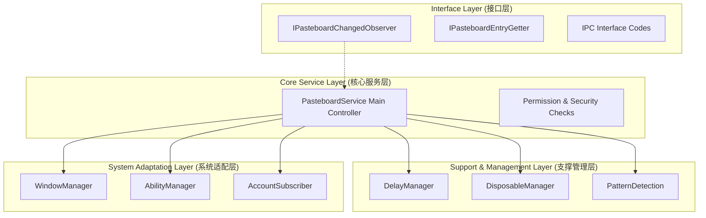
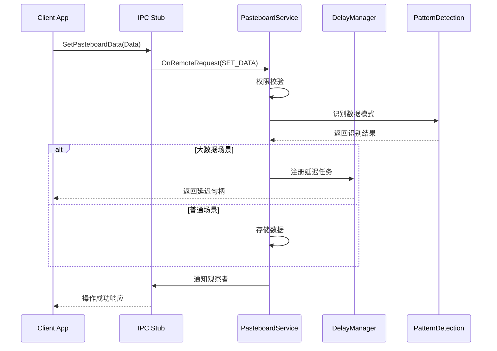
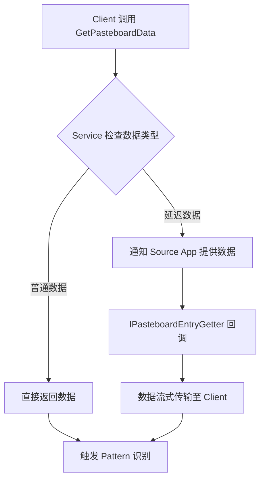

# PasteboardService QA 导航指南

## 1. 项目概要
PasteboardService 是 OpenHarmony 操作系统的核心剪贴板管理服务，旨在解决跨应用、跨设备的复制粘贴与数据同步问题。该项目采用 C++ 语言开发，基于系统级服务架构设计，通过 IPC（进程间通信）机制对外暴露标准接口。其核心功能不仅包含基础的剪贴板数据存取，还涵盖了分布式数据同步（支持 P2P 链路）、细粒度权限管控、大数据延迟加载、一次性数据处理以及智能内容模式识别（如链接、电话号码识别）。该服务是 OpenHarmony 实现多设备协同和无缝数据流转的关键基础设施。

## 2. 入口点
由于 PasteboardService 是一个系统服务，其入口点与传统应用程序不同，主要集中在系统服务加载和 IPC 接口实现上：

- **服务实例化入口**
    - **文件**：`src/pasteboard_service.cpp`
    - **作用**：包含 `PasteboardService` 类的实现，是服务生命周期的起点。系统 init 进程通过读取配置文件（通常在系统镜像中配置，代码库外）加载该服务，调用 `OnStart` 或类似的初始化方法启动服务。
    - **触发方式**：系统启动时由 samgr 或 init 进程拉起。

- **IPC 请求处理入口**
    - **文件**：`include/pasteboard_serv_ipc_interface_code.h`
    - **作用**：定义了所有 IPC 接口的枚举码。当客户端通过 Binder 机制发起请求时，服务端 Stub 根据这些代码分发到 `PasteboardService` 中的具体方法（如 `OnRemoteRequest`）。
    - **触发方式**：客户端应用调用剪贴板 API 时触发。

- **系统事件监听入口**
    - **文件**：`src/pasteboard_common_event_subscriber.cpp` 和 `src/pasteboard_account_state_subscriber.cpp`
    - **作用**：分别负责监听系统公共事件（如屏幕锁屏、解锁）和账号状态变更。服务启动时会注册这些监听器，作为外部事件驱动的入口。
    - **触发方式**：系统广播或账号服务状态变化。

- **构建入口**
    - **文件**：项目根目录下的构建配置文件（如 OpenHarmony 标准的 `BUILD.gn` 或 `bundle.json`，虽然未在文件树中列出，但必不可少）。
    - **触发方式**：执行编译命令（如 `hb build`）。

## 3. 模块地图

| 模块名称 | 路径 | 核心职责 | 关键文件 |
|----------|------|----------|----------|
| **接口定义层** | `include/` | 定义观察者接口、IPC 通信码、数据获取回调及实体识别接口，确立服务边界与契约。 | `ipasteboard_changed_observer.h`, `pasteboard_serv_ipc_interface_code.h` |
| **核心服务层** | `src/` | 实现主服务逻辑，负责剪贴板数据的存取、权限校验、生命周期管理及分布式同步调度。 | `pasteboard_service.cpp`, `pasteboard_service.h` |
| **延迟数据管理** | `src/`, `include/` | 处理大数据的延迟加载逻辑，避免数据传输阻塞主线程，提供按需获取机制。 | `pasteboard_delay_manager.cpp`, `ipasteboard_delay_getter.h` |
| **一次性数据处理** | `src/`, `include/` | 实现“复制即销毁”或单次粘贴场景的数据管理，保障隐私安全。 | `pasteboard_disposable_manager.cpp`, `ipasteboard_disposable_observer.h` |
| **模式识别与实体检测** | `src/`, `include/` | 对剪贴板文本内容进行模式匹配，识别 URL、电话、邮箱等实体，并通知观察者。 | `pasteboard_pattern.cpp`, `ientity_recognition_observer.h` |
| **系统环境交互** | `src/`, `include/` | 管理服务与系统环境的交互，包括窗口焦点监听、Ability 生命周期管理及账号状态同步。 | `pasteboard_window_manager.cpp`, `pasteboard_ability_manager.cpp` |
| **UI 与交互辅助** | `src/`, `include/` | 处理剪贴板操作过程中的用户交互，如进度对话框的显示与隐藏。 | `pasteboard_dialog.cpp` |

## 4. 核心抽象

PasteboardService 项目中定义了多个核心接口和类，构成了系统的骨架：

- **IPasteboardChangedObserver**
    - **类型**：接口
    - **作用**：观察者模式的核心。允许应用注册监听剪贴板内容的变化。
    - **场景**：当用户在应用 A 复制内容时，注册了该观察者的应用 B 会收到回调通知，实现实时响应。

- **IPasteboardEntryGetter**
    - **类型**：接口
    - **作用**：数据获取的抽象层。用于解耦数据源与数据消费者。
    - **场景**：在延迟加载场景下，服务不直接持有大数据对象，而是通过此接口在客户端真正发起粘贴请求时再拉取数据。

- **PasteboardService**
    - **类型**：主服务类
    - **作用**：系统的中央控制器，持有各个 Manager（DelayManager, DisposableManager 等）的实例，负责 IPC 请求的分发和全局状态维护。
    - **场景**：所有外部请求最终都会汇聚到此类的实例中进行处理。

- **PasteboardPattern**
    - **类型**：工具类/处理器
    - **作用**：封装正则匹配逻辑，用于识别文本中的特定模式。
    - **场景**：识别剪贴板文本是否包含网址，以便提供“打开链接”的快捷操作建议。

- **PasteboardServIPCInterfaceCode**
    - **类型**：枚举/常量定义
    - **作用**：定义 IPC 方法调用的唯一标识符。
    - **场景**：确保客户端与服务端方法调用的对应关系，是 IPC 通信的基础协议。

## 5. 架构分层

项目采用分层架构设计，自上而下分为接口层、核心层和支撑层。依赖方向遵循“上层依赖下层，下层不依赖上层”的原则。

**分层说明**：
- **接口层**：定义了模块对外的契约，包括观察者接口和数据获取接口。这一层不包含具体业务逻辑，仅定义数据结构和调用规范。
- **核心服务层**：`PasteboardService` 是唯一的业务编排中心，负责请求的接收、权限校验（如校验调用者 UID）以及业务逻辑的流转。它不直接处理具体细节，而是委托给支撑层。
- **支撑管理层**：包含具体的业务策略实现。例如 `DelayManager` 处理异步数据加载，`PatternDetection` 处理文本分析。这些模块相互独立，降低耦合。
- **系统适配层**：封装对 OpenHarmony 底层能力的调用，如窗口管理、账号服务等，隔离系统底层实现的差异，便于移植和测试。

## 6. 关键数据流

### 6.1 剪贴板数据写入流程
当用户执行“复制”操作时，数据从客户端流向系统服务。

### 6.2 剪贴板数据读取流程（含延迟加载）
当用户执行“粘贴”操作时，数据从服务流向客户端。如果数据是延迟加载类型，会触发回调。

### 6.3 跨设备分布式同步流程
当设备 A 复制，设备 B 粘贴时的流程。

1. **源端**：`PasteboardService` 接收到本地复制数据后，调用 `ClipPlugin`（分布式插件）。
2. **传输**：通过 P2P 链路将数据同步至对端设备。
3. **对端**：对端的 `PasteboardService` 接收同步数据，更新本地缓存，并通过 `IPasteboardChangedObserver` 通知对端应用有新内容。

## 7. 外部依赖

PasteboardService 作为系统服务，强依赖于 OpenHarmony 的底层基础设施。

| 依赖名称 | 版本 | 用途 | 在代码中的使用位置 |
|----------|------|----------|-------------------|
| **IPC/Binder** | System API | 进程间通信基础框架，用于跨进程调用服务接口。 | `pasteboard_service.cpp` (Stub 实现), `pasteboard_serv_ipc_interface_code.h` |
| **Account Kit** | System API | 获取当前登录账号状态，用于多设备同步时的账号校验。 | `pasteboard_account_state_subscriber.cpp` |
| **Ability Manager** | System API | 获取前台 Ability 信息，用于权限判断（如仅前台应用可访问剪贴板）。 | `pasteboard_ability_manager.cpp` |
| **Window Manager** | System API | 获取窗口焦点状态，辅助判断用户的当前操作意图。 | `pasteboard_window_manager.cpp` |
| **Common Event Service** | System API | 订阅系统公共事件（如锁屏、截屏），触发剪贴板清理或状态变更。 | `pasteboard_common_event_subscriber.cpp` |
| **Distributed Data** | System API | 实现跨设备的数据同步链路（P2P）。 | `PasteboardService` 核心逻辑中隐式调用分布式插件 |

## 8. 代码约定

为了保持代码的一致性和可维护性，本项目遵循以下约定：

- **文件命名**：
    - 接口文件统一以 `i` 开头（小写），如 `ipasteboard_changed_observer.h`，表示 Interface。
    - 实现文件以模块功能命名，如 `pasteboard_service.cpp`。
    - 头文件使用下划线分隔命名法（snake_case）。

- **类与接口命名**：
    - 接口类名以 `I` 开头（大写），如 `IPasteboardChangedObserver`。
    - 管理类以 `Manager` 结尾，如 `DelayManager`。
    - 观察者类以 `Observer` 或 `Subscriber` 结尾。

- **模块导出**：
    - 使用宏定义导出符号，确保动态库符号可见性可控（常见于 OpenHarmony 系统代码）。

- **错误处理**：
    - 关键路径使用返回码或错误对象传递异常状态。
    - 在 IPC 边界，错误码会被序列化并通过 Binder 传回客户端。

- **异步编程**：
    - 耗时操作（如大数据处理、跨设备同步）不建议在主线程阻塞执行。
    - 延迟加载机制通过回调接口实现，避免阻塞调用线程。

- **测试文件组织**：
    - 单元测试文件通常位于与 `src` 同级的 `test` 目录下，命名格式为 `<module_name>_test.cpp`。

## 9. 已知设计决策

本节记录了项目架构中的重要决策及其背景，帮助理解“为什么这样设计”。

**决策 1：延迟数据加载机制**
- **背景**：剪贴板内容可能包含大文件（如图片、长文本）或跨设备数据。如果每次复制都强制加载全部数据，会严重消耗内存和性能。
- **选择**：实现了 `PasteboardDelayManager` 和 `IPasteboardDelayGetter` 接口，支持注册数据提供回调。只有当用户真正发起“粘贴”操作时，才拉取数据。
- **权衡**：增加了实现复杂度，客户端需要实现回调接口，但显著优化了内存占用和响应速度，特别是对于大文件场景。

**决策 2：观察者模式的广泛使用**
- **背景**：剪贴板服务是被动的，无法预知应用何时需要数据，且需要支持多应用同时监听剪贴板状态。
- **选择**：定义了多个观察者接口（`IPasteboardChangedObserver`, `IEntityRecognitionObserver` 等），采用注册-通知模式。
- **权衡**：解耦了服务端与客户端，但也引入了生命周期管理的复杂性（需正确注销观察者防止内存泄漏）。

**决策 3：一次性数据处理**
- **背景**：某些敏感数据（如密码、验证码）只需粘贴一次，不应长期保留在系统剪贴板中，以免被其他应用恶意读取。
- **选择**：引入 `PasteboardDisposableManager`，支持“复制即销毁”模式，数据被读取一次后自动清理。
- **权衡**：增强了隐私安全性，但可能导致用户重复粘贴失败，需在 UI 层给用户明确提示。