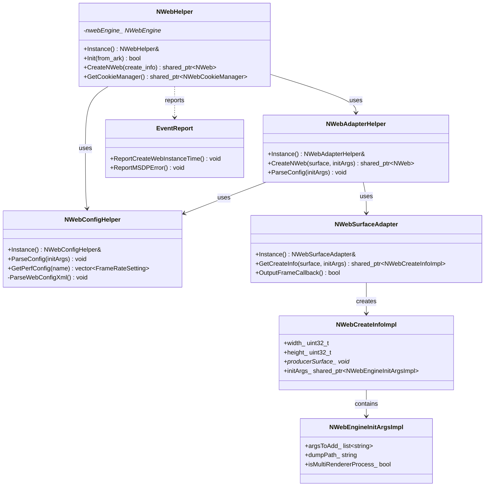
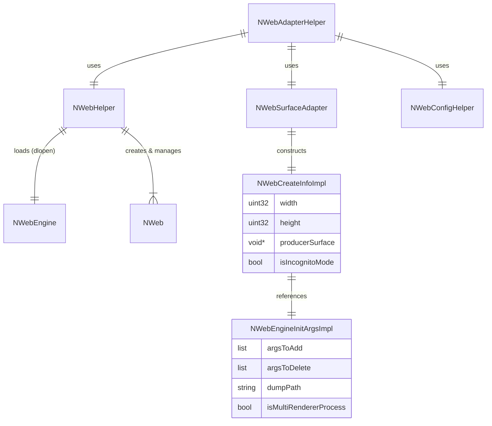

# nweb_adapter 技术文档

## 1. 项目概览

`nweb_adapter`（在构建产物中通常称为 `libnweb.so` 或 `arkweb_core_loader.so`）是 OpenHarmony WebView 子系统的核心适配层。它扮演着关键的中间件角色，向上为应用框架层提供稳定、统一的 C++ 和 C API 接口，向下则通过动态加载机制封装并管理底层 Web 引擎（如 Chromium 内核）的实现细节。

该项目的核心架构目标是**解耦**与**适配**。通过这一层，OpenHarmony 能够屏蔽底层引擎的复杂性和版本差异，实现 WebView 组件的平台无关性。

**核心职责**：
- **引擎生命周期管理**：负责 Web 引擎动态库的加载、初始化参数组装、引擎实例的创建与销毁。
- **配置中心**：解析系统级 XML 配置文件（`web_config.xml`），管理 LTPO 动态帧率、渲染进程模式、安全策略等运行时参数。
- **渲染适配**：适配图形子系统，管理 Surface 缓冲区的分配、数据拷贝与渲染刷新，支持标准 Surface 和增强 Surface 两种模式。
- **诊断与运维**：提供统一的日志系统、HiSysEvent 性能与错误上报机制，以及独立的崩溃处理进程。

**技术栈**：
- **语言**：C++ (核心逻辑), C (对外 API 接口)
- **依赖**：OpenHarmony SDK (Graphic, HiLog, HiSysEvent, Ability), libxml2 (配置解析)

## 2. 功能列表

| 功能名称 | 所属模块 | 简要描述 |
| :--- | :--- | :--- |
| **引擎初始化与加载** | Web Engine Core | 动态加载 Web 引擎库，管理引擎初始化流程及全局配置（Bundle 路径、UA 等）。 |
| **NWeb 实例管理** | Web Engine Core | 创建、销毁 NWeb 实例，管理多实例的生命周期。 |
| **配置解析与管理** | Rendering & Configuration | 解析 `web_config.xml`，提供性能调优、LTPO 策略、开发者模式等配置的查询接口。 |
| **Surface 渲染适配** | Rendering & Configuration | 对接图形子系统，处理生产者 Surface 的创建、缓冲区请求及帧数据回调。 |
| **下载管理 C API** | Web Engine Core | 提供纯 C 语言接口，支持下载任务的创建、暂停、恢复及状态查询。 |
| **日志系统** | Diagnostics & Utilities | 提供分级日志宏，自动区分 App 进程与 Render 进程的日志域。 |
| **事件上报** | Diagnostics & Utilities | 封装 HiSysEvent 接口，上报 Web 实例创建耗时、崩溃及 MSDP 错误等关键指标。 |
| **崩溃处理** | Core (src) | 独立的 `arkweb_crashpad_handler` 进程，负责捕获崩溃信号并生成 Minidump。 |
| **数据结构封装** | Diagnostics & Utilities | 提供 `WebViewValue` 通用值类型，支持跨层数据传递；封装初始化参数与创建信息结构体。 |

## 3. 实现模型

项目的整体架构采用了**外观模式** 和 **适配器模式**。`NWebHelper` 作为核心外观类，协调配置解析、Surface 适配和引擎加载。



**架构分层说明**：
1.  **接口层 (`include`)**: 定义 `NWebHelper`, `NWebAdapterHelper` 等核心类及数据结构，对外暴露 API。
2.  **实现层 (`src`)**: 实现配置解析逻辑、动态库加载逻辑 (`dlopen`)、Surface 适配逻辑。
3.  **外部依赖**:
    *   **Web Engine**: 动态加载的底层引擎库（如 `libarkweb_engine.so`）。
    *   **Graphic Subsystem**: 提供 Surface 和 Buffer 管理。
    *   **HiSysEvent**: 系统事件上报服务。

## 4. 接口设计

项目主要对外暴露 C++ 接口（供系统框架层使用）和 C 接口（供特定场景使用）。

### 4.1 核心管理接口 (NWebHelper)

`NWebHelper` 是管理 WebView 引擎生命周期的核心单例类。

| 接口名称 | 输入参数 | 输出/返回 | 描述 |
| :--- | :--- | :--- | :--- |
| `Instance` | 无 | `NWebHelper&` | 获取单例对象引用。 |
| `Init` | `bool from_ark` | `bool` | 初始化 Web 引擎环境，加载动态库。 |
| `CreateNWeb` | `shared_ptr<NWebCreateInfo>` | `shared_ptr<NWeb>` | 根据创建信息创建 NWeb 实例。 |
| `SetBundlePath` | `const string& path` | `void` | 设置应用 Bundle 路径，用于定位资源。 |
| `PrepareForPageLoad` | `url, preconnectable, numSockets` | `void` | 预连接优化，提前建立网络连接。 |

### 4.2 适配与创建接口 (NWebAdapterHelper)

用于协调配置读取和实例创建。

| 接口名称 | 输入参数 | 输出/返回 | 描述 |
| :--- | :--- | :--- | :--- |
| `CreateNWeb` | `sptr<Surface>`, `shared_ptr<NWebEngineInitArgsImpl>` | `shared_ptr<NWeb>` | 基于 Surface 和参数创建 NWeb 实例。 |
| `ParseConfig` | `shared_ptr<NWebEngineInitArgsImpl>` | `void` | 解析 XML 配置并填充到启动参数中。 |

### 4.3 下载管理 C API

提供 C 语言接口，主要包含下载管理功能，定义在 `nweb_c_api.h`。

| 接口名称 | 输入参数 | 输出/返回 | 描述 |
| :--- | :--- | :--- | :--- |
| `WebDownloader_StartDownload` | `int32_t nwebId, const char* url` | `void` | 开始下载任务。 |
| `WebDownload_Pause` | `WebDownloadItemCallbackWrapper*` | `void` | 暂停当前下载。 |
| `WebDownload_GetItemState` | `int32_t nwebId, long id` | `NWebDownloadItemState` | 查询下载状态。 |

**约束说明**：
- 在调用 `CreateNWeb` 之前，必须先调用 `Init` 完成引擎加载。
- C API 中的回调函数需在合适的线程上下文中处理，避免阻塞 UI 线程。

## 5. 数据模型

核心数据流转主要围绕**初始化参数**和**实例创建信息**展开。

### 5.1 核心实体

- **NWebEngineInitArgsImpl**: 封装引擎启动时的命令行参数。
    - `argsToAdd_`: 需追加的命令行参数（如 `--renderer-process-limit`）。
    - `argsToDelete_`: 需移除的默认参数。
    - `dumpPath_`: Crash dump 存放路径。
    - `isMultiRendererProcess_`: 是否启用多渲染进程模式。

- **NWebCreateInfoImpl**: 封装创建单个 WebView 实例所需的运行时信息。
    - `width_`, `height_`: 实例尺寸。
    - `producerSurface_`: 指向图形 Surface 的指针，用于渲染输出。
    - `initArgs_`: 指向引擎初始化参数的引用。

- **WebViewValue**: 通用值容器，支持 Int, Double, String, List, Dictionary 等类型，用于跨层数据传递。

### 5.2 实体关系图



## 6. 快速上手

### 6.1 环境要求
- OpenHarmony SDK 版本需兼容当前 `nweb_adapter` 模块。
- 系统需预置 `ArkWebCore.hap` (包含底层引擎库)。
- 配置文件 `/system/etc/web/web_config.xml` 需存在且格式正确。

### 6.2 最小可运行示例 (C++)

```cpp
#include "nweb_helper.h"
#include "nweb_adapter_helper.h"
#include "nweb_init_params.h"

using namespace OHOS::NWeb;

void InitializeWebView() {
    // 1. 获取核心帮助类单例
    NWebHelper& helper = NWebHelper::Instance();

    // 2. 初始化引擎环境 (通常在应用启动时调用)
    // 设置 Bundle 路径
    helper.SetBundlePath("/data/app/el2/100/base/com.example.webapp");
    
    // 执行初始化
    if (!helper.Init(true)) {
        // 处理初始化失败
        return;
    }

    // 3. 准备创建参数
    auto initArgs = std::make_shared<NWebEngineInitArgsImpl>();
    // 可在此处添加自定义命令行参数
    initArgs->AddArg("--disable-web-security"); // 示例参数

    // 4. 创建 NWeb 实例 (假设已获取有效的 Surface)
    sptr<Surface> surface = ...; // 从图形子系统获取
    auto nweb = NWebAdapterHelper::Instance().CreateNWeb(surface, initArgs, false);

    if (nweb) {
        // 5. 配置并加载 URL
        nweb->Resize(1080, 1920);
        nweb->LoadURL("https://www.openharmony.cn");
    }
}
```

### 6.3 常见配置选项
配置文件路径：`/system/etc/web/web_config.xml`
- **渲染进程数**: 修改 `<renderProcessCount>` 节点值。
- **LTPO 帧率策略**: 修改 `<LowerFrameRateConfig>` 中的 `visibleAreaRatio`。
- **调试模式**: 通过 `IsDeveloperModeEnabled` 接口或系统参数控制。

## 7. 安全与部署

### 7.1 部署方式
项目构建产物主要包含以下部分：
1.  **核心库**: `arkweb_core_loader.so` (原 `libnweb.so`)，部署在系统库路径下。
2.  **预编译包**: `ArkWebCore.hap`，包含 Chromium 引擎核心，部署在应用路径下。
3.  **崩溃处理程序**: `arkweb_crashpad_handler`，独立的可执行文件，用于监控和捕获崩溃。
4.  **配置文件**: `web_config.xml` 及 `web.para` 系统参数文件，部署在 `/system/etc/web/`。

### 7.2 安全策略
- **沙箱机制**: 底层引擎通过多进程架构隔离，Render 进程运行在受限沙箱中。
- **参数校验**: 配置解析 (`NWebConfigHelper`) 中对 XML 属性进行合法性校验，防止注入攻击。
- **动态库加载**: `NWebHelper` 在加载引擎动态库时，会校验库路径来源，仅加载系统预置的合法引擎库。
- **PlayGround 模式**: 调试模式需同时满足调试签名、开发者模式开启及环境变量设置，防止生产环境意外开启调试接口。

### 7.3 生产环境注意事项
- **崩溃监控**: 确保 `arkweb_crashpad_handler` 进程具有足够的权限写入 `/data/log/crash/` 目录。
- **日志隔离**: 系统通过 UID 自动区分应用进程日志和渲染进程日志，排查问题时应注意过滤对应的 Domain (`LOG_APP_DOMAIN` / `LOG_RENDER_DOMAIN`)。
- **资源限制**: 可通过 `web_config.xml` 限制最大渲染进程数，防止内存溢出 (OOM)。