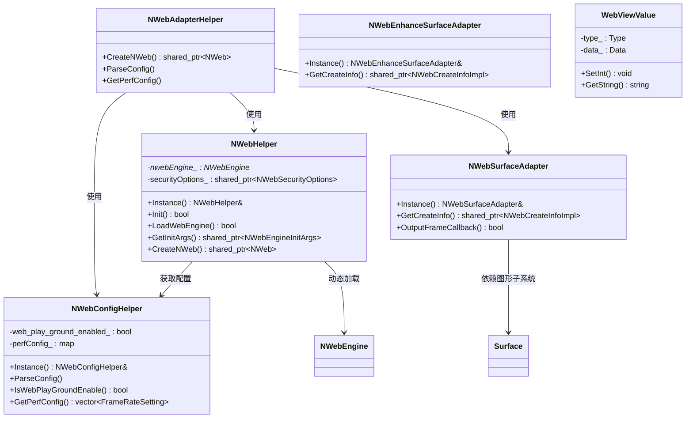
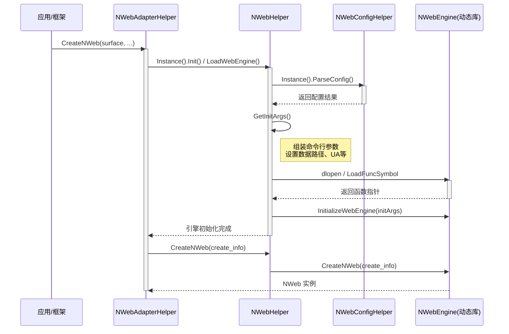

# OpenHarmony NWeb 核心适配模块设计文档

## 1. 模块简介

本模块 (`src`) 是 OpenHarmony WebView 子系统的核心适配层（NWeb Adapter）。它向上对接应用框架，向下通过动态加载机制对接具体的 Web 引擎实现（如 Chromium 内核）。该模块主要负责 Web 引擎的初始化与生命周期管理、配置文件的解析与注入、渲染 Surface 的适配、崩溃处理以及下载管理等基础能力的桥接。

## 2. 功能描述

本模块包含以下核心功能：

*   **配置管理**：解析系统及应用层的 XML 配置文件 (`web_config.xml`)，将其转化为 Web 引擎启动所需的命令行参数，支持性能调优（LTPO、DVSync）、运行模式等配置。
*   **引擎生命周期管理**：负责 Web 引擎动态库的加载、初始化参数组装、引擎实例的创建与销毁。
*   **渲染适配**：
    *   `NWebSurfaceAdapter`：处理标准 Surface 的渲染缓冲区申请、数据拷贝与刷新。
    *   `NWebEnhanceSurfaceAdapter`：针对增强型 Surface 的适配，提供创建信息的封装。
*   **崩溃处理**：提供独立的崩溃捕获处理进程入口，支持根据引擎类型加载对应的崩溃处理动态库。
*   **数据结构支持**：提供通用的值对象 (`WebViewValue`)，支持基本数据类型及字典、列表等复杂结构，用于配置传递。
*   **下载管理 API 桥接**：通过函数指针动态加载并代理 C 层的下载管理接口。
*   **系统事件上报**：封装 HiSysEvent 接口，用于上报 Web 实例创建耗时及关键错误信息。

## 3. 目录结构

```
src/
├── nweb_config_helper.cpp           # 配置文件解析核心类，管理启动参数与特性开关
├── nweb_crashpad_handler_main.cpp  # 崩溃处理进程主入口，负责加载崩溃处理动态库
├── nweb_enhance_surface_adapter.cpp # 增强型 Surface 适配器实现
├── nweb_helper.cpp                 # 核心辅助类，管理引擎加载、初始化及全局功能
├── nweb_hisysevent.cpp             # 系统事件（HiSysEvent）上报封装
├── nweb_surface_adapter.cpp        # 标准 Surface 渲染缓冲区适配器
├── webPlayGround.md                # WebPlayGround 功能替换说明文档
└── webview_value.cpp               # 通用数据结构（类似 JSON Value）实现
```

## 4. 架构图

以下类图展示了核心组件之间的依赖与关联关系：



## 5. 公共 API

本模块主要向内部子系统提供 API，不直接对外暴露应用接口。

### 5.1 NWebHelper (核心引擎管理)

*   [static NWebHelper& Instance()](src/nweb_helper.cpp#L428-L431)：获取单例对象。
*   [bool Init(bool from_ark)](src/nweb_helper.cpp#L433-L436)：初始化 Web 引擎环境。
*   [bool InitAndRun(bool from_ark)](src/nweb_helper.cpp#L438-L441)：初始化并运行引擎。
*   [std::shared_ptr<NWeb> CreateNWeb(std::shared_ptr<NWebCreateInfo> create_info)](src/nweb_helper.cpp#L626-L634)：创建 NWeb 实例。
*   [std::shared_ptr<NWebEngineInitArgs> GetInitArgs()](src/nweb_helper.cpp#L511-L599)：组装引擎初始化参数。

### 5.2 NWebAdapterHelper (适配层入口)

*   [static NWebAdapterHelper& Instance()](src/nweb_helper.cpp#L868-L871)：获取单例对象。
*   [std::shared_ptr<NWeb> CreateNWeb(sptr<Surface> surface, ...)](src/nweb_helper.cpp#L880-L912)：基于 Surface 创建 NWeb 实例。

### 5.3 NWebConfigHelper (配置解析)

*   [static NWebConfigHelper& Instance()](src/nweb_config_helper.cpp#L153-L156)：获取单例对象。
*   [void ParseConfig(std::shared_ptr<NWebEngineInitArgsImpl> initArgs)](src/nweb_config_helper.cpp#L206-L230)：解析配置文件并填充参数对象。
*   [bool IsWebPlayGroundEnable()](src/nweb_config_helper.cpp#L158-L161)：判断是否启用了 PlayGround 模式。

### 5.4 NWebSurfaceAdapter (渲染适配)

*   [static NWebSurfaceAdapter& Instance()](src/nweb_surface_adapter.cpp#L46-L49)：获取单例对象。
*   [std::shared_ptr<NWebCreateInfoImpl> GetCreateInfo(sptr<Surface> surface, ...)](src/nweb_surface_adapter.cpp#L51-L64)：构造 NWeb 创建所需的信息结构。

## 6. 初始化流程

Web 引擎的初始化流程主要由 `NWebHelper` 和 `NWebAdapterHelper` 协作完成，流程图如下：



## 7. 配置说明

### 7.1 配置文件加载

`NWebConfigHelper` 负责加载和解析 `/system/etc/web/web_config.xml` 及其覆盖配置。配置解析逻辑见 [ParseConfig](src/nweb_config_helper.cpp#L206-L230)。

主要配置项映射逻辑如下：

*   **初始化配置 (`initConfig`)**：解析 `renderConfig`, `mediaConfig`, `settingConfig` 等节点，将其转换为 Chromium 命令行开关（如 `--renderer-process-limit`）。
*   **性能配置 (`performanceConfig`)**：解析性能相关参数，如帧率设置。
*   **LTPO/DVSync 配置**：解析动态帧率与垂直同步相关的高级图形配置。
*   **PlayGround 模式**：在构造函数中检测，需同时满足：调试签名、开发者模式开启、环境变量 `enableArkWebPlayGround` 为 true。详见 [NWebConfigHelper 构造函数](src/nweb_config_helper.cpp#L122-L149)。

### 7.2 参数组装

`NWebHelper::GetInitArgs` 负责将配置文件参数与运行时参数合并，包括：
*   应用数据目录 (`--user-data-dir`)
*   语言设置 (`--lang`)
*   安全选项 (JIT 禁用、WebAssembly 禁用等)
*   PlayGround 模式参数

详细逻辑参考 [GetInitArgs](src/nweb_helper.cpp#L511-L599)。

## 8. 回调接口

### 8.1 渲染帧输出回调

在 `NWebSurfaceAdapter` 中定义了 `NWebOutputFrameCallback` 接口，用于处理渲染完成后的帧数据。

*   [class NWebOutputFrameCallbackImpl](src/nweb_surface_adapter.cpp#L29-L40)：实现了回调接口，负责将渲染缓冲区的数据拷贝到 Surface 中。

```cpp
// 回调接口定义
class NWebOutputFrameCallback {
public:
    virtual bool Handle(const char* buffer, uint32_t width, uint32_t height) = 0;
};
```

### 8.2 下载管理回调

模块通过 C 风格的函数指针包装了下载相关的回调，如 `WebDownloadManager_PutDownloadCallback` 等，这些函数在 [nweb_helper.cpp](src/nweb_helper.cpp#L127-L286) 中通过 `g_nwebCApi` 进行转发调用。

## 9. 错误处理策略

### 9.1 动态库加载检查

在进行 `dlopen` 和 `dlsym` 操作时，严格检查返回值。若加载失败，记录详细错误日志（`WVLOG_E`）并返回空指针或错误码，避免后续调用空指针导致 Crash。

示例：[Crashpad Handler Main](src/nweb_crashpad_handler_main.cpp#L35-L67) 中对 `dlopen` 结果的检查。

### 9.2 空指针保护

在所有涉及指针传递的关键路径上，均增加了空指针检查。
例如在 `NWebHelper` 的各个接口中，首先检查 `nwebEngine_` 是否为空：
```cpp
if (nwebEngine_ == nullptr) {
    WVLOG_E("web engine is nullptr");
    return nullptr;
}
```

### 9.3 配置解析容错

XML 解析过程中，对节点类型、属性值进行合法性校验。若解析失败，跳过当前节点继续解析，保证系统可用性。
参考 [ParseWebConfigXml](src/nweb_config_helper.cpp#L232-L288) 中的节点校验逻辑。

### 9.4 类型安全检查

在 `WebViewValue` 中实现了 `CheckType` 方法，确保存取数据类型一致，防止类型混淆错误。
参考 [WebViewValue::CheckType](src/webview_value.cpp#L118-L123)。