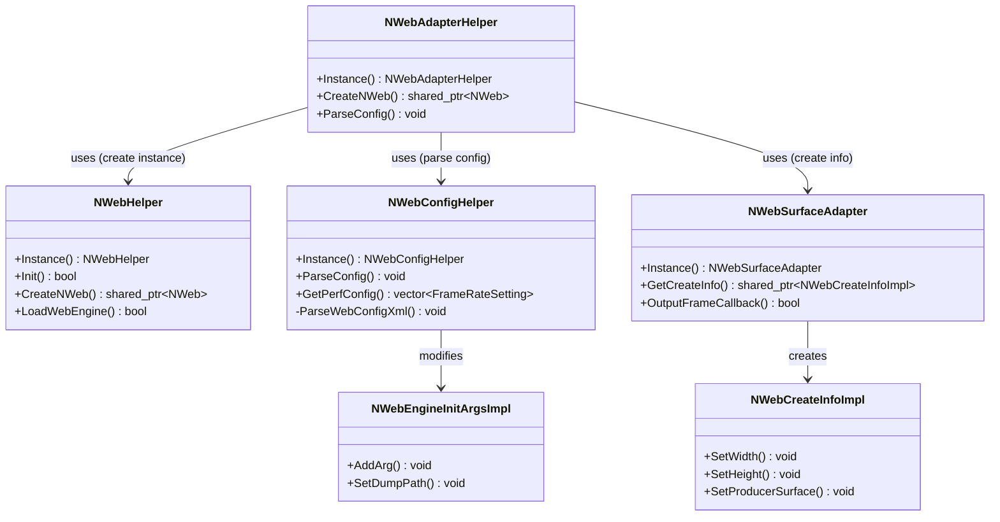
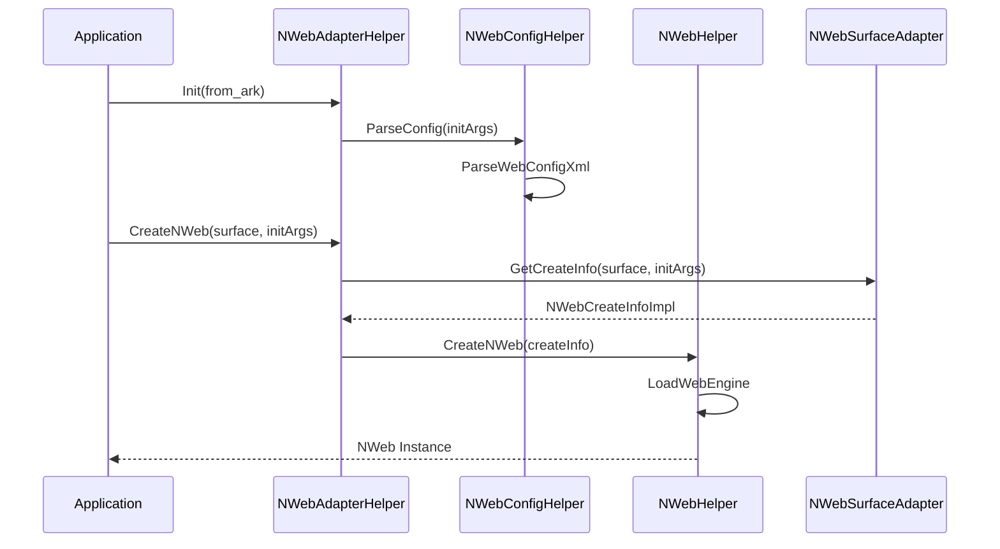

# NWeb 接口层模块设计文档

## 1. 模块简介

`include` 模块作为 NWeb 子系统的核心接口层，承担了 Web 引擎初始化、NWeb 实例创建与管理、配置解析、渲染 Surface 适配以及 C 语言 API 暴露等关键职责。该模块向上层应用提供统一的 C++ 和 C 接口，向下通过适配器模式对接底层图形、窗口及 Web 引擎实现，是 OpenHarmony Webview 组件的基础设施层。

## 2. 功能描述

### 2.1 引擎初始化与实例创建
通过 `NWebHelper` 和 `NWebAdapterHelper` 提供的能力，负责加载 Web 引擎动态库，解析初始化参数，并创建具体的 `NWeb` 实例。支持普通模式和隐私模式的 Web 组件创建。

### 2.2 配置管理
`NWebConfigHelper` 负责解析系统配置文件（XML 格式），管理 Web 引擎的性能参数（如 LTPO 刷新率策略）、安全选项、调试开关以及开发者模式配置。

### 2.3 渲染适配
`NWebSurfaceAdapter` 和 `NWebEnhanceSurfaceAdapter` 负责处理图形 Surface 的缓冲区分配、数据拷贝与刷新，支持标准 Surface 和增强型 Surface 两种渲染模式。

### 2.4 数据结构定义
定义了引擎初始化参数 `NWebEngineInitArgsImpl`、创建信息 `NWebCreateInfoImpl`、缓存选项 `NWebCacheOptionsImpl` 等核心数据结构，用于接口层的数据传递。

### 2.5 C API 暴露
`nweb_c_api.h` 提供了纯 C 语言的 API 接口，主要封装了下载管理功能，方便非 C++ 环境调用。

### 2.6 辅助功能
包含日志打印宏（`nweb_log.h`）、事件上报（`nweb_hisysevent.h`）以及各种异步回调封装（如 Cookie 保存、快照生成、资源预编译等）。

## 3. 目录结构

```
include/
├── nweb_adapter_common.h        # 定义窗口信息和 VSync 回调信息结构体
├── nweb_adapter_helper.h       # NWeb 适配器辅助类，负责 NWeb 实例创建
├── nweb_c_api.h                # C 语言 API 接口定义，主要涉及下载管理
├── nweb_cache_options_impl.h   # 缓存选项实现类
├── nweb_config_helper.h        # 配置文件解析辅助类
├── nweb_enhance_surface_adapter.h # 增强型 Surface 适配器
├── nweb_helper.h               # 核心辅助类，管理引擎生命周期和全局配置
├── nweb_hisysevent.h           # 系统事件上报工具类
├── nweb_init_params.h          # 初始化参数、创建信息等核心数据结构定义
├── nweb_log.h                  # 日志宏定义，区分主进程与渲染进程域
├── nweb_precompile_callback.h  # 资源预编译回调封装
├── nweb_save_cookie_callback.h # Cookie 保存回调封装
├── nweb_snapshot_callback_impl.h # 屏幕快照回调实现
├── nweb_store_web_archive_callback.h # 网页归档存储回调封装
├── nweb_surface_adapter.h      # 标准 Surface 适配器
└── webview_value.h             # 通用值类型封装，支持多种数据类型
```

## 4. 架构图



## 5. 公共 API

### 5.1 NWebHelper
核心单例类，管理 Web 引擎的全局状态。

| 方法名 | 描述 |
| :--- | :--- |
| `Instance()` | 获取单例实例。 |
| `Init(bool from_ark)` | 初始化 Web 引擎环境。 |
| `CreateNWeb(std::shared_ptr<NWebCreateInfo> create_info)` | 根据创建信息创建 NWeb 实例。 |
| `LoadWebEngine(bool fromArk, bool runFlag)` | 加载 Web 引擎动态库。 |
| `GetCookieManager()` | 获取 Cookie 管理器。 |
| `SetBundlePath(const std::string& path)` | 设置应用 Bundle 路径。 |

代码引用：[include/nweb_helper.h#L50-L164](https://gitcode.com/openharmony/web_webview/blob/113588bf08178843da2a2dde72dc2990bd91afb1/include/nweb_helper.h#L50-L164)

### 5.2 NWebAdapterHelper
用于适配层创建 NWeb 的辅助类。

| 方法名 | 描述 |
| :--- | :--- |
| `Instance()` | 获取单例实例。 |
| `CreateNWeb(sptr<Surface> surface, ...)` | 基于 Surface 创建 NWeb 实例。 |
| `ParseConfig(std::shared_ptr<NWebEngineInitArgsImpl> initArgs)` | 解析配置到初始化参数中。 |

代码引用：[include/nweb_adapter_helper.h#L29-L48](https://gitcode.com/openharmony/web_webview/blob/113588bf08178843da2a2dde72dc2990bd91afb1/include/nweb_adapter_helper.h#L29-L48)

### 5.3 NWebSurfaceAdapter
Surface 适配器，处理渲染缓冲区。

| 方法名 | 描述 |
| :--- | :--- |
| `Instance()` | 获取单例实例。 |
| `GetCreateInfo(...)` | 构造 NWebCreateInfoImpl 对象。 |
| `OutputFrameCallback(...)` | 帧输出回调处理。 |

代码引用：[include/nweb_surface_adapter.h#L37-L48](https://gitcode.com/openharmony/web_webview/blob/113588bf08178843da2a2dde72dc2990bd91afb1/include/nweb_surface_adapter.h#L37-L48)

### 5.4 C API (Download Manager)
提供下载相关功能的 C 接口。

| 方法名 | 描述 |
| :--- | :--- |
| `WebDownloadManager_PutDownloadCallback` | 设置下载回调。 |
| `WebDownloader_StartDownload` | 开始下载任务。 |
| `WebDownload_Resume` | 恢复下载。 |

代码引用：[include/nweb_c_api.h#L57-L59](https://gitcode.com/openharmony/web_webview/blob/113588bf08178843da2a2dde72dc2990bd91afb1/include/nweb_c_api.h#L57-L59)

## 6. 初始化流程

模块初始化主要涉及配置解析、引擎加载和实例创建三个阶段。



**流程说明**：
1. **初始化阶段**：调用 `NWebAdapterHelper::Init`，内部调用 `NWebConfigHelper` 解析 XML 配置文件，将配置参数填充到 `NWebEngineInitArgsImpl` 中。
2. **创建信息构建**：调用 `CreateNWeb` 时，通过 `NWebSurfaceAdapter::GetCreateInfo` 将 Surface 指针和初始化参数打包为 `NWebCreateInfoImpl`。
3. **实例创建**：`NWebHelper` 根据传入的 `CreateInfo` 加载引擎库并实例化 `NWeb` 对象。

关键数据结构 `NWebCreateInfoImpl` 定义参考：[include/nweb_init_params.h#L40-L96](https://gitcode.com/openharmony/web_webview/blob/113588bf08178843da2a2dde72dc2990bd91afb1/include/nweb_init_params.h#L40-L96)

## 7. 配置说明

`NWebConfigHelper` 负责解析 Web 引擎相关的配置。主要配置项和逻辑如下：

### 7.1 配置文件解析
通过 `ParseWebConfigXml` 方法解析 XML 配置文件。配置解析逻辑参考 [include/nweb_config_helper.h#L37-L86](https://gitcode.com/openharmony/web_webview/blob/113588bf08178843da2a2dde72dc2990bd91afb1/include/nweb_config_helper.h#L37-L86)。

### 7.2 性能配置 (LTPO)
支持解析 LTPO (Low Temperature Polycrystalline Oxide) 屏幕刷新率配置，以优化 Web 内容渲染的功耗和流畅度。
- `IsLTPODynamicApp`: 判断当前应用是否启用 LTPO 动态帧率。
- `GetPerfConfig`: 获取性能相关的帧率设置。

### 7.3 安全与调试
- `IsDeveloperModeEnabled`: 检查开发者模式状态。
- `ParseNativeMessagingConfig`: 解析 Native Messaging 配置。
- `GetWebDebuggingAccess`: 获取 Web 调试开关状态。

配置参数通过 `NWebEngineInitArgsImpl` 传递给引擎，该类提供了参数设置的接口，定义见 [include/nweb_init_params.h#L98-L173](https://gitcode.com/openharmony/web_webview/blob/113588bf08178843da2a2dde72dc2990bd91afb1/include/nweb_init_params.h#L98-L173)。

## 8. 回调接口

模块定义了多个回调类以处理异步操作结果：

| 回调类 | 文件 | 描述 |
| :--- | :--- | :--- |
| `NWebPrecompileCallback` | `nweb_precompile_callback.h` | 资源预编译完成回调，返回 int64_t 结果。 |
| `NWebSaveCookieCallback` | `nweb_save_cookie_callback.h` | Cookie 保存操作结果回调。 |
| `NWebSnapshotCallbackImpl` | `nweb_snapshot_callback_impl.h` | 屏幕快照生成后的回调，包含图像数据和尺寸。 |
| `NWebStoreWebArchiveCallback` | `nweb_store_web_archive_callback.h` | 网页归档存储完成回调，返回文件路径。 |

示例：`NWebSnapshotCallbackImpl` 实现了 `OnSnapshotResult` 接口，将结果转发给用户设置的回调函数。
代码引用：[include/nweb_snapshot_callback_impl.h#L28-L41](https://gitcode.com/openharmony/web_webview/blob/113588bf08178843da2a2dde72dc2990bd91afb1/include/nweb_snapshot_callback_impl.h#L28-L41)

## 9. 错误处理策略

### 9.1 日志记录
模块定义了统一的日志宏 `WVLOG_D/I/W/E/F`，自动根据当前进程 UID 区分主进程（App Domain）和渲染进程（Render Domain）的日志域，便于问题定位。
代码引用：[include/nweb_log.h#L35-L45](https://gitcode.com/openharmony/web_webview/blob/113588bf08178843da2a2dde72dc2990bd91afb1/include/nweb_log.h#L35-L45)

日志宏定义示例：
```cpp
#define WVLOG_E(fmt, ...) \
    do { \
        // ... logic to determine domain ... \
        HILOG_IMPL(LOG_CORE, LOG_ERROR, domain, HILOG_TAG, FUNC_LINE_FMT fmt, __func__, ##__VA_ARGS__); \
    } while (0)
```

### 9.2 事件上报
`EventReport` 类提供了关键事件的上报能力，用于监控 Web 实例创建耗时和 MSDP 相关错误。
- `ReportCreateWebInstanceTime`: 上报 Web 实例创建耗时。
- `ReportMSDPError`: 上报 MSDP 错误信息。

代码引用：[include/nweb_hisysevent.h#L26-L36](https://gitcode.com/openharmony/web_webview/blob/113588bf08178843da2a2dde72dc2990bd91afb1/include/nweb_hisysevent.h#L26-L36)

### 9.3 异常处理
- 在 `NWebHelper` 初始化过程中，通过检查 `initFlag_` 和 `nwebEngine_` 指针防止重复初始化或空指针访问。
- 配置解析过程中，XML 节点解析具有容错处理，通过 `safeGetPropAsInt` 等方法安全读取属性。
- Surface 适配器中检查 `SurfaceBuffer` 和 `Surface` 指针有效性，防止渲染崩溃。