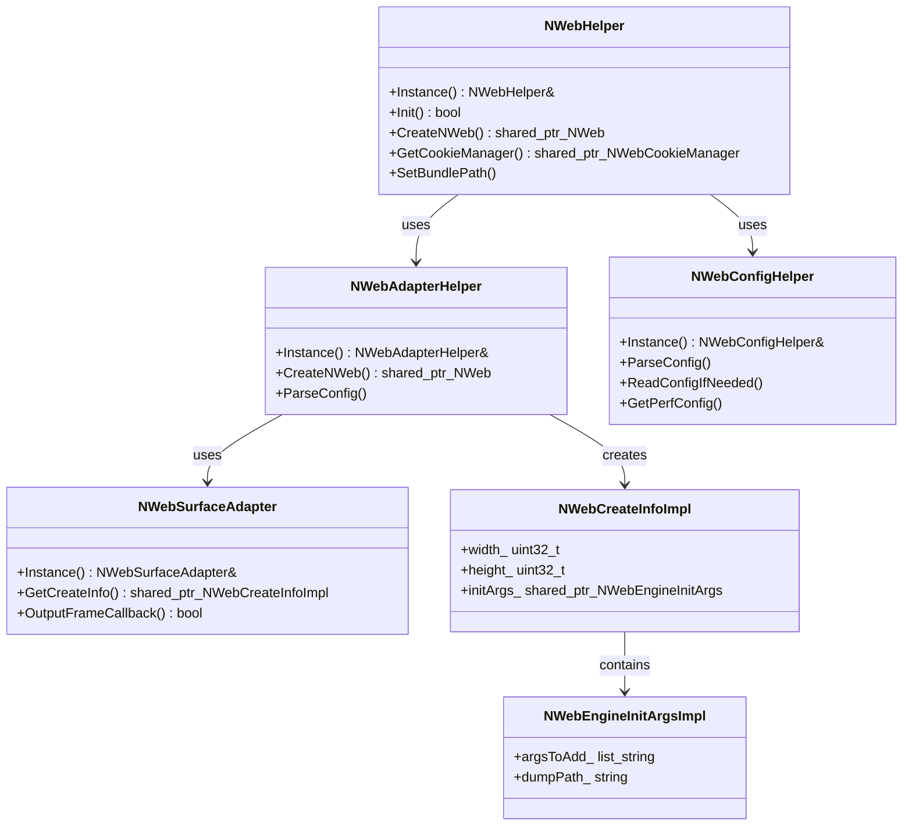
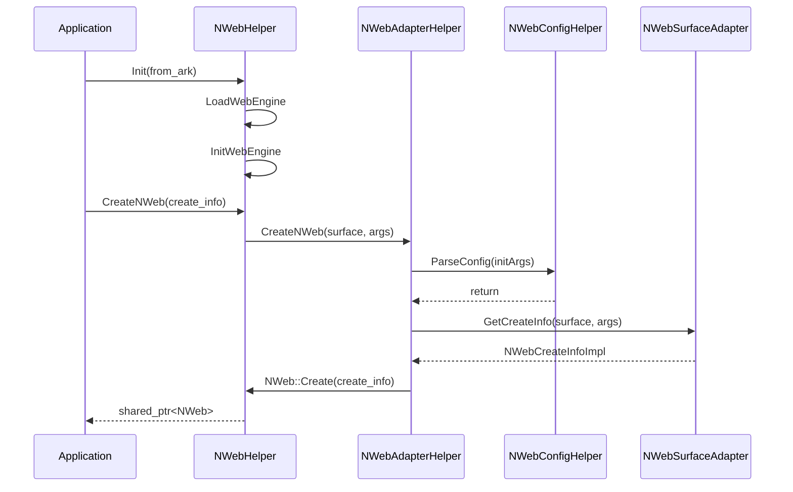

# NWeb 接口层模块设计文档

## 1. 模块简介
NWeb 接口层模块（`include` 目录）是 OpenHarmony WebView 组件的核心 C++ 公共接口层。它向上层应用框架提供稳定的 API 接口，向下对接底层 WebView 引擎实现。该模块主要职责包括：WebView 引擎的初始化与配置、NWeb 实例的创建与管理、Surface 渲染适配、下载管理 C API 暴露、系统事件上报以及数据类型的封装定义。通过这一抽象层，系统实现了上层业务与底层引擎实现的解耦。

## 2. 功能描述

### 2.1 核心管理与初始化
- **NWebHelper**: 核心单例类，负责 WebView 引擎的加载、初始化流程控制、全局配置管理（如 Cookie、存储、代理、UserAgent）以及 NWeb 实例的创建与销毁。
- **NWebAdapterHelper**: 辅助适配器单例，协助 `NWebHelper` 完成 NWeb 实例的具体创建过程，处理初始化参数的解析与配置读取。
- **NWebConfigHelper**: 配置解析单例，负责解析 XML 格式的配置文件（如性能调优、LTPO 策略、开发者模式等），支持动态读取与缓存。

### 2.2 渲染与 Surface 适配
- **NWebSurfaceAdapter**: 处理基于 `Surface` 的渲染输出，负责图形缓冲区的请求、拷贝与刷新，适配标准图形栈。
- **NWebEnhanceSurfaceAdapter**: 处理增强型 Surface 信息，提供特殊场景下的渲染表面适配能力。
- **NWebAdapterCommon**: 定义通用的窗口信息结构（`NWebWindowInfo`）和 VSync 回调信息，用于渲染同步。

### 2.3 数据结构与会话管理
- **NWebInitParams**: 定义引擎初始化参数实现（`NWebEngineInitArgsImpl`）、实例创建信息（`NWebCreateInfoImpl`）、安全选项、预加载参数等核心数据结构。
- **WebViewValue**: 实现通用的值类型封装，支持整型、布尔、浮点、字符串、二进制、字典、数组等多种数据类型，用于跨语言/跨层数据传递。
- **NWebCacheOptionsImpl**: 封装缓存响应头的配置选项。

### 2.4 C API 接口
- **nweb_c_api.h**: 提供 C 语言风格的下载管理 API，包括下载委托回调设置、下载项状态查询、下载控制（开始、暂停、恢复、取消）等功能，便于非 C++ 环境调用。

### 2.5 回调与事件
- **NWebPrecompileCallback**: 预编译操作的回调处理。
- **NWebSaveCookieCallback**: Cookie 保存结果的异步回调。
- **NWebStoreWebArchiveCallback**: 网页归档保存结果的异步回调。
- **NWebSnapshotCallbackImpl**: 截图操作的回调实现。
- **EventReport**: 负责向 HiSysEvent 上报系统事件，如 Web 实例创建耗时、特定内容高亮事件及 MSDP 错误。

### 2.6 日志系统
- **nweb_log.h**: 定义了统一的日志宏（WVLOG_D/I/W/E/F），能够根据进程 UID 自动区分应用进程域和渲染进程域，实现日志分类输出。

## 3. 目录结构
```text
include/
├── nweb_adapter_common.h       # 通用适配结构定义，如窗口信息、VSync 信息
├── nweb_adapter_helper.h       # NWeb 适配辅助类，负责实例创建与配置解析
├── nweb_c_api.h                # 下载管理相关的 C 语言 API 接口定义
├── nweb_cache_options_impl.h   # 缓存选项实现类
├── nweb_config_helper.h        # 配置文件解析辅助类
├── nweb_enhance_surface_adapter.h # 增强 Surface 适配器
├── nweb_helper.h               # 核心辅助类，管理引擎生命周期与全局功能
├── nweb_hisysevent.h           # 系统事件上报工具类
├── nweb_init_params.h          # 初始化参数、创建信息等核心数据结构定义
├── nweb_log.h                  # 日志宏定义
├── nweb_precompile_callback.h  # 预编译回调接口
├── nweb_save_cookie_callback.h # Cookie 保存回调接口
├── nweb_snapshot_callback_impl.h # 截图回调实现
├── nweb_store_web_archive_callback.h # 网页归档保存回调接口
├── nweb_surface_adapter.h      # Surface 图形适配器
└── webview_value.h             # 通用值类型封装
```

## 4. 架构图



## 5. 公共 API

### 5.1 NWebHelper (核心入口)
[include/nweb_helper.h#L44-L177](https://gitcode.com/openharmony/web_webview/blob/113588bf08178843da2a2dde72dc2990bd91afb1/include/nweb_helper.h#L44-L177)
- `static NWebHelper& Instance()`: 获取单例对象。
- `bool Init(bool from_ark = true)`: 初始化 WebView 引擎环境。
- `std::shared_ptr<NWeb> CreateNWeb(std::shared_ptr<NWebCreateInfo> create_info)`: 创建 NWeb 实例。
- `std::shared_ptr<NWebCookieManager> GetCookieManager()`: 获取 Cookie 管理器。
- `void SetBundlePath(const std::string& path)`: 设置应用 Bundle 路径。
- `std::string GetDefaultUserAgent()`: 获取默认 UserAgent。

### 5.2 NWebAdapterHelper (实例适配)
[include/nweb_adapter_helper.h#L25-L46](https://gitcode.com/openharmony/web_webview/blob/113588bf08178843da2a2dde72dc2990bd91afb1/include/nweb_adapter_helper.h#L25-L46)
- `static NWebAdapterHelper &Instance()`: 获取单例对象。
- `std::shared_ptr<NWeb> CreateNWeb(...)`: 创建 NWeb 实例（重载方法，支持 Surface 和增强 Surface）。
- `void ParseConfig(std::shared_ptr<NWebEngineInitArgsImpl> initArgs)`: 解析配置到启动参数。

### 5.3 NWebConfigHelper (配置解析)
[include/nweb_config_helper.h#L31-L84](https://gitcode.com/openharmony/web_webview/blob/113588bf08178843da2a2dde72dc2990bd91afb1/include/nweb_config_helper.h#L31-L84)
- `void ReadConfigIfNeeded()`: 按需读取配置文件。
- `std::vector<FrameRateSetting> GetPerfConfig(const std::string& settingName)`: 获取性能帧率配置。
- `bool IsLTPODynamicApp(const std::string& bundleName)`: 判断是否为 LTPO 动态帧率应用。

### 5.4 C API (下载管理)
[include/nweb_c_api.h#L46-L109](https://gitcode.com/openharmony/web_webview/blob/113588bf08178843da2a2dde72dc2990bd91afb1/include/nweb_c_api.h#L46-L109)
- `WebDownloadManager_PutDownloadCallback`: 设置下载回调。
- `WebDownloader_StartDownload`: 开始下载。
- `WebDownload_Resume`, `WebDownload_Pause`, `WebDownload_Cancel`: 控制下载生命周期。

## 6. 初始化流程



## 7. 配置说明

### 7.1 引擎初始化参数
[include/nweb_init_params.h#L108-L198](https://gitcode.com/openharmony/web_webview/blob/113588bf08178843da2a2dde72dc2990bd91afb1/include/nweb_init_params.h#L108-L198)
`NWebEngineInitArgsImpl` 类封装了传递给底层引擎的命令行参数：
- `argsToAdd_`: 需添加的启动参数列表。
- `argsToDelete_`: 需移除的默认参数列表。
- `dumpPath_`: Dump 文件路径。
- `isMultiRendererProcess_`: 是否启用多渲染进程模式。

### 7.2 实例创建信息
[include/nweb_init_params.h#L43-L106](https://gitcode.com/openharmony/web_webview/blob/113588bf08178843da2a2dde72dc2990bd91afb1/include/nweb_init_params.h#L43-L106)
`NWebCreateInfoImpl` 类封装了创建 Web 实例所需的运行时信息：
- `width_`, `height_`: 实例尺寸。
- `producerSurface_`: 生产者 Surface 指针。
- `isIncognitoMode_`: 是否隐私模式。

### 7.3 XML 配置解析
`NWebConfigHelper` 负责解析系统配置文件，主要包括：
- **LTPO 配置**: 解析 `ParseNWebLTPOConfig`，获取动态帧率策略。
- **性能配置**: `GetPerfConfig` 获取帧率设定。
- **开发者选项**: `IsDeveloperModeEnabled` 检查开发者模式状态。

## 8. 回调接口

### 8.1 下载回调 (C API)
[include/nweb_c_api.h#L36-L44](https://gitcode.com/openharmony/web_webview/blob/113588bf08178843da2a2dde72dc2990bd91afb1/include/nweb_c_api.h#L36-L44)
定义了 `OnDownloadBeforeStart` 和 `OnDownloadDidUpdate` 等函数指针类型，用于在下载生命周期关键节点通知调用者。

### 8.2 截图回调
[include/nweb_snapshot_callback_impl.h#L26-L44](https://gitcode.com/openharmony/web_webview/blob/113588bf08178843da2a2dde72dc2990bd91afb1/include/nweb_snapshot_callback_impl.h#L26-L44)
`NWebSnapshotCallbackImpl` 实现 `NWebSnapshotCallback` 接口，封装了截图结果（像素数据、宽高、比例）的异步返回逻辑。

### 8.3 归档与 Cookie 回调
- `NWebStoreWebArchiveCallback`: 用于接收网页保存为归档文件后的文件路径结果。
- `NWebSaveCookieCallback`: 用于接收 Cookie 强制保存操作的布尔结果。

## 9. 错误处理策略

### 9.1 日志分级
[include/nweb_log.h#L31-L64](https://gitcode.com/openharmony/web_webview/blob/113588bf08178843da2a2dde72dc2990bd91afb1/include/nweb_log.h#L31-L64)
模块定义了 `WVLOG_D/I/W/E/F` 宏。日志系统通过 `getuid()` 和 `BASE_USER_RANGE_FOR_NWEB` 计算渲染进程 ID，自动区分 `LOG_APP_DOMAIN` 和 `LOG_RENDER_DOMAIN`，确保应用进程与渲染进程的日志隔离。

### 9.2 异常上报
[include/nweb_hisysevent.h#L23-L36](https://gitcode.com/openharmony/web_webview/blob/113588bf08178843da2a2dde72dc2990bd91afb1/include/nweb_hisysevent.h#L23-L36)
`EventReport` 类提供静态方法用于关键问题上报：
- `ReportCreateWebInstanceTime`: 监控实例创建耗时。
- `ReportHighlightSpecifiedContentEvent`: 上报特定内容高亮事件。
- `ReportMSDPError`: 上报 MSDP (Motion/Stylus/Drag & Pinch) 相关错误。

### 9.3 值类型错误封装
[include/webview_value.h#L24-L148](https://gitcode.com/openharmony/web_webview/blob/113588bf08178843da2a2dde72dc2990bd91afb1/include/webview_value.h#L24-L148)
`WebViewValue` 类提供了 `SetErrName` 和 `SetErrMsg` 方法，允许在跨层数据传递中封装错误名称和信息，而非直接抛出 C++ 异常，保证 Native 层接口的稳定性。