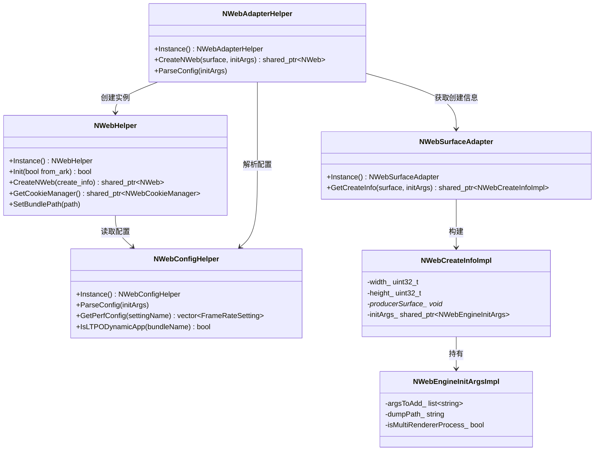
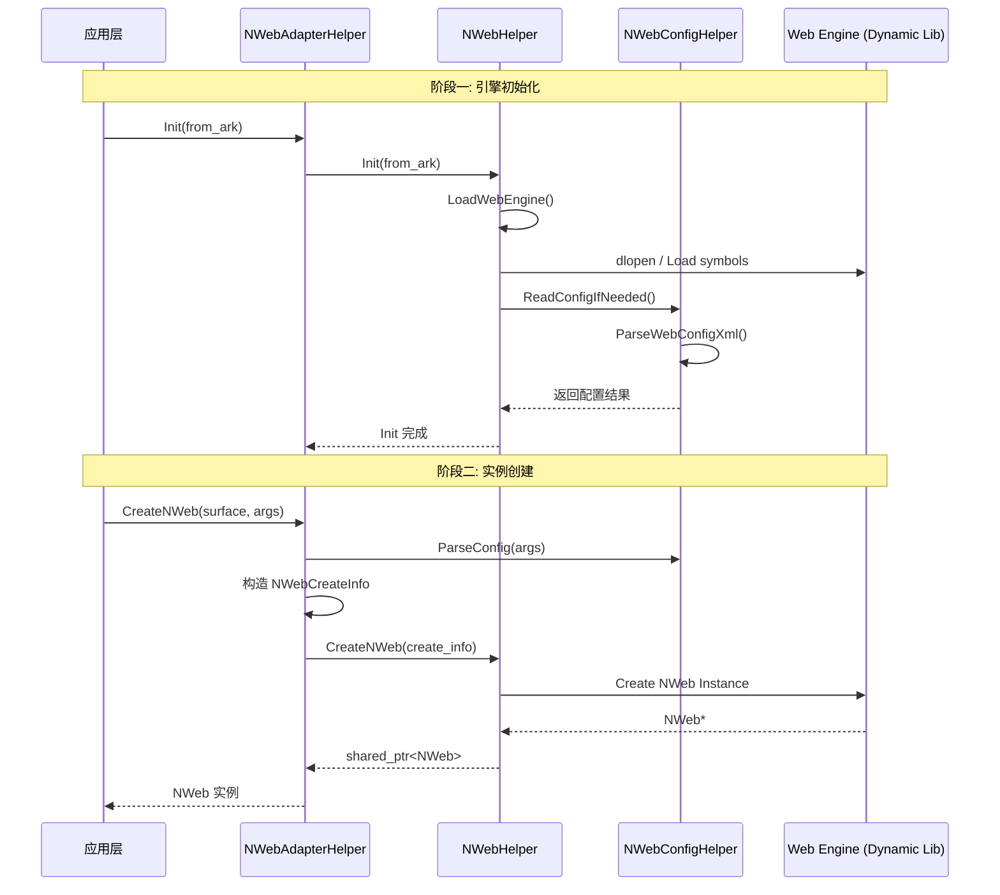

# NWeb 接口层模块设计文档

## 1. 模块简介

`include` 模块作为 OpenHarmony WebView 子系统的核心接口层，起到了承上启下的关键作用。它向上屏蔽了底层 Web 引擎的实现细节，为应用框架层提供统一的 C++ 和 C API 接口；向下则封装了平台相关的初始化参数、配置解析、Surface 渲染适配及生命周期管理。

该模块主要负责：定义 WebView 核心数据结构（如初始化参数、配置选项），提供 Web 引擎加载与初始化入口（`NWebHelper`），管理平台适配逻辑（`NWebAdapterHelper`），解析系统配置文件（`NWebConfigHelper`），以及提供下载管理、日志上报等辅助功能的接口定义与默认实现。

## 2. 功能描述

### 2.1 核心引擎管理
通过 `NWebHelper` 单例类管理 Web 引擎的动态库加载、初始化及运行。支持设置 Bundle 路径、HTTP DNS、代理配置、用户代理（UA）等全局设置，并提供了预连接、资源预加载等性能优化接口。

### 2.2 配置解析与管理
`NWebConfigHelper` 负责 XML 配置文件的解析，管理 LTPO 动态帧率策略、加载 URL 策略、开发者模式开关等。支持运行时读取配置并写入系统参数，提供查询接口（如 `IsLTPODynamicApp`, `GetWebDebuggingAccess`）。

### 2.3 实例创建与适配
`NWebAdapterHelper` 协调 `NWebSurfaceAdapter` 和 `NWebEnhanceSurfaceAdapter`，将图形侧的 Surface 信息与引擎初始化参数封装为 `NWebCreateInfo`，支持普通 Surface 和增强 Surface 两种渲染模式，用于创建 `NWeb` 实例。

### 2.4 参数与数据结构封装
定义了丰富的参数实现类：
- `NWebCreateInfoImpl`：封装创建 Web 实例所需的宽高、Surface、初始化参数等。
- `NWebEngineInitArgsImpl`：封装引擎启动命令行参数、Dump 路径、多进程模式等。
- `WebViewValue`：通用的值容器，支持基本数据类型、数组及字典结构，用于跨层数据传递。

### 2.5 C 语言接口层
提供了一套完整的 C 语言 API（`nweb_c_api.h`），主要用于下载管理功能。支持下载任务的创建、暂停、恢复、取消及状态查询，方便非 C++ 环境或跨语言调用。

### 2.6 辅助功能
- **日志系统**：`nweb_log.h` 定义了分级日志宏，自动区分 App 进程与 Render 进程的日志域。
- **事件上报**：`nweb_hisysevent.h` 提供关键性能指标（如实例创建耗时）和错误信息的上报接口。
- **回调实现**：提供了 Cookie 保存、截图、归档存储等异步操作的回调接口实现。

## 3. 目录结构

```
include/
├── nweb_adapter_common.h       # 定义窗口信息和 Vsync 回调信息结构体
├── nweb_adapter_helper.h       # NWeb 适配帮助类，协调配置与 Surface 创建实例
├── nweb_c_api.h                # C 语言 API 定义，主要包含下载管理接口
├── nweb_cache_options_impl.h   # 缓存选项实现类
├── nweb_config_helper.h        # 配置文件解析帮助类（XML解析、策略管理）
├── nweb_enhance_surface_adapter.h # 增强 Surface 适配器
├── nweb_helper.h               # 核心 NWeb 引擎管理单例类定义
├── nweb_hisysevent.h           # 系统事件（HiSysEvent）上报接口
├── nweb_init_params.h          # 引擎初始化参数、创建信息等数据结构定义
├── nweb_log.h                  # 日志宏定义，区分进程域
├── nweb_precompile_callback.h  # 预编译回调接口实现
├── nweb_save_cookie_callback.h  # Cookie 保存回调接口实现
├── nweb_snapshot_callback_impl.h # 截图回调接口实现
├── nweb_store_web_archive_callback.h # 网页归档存储回调接口实现
├── nweb_surface_adapter.h      # 普通 Surface 适配器
└── webview_value.h             # 通用值类型容器实现
```

## 4. 架构图



## 5. 公共 API

### 5.1 核心管理类 (NWebHelper)

`NWebHelper` 是管理 WebView 引擎生命周期的核心单例类。

| API 接口 | 功能说明 |
| :--- | :--- |
| `static NWebHelper& Instance()` | 获取单例对象引用。 |
| `bool Init(bool from_ark = true)` | 初始化 Web 引擎，加载动态库。 |
| `std::shared_ptr<NWeb> CreateNWeb(std::shared_ptr<NWebCreateInfo> create_info)` | 根据创建信息创建 NWeb 实例。 |
| `void SetBundlePath(const std::string& path)` | 设置应用 Bundle 路径。 |
| `std::shared_ptr<NWebCookieManager> GetCookieManager()` | 获取 Cookie 管理器。 |
| `void PrepareForPageLoad(std::string url, bool preconnectable, int32_t numSockets)` | 预加载准备，优化首屏加载速度。 |

代码引用：
- 单例获取：[include/nweb_helper.h#L63-L64](https://gitcode.com/openharmony/web_webview/blob/113588bf08178843da2a2dde72dc2990bd91afb1/include/nweb_helper.h#L63-L64)
- 初始化接口：[include/nweb_helper.h#L66-L67](https://gitcode.com/openharmony/web_webview/blob/113588bf08178843da2a2dde72dc2990bd91afb1/include/nweb_helper.h#L66-L67)

### 5.2 适配帮助类

用于协调配置读取和实例创建。

| API 接口 | 功能说明 |
| :--- | :--- |
| `static NWebAdapterHelper &Instance()` | 获取单例对象。 |
| `std::shared_ptr<NWeb> CreateNWeb(...)` | 创建 NWeb 实例（重载，支持 Surface 和增强 Surface）。 |
| `void ParseConfig(std::shared_ptr<NWebEngineInitArgsImpl> initArgs)` | 解析配置并填充到启动参数中。 |

代码引用：
- 单例获取：[include/nweb_adapter_helper.h#L32-L33](https://gitcode.com/openharmony/web_webview/blob/113588bf08178843da2a2dde72dc2990bd91afb1/include/nweb_adapter_helper.h#L32-L33)
- 创建实例：[include/nweb_adapter_helper.h#L36-L41](https://gitcode.com/openharmony/web_webview/blob/113588bf08178843da2a2dde72dc2990bd91afb1/include/nweb_adapter_helper.h#L36-L41)

### 5.3 下载管理 C API

提供下载任务的全生命周期管理。

| API 接口 | 功能说明 |
| :--- | :--- |
| `void WebDownloader_StartDownload(int32_t nwebId, const char* url)` | 开始下载任务。 |
| `void WebDownload_Pause(const WebDownloadItemCallbackWrapper *wrapper)` | 暂停下载。 |
| `void WebDownload_Resume(const WebDownloadItemCallbackWrapper *wrapper)` | 恢复下载。 |
| `NWebDownloadItemState WebDownload_GetItemState(int32_t nwebId, long downloadItemId)` | 获取下载状态。 |

代码引用：
- 下载状态枚举：[include/nweb_c_api.h#L31-L38](https://gitcode.com/openharmony/web_webview/blob/113588bf08178843da2a2dde72dc2990bd91afb1/include/nweb_c_api.h#L31-L38)
- 开始下载接口：[include/nweb_c_api.h#L63](https://gitcode.com/openharmony/web_webview/blob/113588bf08178843da2a2dde72dc2990bd91afb1/include/nweb_c_api.h#L63)

## 6. 初始化流程

WebView 引擎的初始化流程主要分为加载动态库、解析配置和创建实例三个阶段。



## 7. 配置说明

配置管理主要由 `NWebConfigHelper` 负责，支持以下关键配置项：

1.  **性能配置**：
    - `ParsePerfConfig`：解析性能相关节点。
    - `GetPerfConfig`：获取帧率设置，支持 LTPO 屏幕的动态帧率策略。
    - `IsLTPODynamicApp`：判断当前应用是否启用 LTPO 动态帧率。

2.  **安全与策略**：
    - `GetLoadUrlStrategy`：获取 URL 加载策略。
    - `IsNativeMessagingEnabled`：检查 Native Messaging 是否启用。
    - `IsWebPlayGroundEnable`：检查 Playground 模式开关。

3.  **Web 引擎参数**：
    - 通过 `ParseConfig` 方法将 XML 配置转化为 `NWebEngineInitArgsImpl` 中的 `argsToAdd_` 和 `argsToDelete_`，最终传递给 Chromium 命令行。

代码引用：配置解析类定义 [include/nweb_config_helper.h#L34-L36](https://gitcode.com/openharmony/web_webview/blob/113588bf08178843da2a2dde72dc2990bd91afb1/include/nweb_config_helper.h#L34-L36)

## 8. 回调接口

模块提供了多个回调接口的实现，用于处理异步操作结果。

### 8.1 截图回调 (NWebSnapshotCallbackImpl)
封装了截图结果的回调，将数据通过 `WebSnapshotCallback` 传递回调用方。
代码引用：[include/nweb_snapshot_callback_impl.h#L28-L38](https://gitcode.com/openharmony/web_webview/blob/113588bf08178843da2a2dde72dc2990bd91afb1/include/nweb_snapshot_callback_impl.h#L28-L38)

### 8.2 Cookie 保存回调
用于异步接收 Cookie 保存操作的结果。
代码引用：[include/nweb_save_cookie_callback.h#L27-L30](https://gitcode.com/openharmony/web_webview/blob/113588bf08178843da2a2dde72dc2990bd91afb1/include/nweb_save_cookie_callback.h#L27-L30)

### 8.3 预编译回调
用于接收 JavaScript 预编译的结果，继承自 `NWebMessageValueCallback`。
代码引用：[include/nweb_precompile_callback.h#L27-L31](https://gitcode.com/openharmony/web_webview/blob/113588bf08178843da2a2dde72dc2990bd91afb1/include/nweb_precompile_callback.h#L27-L31)

## 9. 错误处理策略

### 9.1 日志分级
模块通过 `nweb_log.h` 定义了统一的日志宏 `WVLOG_D/I/W/E/F`。
- **进程隔离**：自动通过 `getuid()` 判断当前进程是 App 进程还是 Render 进程，并设置不同的 HiLog Domain (`LOG_APP_DOMAIN` / `LOG_RENDER_DOMAIN`)，便于日志过滤和问题定位。
- **格式化输出**：支持函数名和行号的自动追加。

代码引用：日志宏定义 [include/nweb_log.h#L71-L83](https://gitcode.com/openharmony/web_webview/blob/113588bf08178843da2a2dde72dc2990bd91afb1/include/nweb_log.h#L71-L83)

### 9.2 事件上报
通过 `EventReport` 类将关键异常和性能数据上报至 HiSysEvent 系统。
- **性能监控**：`ReportCreateWebInstanceTime` 用于上报 Web 实例创建耗时，监控启动性能。
- **错误上报**：`ReportHighlightSpecifiedContentEvent` 和 `ReportMSDPError` 用于上报特定错误事件。

代码引用：[include/nweb_hisysevent.h#L36-L43](https://gitcode.com/openharmony/web_webview/blob/113588bf08178843da2a2dde72dc2990bd91afb1/include/nweb_hisysevent.h#L36-L43)

### 9.3 空指针与参数校验
在数据结构实现中（如 `NWebCreateInfoImpl`, `NWebEngineInitArgsImpl`），虽然头文件主要定义结构，但在实际使用中通过 `shared_ptr` 管理生命周期，避免内存泄漏。接口层设计使用了默认参数和空指针检查（如 `nweb_save_cookie_callback.h` 中的 `if (callback_)`）来防止空指针崩溃。