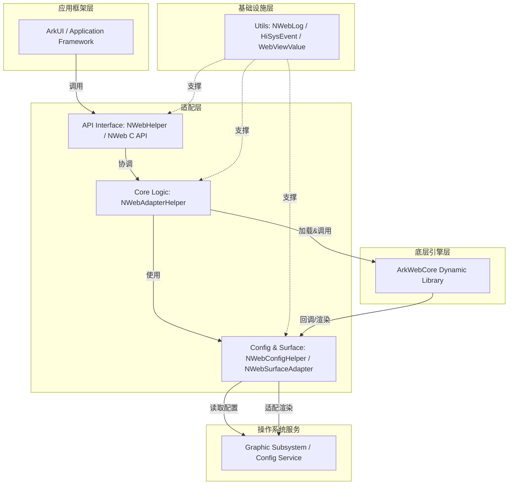
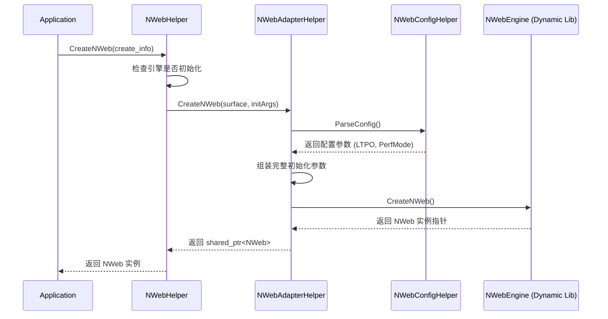

# nweb_adapter QA 导航指南

## 1. 项目概要

`nweb_adapter` 是 OpenHarmony WebView 子系统的核心适配层组件，构建产物主要为 `libnweb.so`。该项目的核心目标是实现上层应用框架与底层 Web 引擎（如 Chromium 内核）的解耦。它通过动态加载机制封装底层引擎细节，向上提供稳定的 C++ 和 C API 接口。项目解决了 WebView 组件的平台无关性问题，负责管理 Web 引擎的完整生命周期、渲染 Surface 适配、系统配置解析以及诊断日志上报，是 OpenHarmony 图形系统中 Web 内容展示的关键桥梁。

## 2. 入口点

本项目是一个系统级共享库，而非独立可执行应用程序，因此其入口点主要体现为 API 调用接口、初始化函数及独立的辅助进程。

| 入口类型 | 入口名称/标识 | 源文件位置 | 作用与触发方式 |
| :--- | :--- | :--- | :--- |
| **核心 API 入口** | `NWebHelper::Instance()` | `include/nweb_helper.h`   `src/nweb_helper.cpp` | **单例获取入口**。应用框架启动 WebView 服务时调用，用于获取适配器实例，是所有后续操作的前提。 |
| **初始化入口** | `NWebHelper::Init()` | `include/nweb_helper.h`   `src/nweb_helper.cpp` | **引擎初始化入口**。在 `Instance` 获取后调用，负责加载 `ArkWebCore.hap` 中的动态库，组装初始化参数，完成底层引擎的启动。 |
| **实例创建入口** | `NWebHelper::CreateNWeb()` | `include/nweb_helper.h` | **NWeb 实例创建入口**。触发 Web 实例的创建流程，关联窗口信息与初始化参数，返回 NWeb 实例对象。 |
| **C API 入口** | `nweb_c_api.h` 中的函数 | `include/nweb_c_api.h` | **C 语言接口入口**。提供给不支持 C++ 的模块使用，主要是下载管理相关功能的 C 封装。 |
| **辅助进程入口** | `main()` (Crashpad Handler) | `src/nweb_crashpad_handler_main.cpp` | **崩溃处理入口**。编译为独立的 `arkweb_crashpad_handler` 可执行文件，由主进程在启动时拉起，用于监听和处理 Web 引擎崩溃，生成 Minidump 文件。 |
| **配置入口** | `web_config.xml` | `etc/web_config.xml` | **配置文件入口**。系统启动或配置更新时由 `NWebConfigHelper` 解析，控制 LTPO 帧率、渲染模式等运行时行为。 |
| **构建入口** | `BUILD.gn` | `BUILD.gn` | **编译构建入口**。定义了各个模块（库、可执行文件、配置文件）的编译规则和依赖关系。 |

## 3. 模块地图

| 模块名称 | 路径 | 核心职责 | 关键文件 |
| :--- | :--- | :--- | :--- |
| **Web Engine Core** | `include/`   `src/` | 负责底层 Web 引擎动态库的加载、生命周期管理、NWeb 实例的创建与销毁，以及下载管理等 C API 接口实现。 | `nweb_helper.h`   `nweb_adapter_helper.h`   `nweb_c_api.h` |
| **Rendering & Configuration** | `include/`   `src/` | 处理图形子系统适配，管理 Surface 缓冲区分配与渲染数据流转；解析系统 XML 配置文件，提供运行时参数查询。 | `nweb_surface_adapter.h`   `nweb_config_helper.h`   `nweb_enhance_surface_adapter.h` |
| **Diagnostics & Utilities** | `include/`   `src/` | 提供统一的日志输出、HiSysEvent 事件上报、崩溃处理机制，以及跨层数据传递的通用值类型封装。 | `nweb_log.h`   `nweb_hisysevent.h`   `webview_value.h` |
| **Callback Interfaces** | `include/` | 定义异步操作回调接口，用于处理截图、存档、预编译等操作的异步结果通知。 | `nweb_snapshot_callback_impl.h`   `nweb_store_web_archive_callback.h` |
| **Configuration Resources** | `etc/` | 存放系统级配置文件和参数文件，定义 WebView 的默认行为和资源路径。 | `web_config.xml`   `web.para` |
| **Prebuilt Binaries** | `prebuilts/` | 存放预编译的 ArkWebCore HAP 包，包含底层 Web 引擎的实现。 | `ArkWebCore.hap` |

## 4. 核心抽象

项目中定义了几个关键的抽象概念，理解它们对代码定位至关重要：

- **NWebHelper (外观类)**：
  这是整个适配层的“门面”。它是一个单例类，聚合了引擎加载、配置管理、Surface 适配等功能。上层框架主要通过此类与 WebView 子系统交互。它屏蔽了底层 `NWebEngine` 实现细节，提供了 `Init`、`CreateNWeb`、`GetCookieManager` 等高层接口。

- **NWebAdapterHelper (适配助手)**：
  位于内部实现层，辅助 `NWebHelper` 完成具体的适配逻辑。它负责解析配置、组装创建参数，并调用底层接口创建 NWeb 实例。

- **NWeb (实例接口)**：
  代表一个具体的 WebView 实例。这是一个抽象接口，定义了网页加载、导航、截图、注入 JS 等具体业务操作。上层持有 `shared_ptr<NWeb>` 进行页面控制，具体实现由底层引擎动态库提供。

- **NWebSurfaceAdapter (渲染适配器)**：
  抽象了图形渲染表面的管理。它负责连接 OpenHarmony 的图形子系统与 Web 引擎的渲染输出。主要处理 BufferQueue 的交互，支持标准 Surface 模式和增强 Surface 模式（用于特定性能优化场景）。

- **NWebInitParams (初始化参数)**：
  定义了创建 NWeb 实例所需的全部信息结构体，包括窗口 ID、大小、是否透明、初始化脚本等。这是上层意图传递到底层的载体。

- **WebViewValue (通用值类型)**：
  类似于 JavaScript 的变量类型，封装了基本数据类型、字符串、列表、字典等。用于跨语言/跨层数据传递，例如在 C++ 层和底层引擎之间传递复杂的配置或返回值。

## 5. 架构分层

项目采用典型的分层架构，通过适配器模式隔离底层实现，通过外观模式简化上层调用。

**架构说明**：
1.  **应用框架层**：调用者，不感知底层实现。
2.  **适配层**：
    *   **API Interface**：暴露 C++ 类和 C 函数，保证 API 兼容性。
    *   **Core Logic**：处理实例创建、引擎加载、生命周期管理等核心流程编排。
    *   **Config & Surface**：与 OS 具体服务交互的子模块，处理渲染和配置。
3.  **基础设施层**：提供日志、崩溃处理、通用数据结构等工具，被上层各模块依赖。
4.  **底层引擎层**：通过动态加载技术运行时加载，与适配层通过接口解耦。
5.  **依赖规则**：上层依赖下层，下层不依赖上层；适配层通过接口隔离底层引擎的具体实现。

## 6. 关键数据流

### 6.1 WebView 实例创建流程

这是最核心的启动流程，描述了从应用请求到 Web 引擎实例生成的全过程。

### 6.2 渲染帧数据流

描述了 Web 引擎绘制内容如何显示到屏幕上。

1.  **Surface 初始化**：`NWebSurfaceAdapter` 接收上层传入的 Surface 或自行创建 Surface。
2.  **Buffer 请求**：Web 引擎（生产者）在需要绘制时，通过适配器请求 Graphic 子系统分配 Buffer。
3.  **数据写入**：引擎将光栅化后的像素数据写入 Buffer。
4.  **帧回调**：`NWebSurfaceAdapter` 接收帧可用回调，通知上层或直接触发 Surface 的 Flush 操作。
5.  **上屏**：Graphic 子系统消费 Buffer，合成上屏。

### 6.3 配置更新与生效流程

1.  **触发**：系统启动或监听到配置变更。
2.  **解析**：`NWebConfigHelper` 读取 `/etc/web_config.xml` 及 `web.para`。
3.  **存储**：解析后的参数（如 `LTPODynamicFrameRate`、`RenderProcessMode`）存储在内存结构中。
4.  **查询**：在 `NWebHelper::Init` 或创建实例时，核心逻辑模块查询 ConfigHelper 获取当前参数。
5.  **应用**：参数被组装进 `NWebInitParams` 或直接设置到底层引擎。

### 6.4 崩溃处理流程

1.  **启动**：主进程在初始化时拉起 `arkweb_crashpad_handler` 独立进程。
2.  **监听**：Handler 进程通过 IPC 机制监听主进程及渲染进程的异常信号。
3.  **捕获**：发生 Crash 时，Handler 捕获信号，挂起线程。
4.  **生成**：生成 Minidump 文件，写入指定目录。
5.  **上报**：`NWebHiSysEvent` 记录崩溃事件，后续可上传至云端分析平台。

## 7. 外部依赖

| 依赖名称 | 用途 | 在代码中的使用位置 |
| :--- | :--- | :--- |
| **OpenHarmony Graphic Subsystem** | 提供 Surface 管理、Buffer 分配、渲染合成能力。 | `nweb_surface_adapter.cpp` (创建生产者 Surface，请求 Buffer) |
| **libxml2** | 解析 XML 格式的配置文件 `web_config.xml`。 | `nweb_config_helper.cpp` (解析 XML 节点) |
| **HiLog** | OpenHarmony 标准日志系统，用于输出调试和运行时日志。 | `nweb_log.h` (封装日志宏，全模块使用) |
| **HiSysEvent** | OpenHarmony 系统事件打点工具，用于性能监控和故障上报。 | `nweb_hisysevent.cpp` (上报创建耗时、崩溃事件) |
| **ArkWebCore.hap** | 包含实际的 Web 引擎动态库，是适配的核心目标。 | `nweb_helper.cpp` (动态加载 HAP 中的 so 文件) |
| **Ability Kit** | 获取应用上下文、路径等信息。 | `nweb_adapter_helper.cpp` (获取 Bundle 路径等) |

## 8. 代码约定

为了保持代码的一致性和可维护性，项目遵循以下约定：

- **命名规范**：
  - 类名使用大驼峰命名，以 `NWeb` 开头，例如 `NWebHelper`, `NWebSurfaceAdapter`。
  - 函数名使用大驼峰命名，例如 `CreateNWeb`, `Init`。
  - 成员变量使用小驼峰命名，以下划线结尾，例如 `nwebEngine_`。
  - 文件名使用小写字母加下划线，例如 `nweb_helper.cpp`。

- **文件组织**：
  - 头文件统一放置在 `include/` 目录下。
  - 实现文件统一放置在 `src/` 目录下。
  - 配置文件和资源放置在 `etc/` 或 `prebuilts/` 目录下。

- **模块导出**：
  - 对外公开的 API 类通常包含 `static Instance()` 单例方法。
  - 使用工厂模式或抽象基类隐藏实现细节（如 `NWeb` 接口）。

- **异步处理**：
  - 耗时操作（如存档、截图）通过 Callback 接口异步返回结果，Callback 定义在 `include/` 目录下，以 `Callback` 结尾。

- **错误处理与日志**：
  - 关键流程使用 `NWEB_LOG*` 宏记录日志，日志级别区分 INFO、WARN、ERROR。
  - 日志中会区分 App 进程和 Render 进程的上下文。
  - 系统级错误通过 HiSysEvent 上报。

- **配置管理**：
  - 新增配置项需参考 `HOW_TO_ADD_PARAM_CONFIG.md` 和 `HOW_TO_ADD_XML_CONFIG.md`。
  - 默认配置在 `etc/` 下，代码中需对配置缺失或解析失败做容错处理。

## 9. 已知设计决策

### 决策：动态加载 Web 引擎

- **背景**：Web 引擎（如 Chromium）体积巨大且版本迭代快，直接编译进系统镜像会导致镜像体积过大且难以独立升级。
- **选择**：采用动态加载机制，将引擎打包为 HAP (`ArkWebCore.hap`)，在运行时由 `NWebHelper` 动态加载 `so`。
- **权衡**：优点是实现了引擎与系统的解耦，支持独立升级，减少了基础镜像体积；缺点是首次启动时会有加载开销，且需要处理加载失败的异常情况。

### 决策：独立 Crashpad 处理进程

- **背景**：Web 引擎是崩溃高发区，且多进程架构下的崩溃捕获复杂。
- **选择**：实现独立的 `arkweb_crashpad_handler` 进程，利用 Crashpad 机制捕获崩溃。
- **权衡**：优点是崩溃捕获更稳定，不易受主进程崩溃影响，生成 Minidump 文件便于离线分析；缺点是引入了额外的进程资源开销和进程间通信的复杂性。

### 决策：双 Surface 渲染模式

- **背景**：不同应用场景对渲染性能和功耗的要求不同。
- **选择**：支持标准 Surface 和增强 Surface (`NWebEnhanceSurfaceAdapter`) 两种模式。
- **权衡**：标准模式兼容性好，适合一般场景；增强模式允许更底层的 Buffer 控制，可能带来性能提升（如 LTPO 动态帧率），但增加了代码复杂度和对图形子系统的依赖。配置解析模块会根据设备能力动态选择模式。

### 决策：统一的 C API 层

- **背景**：部分系统组件或底层模块仅支持 C 语言接口。
- **选择**：在 C++ 适配层之上额外封装一层纯 C API (`nweb_c_api.h`)。
- **权衡**：虽然增加了一层封装，但极大地提高了组件在不同语言环境下的可移植性，特别是针对下载管理等非核心但必要的功能。