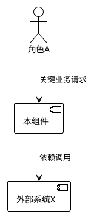
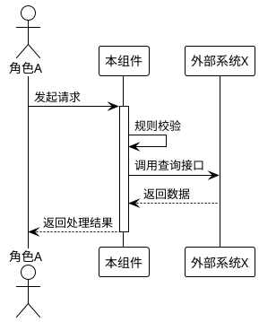
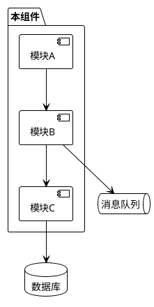
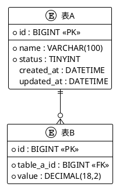
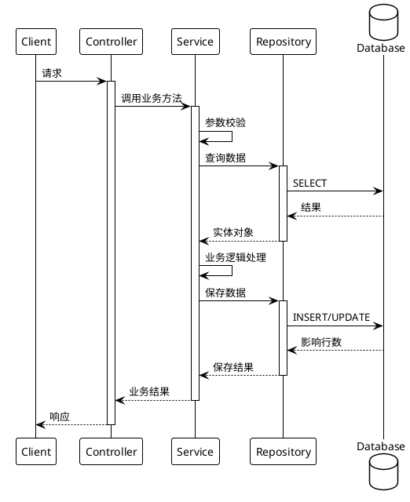
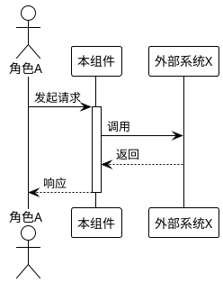
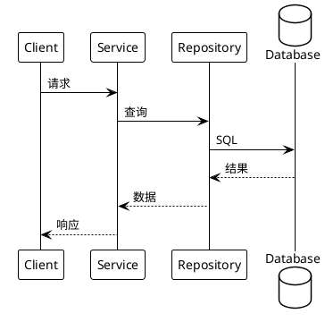
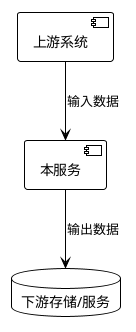

# MatSpec 模板全集

本文档由 `templates/` 下所有 Markdown 模板拼接生成。

---

## templates/full/SPEC.md

# [组件名称] 规格说明书

## 1. 组件定位

### 1.1 核心职责

本组件负责[核心业务动作]，为[上游用户/系统]提供[服务能力]，是[所属子系统]的关键组成部分。

### 1.2 核心输入

1. [来源A]：[业务实体/信号]
2. [来源B]：[业务实体/信号]

### 1.3 核心输出

1. [目标A]：[业务实体/报表]
2. [目标B]：[通知/事件]

### 1.4 职责边界（本组件不负责）

1. [明确排除的职责A]
2. [明确排除的职责B]

## 2. 领域术语

**术语名称1**
: 术语的严格业务定义。
: 备注：可选的补充说明或别名。

**术语名称2**
: 术语的严格业务定义。

## 3. 角色与边界

### 3.1 核心角色

1. **角色A**：[描述，如：发起交易的终端用户]
2. **角色B**：[描述，如：进行风控审核的运营人员]

### 3.2 外部系统

1. **系统X**：[描述，如：第三方支付网关]
2. **系统Y**：[描述，如：集团统一认证服务]

### 3.3 交互上下文



## 4. DFX 约束

### 4.1 性能

1. **响应时间**：[如：核心接口 TP99 低于 200 毫秒]
2. **吞吐量**：[如：支持 1000 QPS]
3. **资源水位**：[如：单实例堆内存占用不超过 2GB]

### 4.2 可靠性

1. **可用性**：[如：承诺 99.9% 可用性]
2. **故障恢复**：[如：依赖服务宕机时，必须降级为只读模式]
3. **数据一致性**：[如：涉及资金流转必须保证强一致性]

### 4.3 安全性

1. **认证鉴权**：[如：禁止匿名访问，必须校验 Token 有效性]
2. **数据保护**：[如：身份证号必须脱敏传输与存储]
3. **审计要求**：[如：所有写操作必须记录操作人 IP]

### 4.4 可维护性

1. **监控**：[如：必须暴露 Prometheus 指标]
2. **日志**：[如：日志必须包含 TraceID]

### 4.5 兼容性

1. **接口兼容**：[如：API 变更需兼容至少一个旧版本]
2. **数据迁移**：[如：新旧数据格式需并存过渡]

## 5. 核心能力

### 5.1 [功能模块A名称]

#### 5.1.1 业务规则

1. **规则名称**：[详细描述，例如：订单金额必须大于零]
   - **验收条件**：输入金额 -1，系统返回错误码 E4001；输入金额 0，系统返回错误码 E4001。
2. **规则名称**：[详细描述，例如：状态流转]
   - **验收条件**：当前状态为"待支付"时，接收"支付成功"事件，状态变更为"已支付"。
3. **禁止项**：[详细描述，例如：禁止删除已生效的配置]
   - **验收条件**：对状态为"生效中"的记录发起删除请求，系统拒绝并提示错误。

#### 5.1.2 交互流程



#### 5.1.3 异常场景

1. **场景：外部依赖超时**
   - **触发条件**：外部系统 X 响应时间超过 3 秒。
   - **系统行为**：自动重试 1 次；若仍失败，熔断并记录错误日志。
   - **用户感知**：收到"系统繁忙，请稍后重试"的提示。
2. **场景：并发冲突**
   - **触发条件**：两个用户同时修改同一条记录。
   - **系统行为**：采用乐观锁机制，后提交的请求失败。
   - **用户感知**：收到"数据版本已过期，请刷新后重试"的提示。

### 5.2 [功能模块B名称]

...

## 6. 数据约束

### 6.1 [领域对象A]

1. **标识符**：全局唯一，不可变更。
2. **名称**：必填，长度限制 1-100 字符，禁止包含特殊符号。
3. **类型**：枚举值，仅限于 [类型X, 类型Y, 类型Z]。

### 6.2 [领域对象B]

1. **关联**：必须关联一个有效的 [领域对象A]。
2. **有效期**：开始时间必须早于结束时间。


---

## templates/full/SPEC-annotated.md

# [组件/服务名称] 规格说明书

> **Spec 与 Design 的核心区别**
>
> 本文档是 Spec，不是 Design。两者的本质区别在于：
>
> **Spec 回答"做什么"**
>
> 1. 描述系统对外呈现的业务行为
> 2. 定义业务规则与约束条件
> 3. 关注外部视角，把系统当作黑盒
> 4. 读者是产品经理、测试人员、业务方、AI
>
> **Design 回答"怎么做"**
>
> 1. 描述系统内部的技术实现
> 2. 定义数据库表结构、类设计、算法选型
> 3. 关注内部视角，把系统当作白盒
> 4. 读者是架构师、开发者
>
> **判定标准**
>
> 1. 如果删掉这段内容，外部用户能否感知到差异？能感知 → Spec，不能感知 → Design
> 2. 如果更换技术栈，这段内容是否需要重写？需要重写 → Design，无需重写 → Spec
>
> **严禁写入本文档的内容**
>
> 1. 数据库表结构、字段类型、索引设计
> 2. 类图、接口继承关系、函数签名
> 3. 缓存策略、消息队列主题、中间件选型
> 4. 算法实现细节、性能优化手段

---

## 1. 组件定位

> **写作指导**
>
> 本章节目的是在短时间内让读者理解这个组件是什么、边界在哪里。
>
> 常见错误：
>
> 1. 写成空泛的愿景描述
> 2. 抄袭系统设计文档的内容
> 3. 边界不清晰，什么都想做
>
> 写作原则：
>
> 1. 核心职责用一句话说清楚，不超过50字
> 2. 输入输出必须具体到数据对象级别
> 3. 职责边界必须明确写出"不做什么"

### 1.1 核心职责

> 用一句话描述本组件在系统中承担的核心业务能力。
> 格式建议：本组件负责 [动作] [业务对象]，实现 [核心价值]。

### 1.2 核心输入

> 列出本组件接收的所有外部输入，包括：
>
> 1. 上游系统的调用请求
> 2. 用户的操作指令
> 3. 定时任务的触发信号
> 4. 消息队列的订阅消息
>
> 每条输入需说明来源和内容概要。

### 1.3 核心输出

> 列出本组件对外产生的所有输出，包括：
>
> 1. 返回给调用方的响应
> 2. 发送给下游系统的请求
> 3. 推送给用户的通知
> 4. 发布到消息队列的事件
>
> 每条输出需说明目标和内容概要。

### 1.4 职责边界

> 明确列出本组件不负责的事项。
> 这是防止职责蔓延的关键章节。
>
> 写作原则：
>
> 1. 列出容易产生误解的边界地带
> 2. 列出已经明确划给其他组件的职责
> 3. 列出曾经讨论过但决定不做的功能

---

## 2. 领域术语

> **写作指导**
>
> 本章节目的是建立业务与代码共用的统一语言。
>
> 收录标准：
>
> 1. 在代码中作为类名、变量名、枚举值出现的业务概念
> 2. 在需求讨论中容易产生歧义的术语
> 3. 有特定业务含义，不同于日常理解的词汇
>
> 格式要求：
>
> 1. 使用定义列表格式，术语加粗
> 2. 定义必须是完整的陈述句
> 3. 备注为可选项，用于补充别名、反义词、易混淆项

**术语名称**
: 术语的业务定义，必须是完整的陈述句。

**术语名称**
: 术语的业务定义。
: 备注：可选的补充说明，如别名、易混淆项。

---

## 3. 角色与边界

> **写作指导**
>
> 本章节目的是明确谁会与本组件交互。
>
> 角色分类：
>
> 1. 人类角色：直接操作系统的用户类型
> 2. 外部系统：与本组件有接口调用关系的其他系统或组件
>
> 写作原则：
>
> 1. 每个角色必须有明确的职责描述
> 2. 上下文图必须使用 PlantUML 绘制
> 3. 上下文图只展示组件与外部的交互，不展示内部结构

### 3.1 核心角色

> 列出所有与本组件直接交互的人类角色。
> 格式：角色名 + 冒号 + 职责描述

### 3.2 外部系统

> 列出所有与本组件有接口调用关系的外部系统。
> 包括上游调用方和下游依赖方。
> 格式：系统名 + 冒号 + 交互内容描述

### 3.3 交互上下文

> 使用 PlantUML 绘制系统上下文图。
>
> 图中必须包含：
>
> 1. 本组件（居中）
> 2. 所有人类角色
> 3. 所有外部系统
> 4. 交互方向和交互内容的简要标注
>
> 图中禁止包含：
>
> 1. 组件内部的模块划分
> 2. 数据库、缓存等技术组件
> 3. 详细的接口参数

```plantuml
@startuml
!theme plain
' 在此绘制上下文图
@enduml
```

---

## 4. DFX约束

> **写作指导**
>
> 本章节目的是前置定义非功能性红线。
>
> DFX 约束会直接影响业务规则的设计，因此必须放在核心能力之前。
>
> 写作原则：
>
> 1. 每条约束必须是可量化、可验证的
> 2. 避免使用"尽量""适当"等模糊词汇
> 3. 如无明确要求，可标注"待定"，但不可留空

### 4.1 性能

> 定义响应时间、吞吐量、资源占用等性能红线。
>
> 常见指标：
>
> 1. 核心接口响应时间上限
> 2. 系统吞吐量下限
> 3. 单实例资源占用上限

### 4.2 可靠性

> 定义可用性、故障恢复、数据一致性等可靠性要求。
>
> 常见指标：
>
> 1. 系统可用性目标
> 2. 故障恢复时间上限
> 3. 数据一致性级别

### 4.3 安全性

> 定义认证鉴权、数据加密、审计日志等安全要求。
>
> 常见要求：
>
> 1. 接口认证方式
> 2. 敏感数据加密要求
> 3. 关键操作审计要求

### 4.4 可维护性

> 定义监控告警、日志规范等运维支撑要求。
>
> 常见要求：
>
> 1. 必须接入的监控指标
> 2. 日志格式与内容规范
> 3. 链路追踪要求

### 4.5 兼容性

> 定义接口兼容、数据迁移等兼容性要求。
>
> 常见要求：
>
> 1. 接口变更的兼容策略
> 2. 存量数据的迁移要求

---

## 5. 核心能力

> **写作指导**
>
> 本章节是文档的主体，描述组件对外提供的所有业务能力。
>
> 组织原则：
>
> 1. 按业务功能模块划分二级标题
> 2. 每个模块包含三个固定子章节：业务规则、交互流程、异常场景
> 3. 模块划分应与用户心智模型对齐，而非与代码结构对齐
>
> 严禁出现：
>
> 1. 代码实现细节
> 2. 数据库操作描述
> 3. 内部函数调用链

### 5.1 [功能模块名称]

> 模块名称应使用业务语言，如"订单创建""退款处理""库存扣减"。
> 避免使用技术语言，如"写入模块""查询模块"。

#### 5.1.1 业务规则

> **写作指导**
>
> 业务规则是本模块的核心内容。
>
> 规则分类：
>
> 1. 数据校验规则：输入数据的合法性约束
> 2. 状态流转规则：业务对象的生命周期变化
> 3. 权限控制规则：谁可以执行什么操作
> 4. 计算规则：金额、数量等业务计算逻辑
> 5. 禁止项：明确不允许的操作
>
> 格式要求：
>
> 1. 每条规则必须使用"必须""应当""禁止"等规范用语
> 2. 每条规则必须附带验收条件
> 3. 验收条件格式：触发场景 → 预期行为

1. **规则名称**：规则的完整描述

   - 验收条件：[触发场景] → [预期行为]
2. **规则名称**：规则的完整描述

   - 验收条件：[触发场景] → [预期行为]
3. **禁止项**：禁止行为的完整描述

   - 验收条件：[触发场景] → [预期行为]

#### 5.1.2 交互流程

> **写作指导**
>
> 使用 PlantUML 时序图描述本模块的主干交互流程。
>
> 图中允许出现：
>
> 1. 外部角色
> 2. 本组件（作为一个整体）
> 3. 外部系统
>
> 图中禁止出现：
>
> 1. 本组件内部的类或模块
> 2. 数据库、缓存等技术组件
> 3. 具体的字段名和参数结构
>
> 图中应体现：
>
> 1. 请求的发起方和接收方
> 2. 主要的交互步骤
> 3. 返回结果的方向

```plantuml
@startuml
!theme plain
' 在此绘制时序图
@enduml
```

#### 5.1.3 异常场景

> **写作指导**
>
> 列出本模块所有需要特殊处理的异常情况。
>
> 异常分类：
>
> 1. 输入校验失败
> 2. 业务规则冲突
> 3. 外部系统调用失败
> 4. 并发竞争冲突
> 5. 超时与重试场景
>
> 格式要求：
>
> 1. 触发条件：描述异常发生的前置条件
> 2. 系统行为：描述组件内部的处理逻辑
> 3. 用户感知：描述最终返回给用户的错误码或提示

1. **异常场景名称**

   - 触发条件：[描述]
   - 系统行为：[描述]
   - 用户感知：[错误码或提示]
2. **异常场景名称**

   - 触发条件：[描述]
   - 系统行为：[描述]
   - 用户感知：[错误码或提示]

### 5.2 [功能模块名称]

> 按照 5.1 的结构继续编写其他功能模块。

---

## 6. 数据约束

> **写作指导**
>
> 本章节定义核心领域对象的逻辑约束。
>
> **属于本章节的内容（逻辑约束）**
>
> 1. 字段的业务含义
> 2. 字段的取值范围
> 3. 字段的格式要求
> 4. 字段之间的业务关联
> 5. 字段的唯一性、必填性要求
>
> **不属于本章节的内容（实现细节）**
>
> 1. 数据库字段类型
> 2. 字段的存储方式
> 3. 索引设计
> 4. 表之间的外键关系
>
> 格式要求：
>
> 1. 按领域对象划分二级标题
> 2. 每个字段用列表项描述
> 3. 字段名加粗，后接冒号和约束描述

### 6.1 [领域对象名称]

> 领域对象应与领域术语章节中定义的术语对应。
> 每个字段的约束必须是可验证的。

1. **字段名**：约束描述
2. **字段名**：约束描述
3. **字段名**：约束描述

### 6.2 [领域对象名称]

1. **字段名**：约束描述
2. **字段名**：约束描述


---

## templates/full/DESIGN.md

# [组件名称] 实现设计文档

## 1. 设计概述

### 1.1 设计目标

本设计文档描述[组件名称]的技术实现方案，基于 SPEC.md 中定义的功能规格进行详细设计。

### 1.2 设计约束

1. [约束1：如技术栈限制]
2. [约束2：如性能要求]
3. [约束3：如兼容性要求]

## 2. 系统架构

### 2.1 架构概览



### 2.2 模块职责

| 模块 | 职责 | 技术选型 |
|------|------|----------|
| 模块A | [职责描述] | [技术/框架] |
| 模块B | [职责描述] | [技术/框架] |
| 模块C | [职责描述] | [技术/框架] |

### 2.3 技术栈

| 类别 | 技术选型 | 版本 | 说明 |
|------|----------|------|------|
| 语言 | [如：Java] | [如：17] | |
| 框架 | [如：Spring Boot] | [如：3.x] | |
| 数据库 | [如：MySQL] | [如：8.0] | |
| 缓存 | [如：Redis] | [如：7.x] | |
| 消息队列 | [如：Kafka] | [如：3.x] | |

## 3. 数据模型

### 3.1 ER 图



### 3.2 表结构设计

#### 3.2.1 表A

| 字段 | 类型 | 约束 | 说明 |
|------|------|------|------|
| id | BIGINT | PK, AUTO_INCREMENT | 主键 |
| name | VARCHAR(100) | NOT NULL | 名称 |
| status | TINYINT | NOT NULL, DEFAULT 0 | 状态：0-待处理，1-处理中，2-已完成 |
| created_at | DATETIME | NOT NULL | 创建时间 |
| updated_at | DATETIME | NOT NULL | 更新时间 |

**索引设计**：

| 索引名 | 字段 | 类型 | 说明 |
|--------|------|------|------|
| idx_status | status | BTREE | 状态查询优化 |
| idx_created_at | created_at | BTREE | 时间范围查询优化 |

#### 3.2.2 表B

...

## 4. 接口设计

### 4.1 接口清单

| 方法 | 路径 | 说明 | 认证 |
|------|------|------|------|
| POST | /api/v1/resource | 创建资源 | 是 |
| GET | /api/v1/resource/{id} | 查询资源 | 是 |
| PUT | /api/v1/resource/{id} | 更新资源 | 是 |
| DELETE | /api/v1/resource/{id} | 删除资源 | 是 |

### 4.2 接口详设

#### 4.2.1 创建资源

**请求**：

```http
POST /api/v1/resource
Content-Type: application/json
Authorization: Bearer {token}

{
  "name": "示例名称",
  "type": "TYPE_A"
}
```

**响应**：

```json
{
  "code": 0,
  "message": "success",
  "data": {
    "id": 12345,
    "name": "示例名称",
    "type": "TYPE_A",
    "status": 0,
    "createdAt": "2024-01-01T00:00:00Z"
  }
}
```

**错误码**：

| 错误码 | HTTP状态码 | 说明 |
|--------|-----------|------|
| E4001 | 400 | 参数校验失败 |
| E4011 | 401 | 未认证 |
| E4031 | 403 | 无权限 |
| E5001 | 500 | 服务内部错误 |

## 5. 核心流程设计

### 5.1 [流程A名称]



**流程说明**：

1. [步骤1说明]
2. [步骤2说明]
3. [步骤3说明]

### 5.2 [流程B名称]

...

## 6. 算法设计

### 6.1 [算法A名称]

**算法描述**：[简述算法目的和原理]

**伪代码**：

```
function algorithmA(input):
    // 步骤1
    // 步骤2
    // 步骤3
    return result
```

**复杂度分析**：

- 时间复杂度：O(n)
- 空间复杂度：O(1)

## 7. 缓存设计

### 7.1 缓存策略

| 缓存Key | 数据内容 | 过期时间 | 更新策略 |
|---------|----------|----------|----------|
| resource:{id} | 资源详情 | 1小时 | Cache-Aside |
| list:resource | 资源列表 | 5分钟 | 写时失效 |

### 7.2 缓存一致性

[描述缓存与数据库的一致性保障方案]

## 8. 异常处理设计

### 8.1 异常分类

| 异常类型 | 处理方式 | 重试策略 |
|----------|----------|----------|
| 参数校验异常 | 直接返回错误 | 不重试 |
| 业务异常 | 返回业务错误码 | 不重试 |
| 外部服务超时 | 降级/熔断 | 指数退避重试3次 |
| 系统异常 | 记录日志，返回通用错误 | 不重试 |

### 8.2 熔断降级

[描述熔断降级策略]

## 9. 监控与日志

### 9.1 监控指标

| 指标名 | 类型 | 说明 |
|--------|------|------|
| api_request_total | Counter | API请求总数 |
| api_request_duration | Histogram | API请求耗时 |
| db_query_duration | Histogram | 数据库查询耗时 |

### 9.2 日志规范

| 日志级别 | 使用场景 |
|----------|----------|
| ERROR | 系统异常、影响业务的错误 |
| WARN | 可恢复的异常、潜在问题 |
| INFO | 关键业务流程节点 |
| DEBUG | 调试信息（生产环境关闭） |

## 10. 安全设计

### 10.1 认证方案

[描述认证实现方案]

### 10.2 授权方案

[描述授权实现方案]

### 10.3 数据安全

[描述敏感数据加密、脱敏方案]


---

## templates/delta/proposal.md

# [REQ编号] 需求澄清

## 0. 用户澄清记录

### 0.1 已确认决策

- [决策1：来自用户、现有 spec/design 或代码事实]
- [决策2：来自用户、现有 spec/design 或代码事实]

### 0.2 开放问题

- [ ] [进入后续阶段前必须回答的问题]
- [ ] [没有开放问题时写“无”]

### 0.3 决策账本

| 决策 | 来源 | 状态 | 影响 |
|------|------|------|------|
| [关键决策1] | [用户/spec/design/代码事实/Agent 推断] | [已确认/待确认] | [范围、验收或实现影响] |
| [关键决策2] | [来源] | [状态] | [影响] |

> 任何会影响业务范围、数据模型、迁移、兼容性、权限、可测试性或验收标准的 Agent 推断，进入下一阶段前必须确认。

## 1. 用户请求 vs 真实需求

### 1.1 用户请求

[用用户原话复述其请求。]

### 1.2 真实需求

[描述该请求背后的痛点、工作流失败、业务目标或运营问题。]

### 1.3 方案-问题检查

- **表面请求**：[功能/UI/API/配置/性能请求]
- **已确认的真实问题**：[是/否；如否，列出阻塞问题]

## 2. 问题陈述

[用可观察的方式描述问题。避免使用“优化”“灵活”“简单”“智能”“支持”“更好”等模糊词，除非写清楚可衡量结果。]

## 3. 用户、角色和场景

| 项目 | 描述 |
|------|------|
| 主要角色 | [谁遇到问题或使用能力] |
| 场景 | [角色何时、为什么需要这个变更] |
| 当前行为 | [需要保留或修改的相关现有行为] |
| 期望结果 | [可观察的最终状态] |

## 4. 成功标准

- [ ] [标准1：可观察、可验证]
- [ ] [标准2：可观察、可验证]

## 5. 范围边界

### 5.1 范围内

- [必须包含的行为或能力]

### 5.2 必须保留的现有行为

- [兼容性规则、现有工作流、API 行为、数据行为或用户可见行为]

### 5.3 输入和交互语义

对新增搜索、筛选、排序、表单输入、API 参数或配置变更，记录：

- **与既有输入的组合关系**：[AND / OR / 优先级 / 互斥 / 不适用]
- **空值行为**：[保留现有行为或定义新行为]
- **无结果行为**：[保留现有行为或定义新行为]
- **匹配语义**：[精确 / 部分 / 模糊 / 范围 / 不适用]
- **格式归一化**：[大小写、空格、标点、区域、单位或不适用]
- **兼容性**：[不可改变的现有用户、链接、API、数据或工作流]

## 6. 非目标

- [明确排除的能力]
- [延后处理的能力]

## 7. 已确认决策

| 决策 | 确认来源 | 说明 |
|------|----------|------|
| [决策] | [用户/spec/design/代码事实] | [说明] |

## 8. 假设和开放问题

### 8.1 假设

- [假设及其为什么安全，或写“无”]

### 8.2 开放问题

- [ ] [会影响 spec、design、实现边界或验收的问题，或写“无”]

## 9. 影响预览

| 领域 | 预期影响 | 说明 |
|------|----------|------|
| Spec 行为 | [新增/修改/删除/无] | [说明] |
| Design 领域 | [UI/API/数据/模型/工作流/无] | [说明] |
| DFX 约束 | [性能/可靠性/安全/兼容/无] | [说明] |
| 破坏性变更 | [是/否/未知] | [影响和迁移说明] |

---

## templates/delta/delta-spec.md

# [REQ编号] Spec 增量设计

> 本文档描述对 SPEC.md 的增量变更，使用 ADDED/MODIFIED/REMOVED 标记。
> 完成后需合并到全量 SPEC.md 中。

---

## ADDED Requirements

> 新增的业务规则和能力

### 5.X [新功能模块名称]

#### 5.X.1 业务规则

1. **规则名称**：[详细描述，使用"必须/禁止/应当"]
   - **验收条件**：[触发场景] → [预期行为]
   - **验收条件**：[触发场景] → [预期行为]

2. **规则名称**：[详细描述]
   - **验收条件**：[触发场景] → [预期行为]

3. **禁止项**：[详细描述]
   - **验收条件**：[触发场景] → [预期行为]

#### 5.X.2 交互流程



#### 5.X.3 异常场景

1. **场景：[异常场景名称]**
   - **触发条件**：[描述]
   - **系统行为**：[描述]
   - **用户感知**：[错误码或提示]

---

## MODIFIED Requirements

> 修改的现有业务规则（需写出完整修改后的内容）

### 5.Y [现有功能模块名称]

#### 5.Y.1 业务规则

1. **规则名称**：[修改后的完整描述]  ← (原为: [原描述])
   - **验收条件**：[触发场景] → [新预期行为]

---

## REMOVED Requirements

> 删除的业务规则

### 5.Z [要删除的功能模块名称]

**删除原因**：[说明为什么删除此功能]

**迁移路径**：[如适用，说明用户如何适应此删除]

---

## 数据约束变更

### ADDED

#### 6.X [新领域对象]

1. **字段1**：[约束描述]
2. **字段2**：[约束描述]

### MODIFIED

#### 6.Y [现有领域对象]

1. **字段1**：[修改后约束]  ← (原为: [原约束])

---

## 术语变更

### ADDED

**新术语名称**
: [术语定义]

### MODIFIED

**现有术语名称**
: [修改后定义]  ← (原为: [原定义])

---

## 合并检查清单

- [ ] ADDED 内容已添加到对应章节
- [ ] MODIFIED 内容已替换原有内容
- [ ] REMOVED 内容已从 SPEC.md 中删除
- [ ] 章节编号已重新整理
- [ ] PlantUML 图表可正常渲染


---

## templates/delta/delta-design.md

# [REQ编号] Design 增量设计

> 本文档描述对 DESIGN.md 的增量变更。
> 完成后需合并到全量 DESIGN.md 中。

---

## 1. 设计背景

### 1.1 设计目标

[描述本次设计要实现的技术目标]

### 1.2 设计约束

1. [约束1]
2. [约束2]

### 1.3 非目标

- [明确不在本次设计范围内的内容]
- [推迟到未来工作的内容]

---

## 2. 设计决策

### 2.1 [决策领域1]

**决策**：[清晰陈述所做的决策]

**背景**：[解释决策的背景和上下文]

**方案对比**：

| 方案 | 优点 | 缺点 |
|------|------|------|
| 方案A（采纳） | [优点] | [缺点] |
| 方案B | [优点] | [缺点] |
| 方案C | [优点] | [缺点] |

**理由**：
- [选择此方案的理由1]
- [选择此方案的理由2]

### 2.2 [决策领域2]

**决策**：[清晰陈述所做的决策]

**理由**：
- [理由1]
- [理由2]

---

## 3. 数据模型变更

### 3.1 新增表

#### 表名：[new_table]

| 字段 | 类型 | 约束 | 说明 |
|------|------|------|------|
| id | BIGINT | PK, AUTO_INCREMENT | 主键 |
| [字段名] | [类型] | [约束] | [说明] |

**索引设计**：

| 索引名 | 字段 | 类型 | 说明 |
|--------|------|------|------|
| [索引名] | [字段] | [类型] | [说明] |

### 3.2 修改表

#### 表名：[existing_table]

**新增字段**：

| 字段 | 类型 | 约束 | 说明 |
|------|------|------|------|
| [字段名] | [类型] | [约束] | [说明] |

**修改字段**：

| 字段 | 原类型 | 新类型 | 说明 |
|------|--------|--------|------|
| [字段名] | [原类型] | [新类型] | [修改原因] |

**DDL语句**：

```sql
ALTER TABLE existing_table ADD COLUMN new_field VARCHAR(100);
```

---

## 4. 接口设计变更

### 4.1 新增接口

#### POST /api/v1/new-resource

**请求**：

```json
{
  "field1": "value1",
  "field2": "value2"
}
```

**响应**：

```json
{
  "code": 0,
  "message": "success",
  "data": {
    "id": 12345
  }
}
```

**错误码**：

| 错误码 | HTTP状态码 | 说明 |
|--------|-----------|------|
| E4001 | 400 | 参数校验失败 |

### 4.2 修改接口

#### PUT /api/v1/existing-resource/{id}

**变更说明**：[描述接口变更内容]

**新增参数**：

| 参数 | 类型 | 必填 | 说明 |
|------|------|------|------|
| [参数名] | [类型] | [是/否] | [说明] |

---

## 5. 流程设计

### 5.1 [流程名称]



**流程说明**：

1. [步骤1]
2. [步骤2]
3. [步骤3]

---

## 6. 风险与缓解

| 风险 | 可能性 | 影响 | 缓解措施 |
|------|--------|------|----------|
| [风险描述] | 高/中/低 | 高/中/低 | [缓解措施] |

---

## 7. 待解决问题

- [ ] [问题1]
- [ ] [问题2]

---

## 合并检查清单

- [ ] 数据模型变更已添加到 DESIGN.md 第3节
- [ ] 接口设计变更已添加到 DESIGN.md 第4节
- [ ] 流程设计已添加到 DESIGN.md 第5节
- [ ] DDL语句已准备好执行
- [ ] PlantUML 图表可正常渲染


---

## templates/delta/tasks.md

# [REQ编号] 任务清单

> 本文档作为 AI Agent（Claude Code / Cursor）的输入，拆解为可执行的开发任务。
> 每个任务应具体到文件/模块级别。

---

## 1. 数据模型

- [ ] 创建数据库迁移脚本：`migrations/YYYYMMDD_[描述].sql`
- [ ] 新增表 `[table_name]`，包含字段：[字段列表]
- [ ] 修改表 `[table_name]`，新增字段：[字段列表]
- [ ] 创建/更新索引

## 2. 领域层

- [ ] 创建实体类：`src/domain/entities/[EntityName].ts`
- [ ] 创建值对象：`src/domain/valueObjects/[ValueObjectName].ts`
- [ ] 创建仓储接口：`src/domain/repositories/[RepositoryName].ts`

## 3. 应用层

- [ ] 创建服务类：`src/application/services/[ServiceName].ts`
  - 实现方法：`[methodName]`
  - 业务规则：[对应 delta-spec.md 中的规则编号]
- [ ] 创建 DTO：`src/application/dto/[DtoName].ts`
- [ ] 创建用例：`src/application/useCases/[UseCaseName].ts`

## 4. 基础设施层

- [ ] 创建仓储实现：`src/infrastructure/repositories/[RepositoryImpl].ts`
- [ ] 创建外部服务客户端：`src/infrastructure/clients/[ClientName].ts`

## 5. 接口层

- [ ] 创建 Controller：`src/interfaces/controllers/[ControllerName].ts`
  - `POST /api/v1/[resource]` - [描述]
  - `GET /api/v1/[resource]/{id}` - [描述]
- [ ] 创建请求验证器：`src/interfaces/validators/[ValidatorName].ts`
- [ ] 更新路由配置：`src/interfaces/routes/index.ts`

## 6. 测试

- [ ] 单元测试：`tests/unit/[ServiceName].test.ts`
  - 测试场景：[场景1]
  - 测试场景：[场景2]
- [ ] 集成测试：`tests/integration/[FeatureName].test.ts`
  - 测试场景：[场景1]
- [ ] 更新测试数据：`tests/fixtures/[fixtureName].json`

## 7. 文档更新

- [ ] 更新 API 文档：`docs/api/[resource].md`
- [ ] 完成文档链一致性验证：`validation.md`
- [ ] 合并 delta-spec.md 到 SPEC.md
- [ ] 合并 delta-design.md 到 DESIGN.md

## 8. 验证

- [ ] 运行单元测试：`npm test`
- [ ] 运行集成测试：`npm run test:integration`
- [ ] 运行 lint 检查：`npm run lint`
- [ ] 本地环境验证功能

---

## 任务依赖关系

```
1. 数据模型
    ↓
2. 领域层 ─────┐
    ↓         │
3. 应用层 ←───┘
    ↓
4. 基础设施层
    ↓
5. 接口层
    ↓
6. 测试
    ↓
7. 文档更新
    ↓
8. 验证
```

---

## AI Agent 执行指引

1. **按顺序执行**：遵循上述依赖关系，先完成依赖项
2. **参考文档**：
   - 业务规则参考：`delta-spec.md`
   - 技术设计参考：`delta-design.md`
   - 一致性验证参考：`validation.md`
   - 全量规格参考：`SPEC.md`
   - 全量设计参考：`DESIGN.md`
3. **代码规范**：遵循项目现有代码风格
4. **测试覆盖**：每个业务规则至少有一个测试用例
5. **提交粒度**：每完成一个模块可以单独提交


---

## templates/delta/validation.md

# [REQ编号] 一致性验证报告

> 本文档用于在实现前检查 proposal、delta-spec、delta-design、tasks 与全量文档之间的覆盖和冲突关系。

---

## 1. 验证概览

| 验证维度 | 状态 | 问题数 | 结论 |
|----------|------|--------|------|
| Proposal ↔ Delta-Spec | [通过/警告/不通过] | [数量] | [简述] |
| Delta-Spec ↔ Delta-Design | [通过/警告/不通过] | [数量] | [简述] |
| Delta-Design ↔ Tasks | [通过/警告/不通过] | [数量] | [简述] |
| 增量 ↔ 全量文档 | [通过/警告/不通过] | [数量] | [简述] |

**总体结论**：[可进入实现/需修订后再实现]

---

## 2. Proposal ↔ Delta-Spec 覆盖检查

| Proposal 功能点/约束 | Delta-Spec 对应规则 | 状态 | 说明 |
|----------------------|---------------------|------|------|
| [功能点1] | [规则编号/标题] | [通过/缺失/部分覆盖] | [说明] |

---

## 3. Delta-Spec ↔ Delta-Design 覆盖检查

| Delta-Spec 业务规则 | Delta-Design 对应设计 | 状态 | 说明 |
|---------------------|-----------------------|------|------|
| [规则1] | [设计章节] | [通过/缺失/部分覆盖] | [说明] |

---

## 4. Delta-Design ↔ Tasks 覆盖检查

| Delta-Design 设计项 | Tasks 对应任务 | 状态 | 说明 |
|---------------------|----------------|------|------|
| [设计项1] | [任务编号] | [通过/缺失/部分覆盖] | [说明] |

---

## 5. 与全量文档兼容性

### 5.1 SPEC.md / spec.md

| 检查项 | 状态 | 说明 |
|--------|------|------|
| 业务规则冲突 | [通过/不通过] | [说明] |
| 数据约束冲突 | [通过/不通过] | [说明] |
| 术语冲突 | [通过/不通过] | [说明] |

### 5.2 DESIGN.md / design.md

| 检查项 | 状态 | 说明 |
|--------|------|------|
| 架构决策冲突 | [通过/不通过] | [说明] |
| 接口兼容性冲突 | [通过/不通过] | [说明] |
| 数据模型冲突 | [通过/不通过] | [说明] |

---

## 6. 遗漏检查

| 类型 | 是否覆盖 | 说明 |
|------|----------|------|
| 异常场景 | [是/否/部分] | [说明] |
| 边界条件 | [是/否/部分] | [说明] |
| DFX 约束 | [是/否/部分] | [说明] |
| 测试/验证任务 | [是/否/部分] | [说明] |

---

## 7. 问题与修订建议

### 7.1 必须修复

- [问题描述]： [修订建议]

### 7.2 建议修复

- [问题描述]： [修订建议]

### 7.3 可选优化

- [问题描述]： [优化建议]

---

## 8. 验证结论

- **是否允许进入实现**：[是/否]
- **阻断问题**：[无/列出问题]
- **验证人/角色**：[姓名或角色]
- **验证日期**：[YYYY-MM-DD]


---

## templates/extension/service-context.md

# [组件/服务名称] 周边交互上下文

> 本文档描述本仓库与外部系统的交互全集。它不替代 `SPEC.md` / `spec.md` 和 `DESIGN.md` / `design.md`，仅用于补足上下游、数据流和运维依赖。

## 1. 服务定位

- **核心职责**：[一句话描述本服务职责]
- **部署形态**：[微服务/批处理/SDK/前端应用/其他]
- **所属系统**：[系统名称]

## 2. 上游调用方

| 调用方 | 调用场景 | 接口/入口 | 关键约束 |
|--------|----------|-----------|----------|
| [系统A] | [场景] | [API/消息/任务] | [鉴权、流量、SLA] |

## 3. 下游依赖

| 依赖服务 | 依赖能力 | 调用方式 | 失败影响 | 降级策略 |
|----------|----------|----------|----------|----------|
| [服务B] | [能力] | [HTTP/RPC/消息/DB] | [影响] | [策略] |

## 4. 外部系统与平台依赖

| 系统/平台 | 用途 | 关键配置 | 责任边界 |
|-----------|------|----------|----------|
| [平台C] | [用途] | [配置项] | [谁负责] |

## 5. 数据流向



## 6. 运维与环境依赖

1. **配置项**：[关键配置及来源]
2. **监控指标**：[核心指标]
3. **告警规则**：[关键告警]
4. **容量约束**：[吞吐、存储、资源约束]
5. **发布依赖**：[发布顺序、兼容窗口、回滚要求]

## 7. 相关文档

- 规格文档：[`SPEC.md` / `spec.md`](../SPEC.md)
- 设计文档：[`DESIGN.md` / `design.md`](../DESIGN.md)
- 编码规范：[`guidelines/coding.md`](./guidelines/coding.md)
- 测试规范：[`guidelines/testing.md`](./guidelines/testing.md)


---

## templates/extension/guidelines/coding.md

# 编码规范

> 本模板用于记录项目级编码约束，供开发者和 AI Agent 执行任务时引用。

## 1. 基本原则

1. 遵循项目现有架构和代码风格。
2. 新增代码必须能追溯到 `delta-spec.md` 中的业务规则或 `delta-design.md` 中的设计项。
3. 不为未确认的未来需求预留复杂抽象。

## 2. 命名规范

| 类型 | 规则 | 示例 |
|------|------|------|
| 文件 | [命名规则] | `[example]` |
| 类/结构体 | [命名规则] | `[ExampleService]` |
| 函数/方法 | [命名规则] | `[createExample]` |
| 配置项 | [命名规则] | `[EXAMPLE_TIMEOUT]` |

## 3. 分层与依赖

1. [描述允许的依赖方向]
2. [描述禁止跨层调用的情况]
3. [描述公共模块复用规则]

## 4. 错误处理

1. [错误码或异常规范]
2. [日志字段要求]
3. [重试、降级、幂等要求]

## 5. 提交前检查

- [ ] 代码符合本文件约束
- [ ] 关键逻辑有测试覆盖
- [ ] 未引入与 `SPEC.md` / `spec.md` 冲突的行为
- [ ] 配置、日志、监控变更已同步到相关文档


---

## templates/extension/guidelines/testing.md

# 测试规范

> 本模板用于记录项目级测试约束，确保每条业务规则能被验证。

## 1. 测试分层

| 类型 | 适用范围 | 命令 |
|------|----------|------|
| 单元测试 | [领域逻辑、工具函数、服务方法] | `[command]` |
| 集成测试 | [接口、数据库、消息、外部依赖适配] | `[command]` |
| 端到端测试 | [关键用户路径] | `[command]` |

## 2. 覆盖要求

1. `delta-spec.md` 中每条业务规则至少应有一个正向或负向测试。
2. 异常场景、边界条件和权限约束必须有测试或明确的人工验证方式。
3. DFX 约束应在可行范围内提供性能、安全、可靠性验证说明。

## 3. 命名规范

| 对象 | 规则 | 示例 |
|------|------|------|
| 测试文件 | [命名规则] | `[feature].test.[ext]` |
| 测试用例 | 应描述场景和预期行为 | `rejects invalid user role` |
| 测试数据 | [命名规则] | `[feature]-fixtures.[ext]` |

## 4. 提交前检查

- [ ] 本地测试命令已运行
- [ ] 新增/修改业务规则有对应测试
- [ ] 失败路径和边界条件已覆盖
- [ ] 测试数据不包含敏感信息
