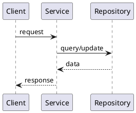

# [Component Name] Implementation Design

## 1. Design Overview

### 1.1 Design Goals

[Describe the technical goals this design must satisfy.]

### 1.2 Design Constraints

1. [Constraint 1]
2. [Constraint 2]

## 2. System Architecture

### 2.1 Architecture Overview

[Describe the runtime architecture and major dependencies.]

### 2.2 Module Responsibilities

| Module | Responsibility | Key Files |
|--------|----------------|-----------|
| [Module] | [Responsibility] | [Files] |

### 2.3 Technology Stack

| Layer | Technology | Purpose |
|-------|------------|---------|
| [Layer] | [Technology] | [Purpose] |

## 3. Data Model

### 3.1 Entities and Structures

| Entity | Purpose | Important Fields |
|--------|---------|------------------|
| [Entity] | [Purpose] | [Fields] |

### 3.2 Persistence

[Describe persistence, migrations, and compatibility requirements.]

## 4. Interface Design

### 4.1 Public Interfaces

| Interface | Input | Output | Errors |
|-----------|-------|--------|--------|
| [Interface] | [Input] | [Output] | [Errors] |

## 5. Core Flow Design

### 5.1 [Flow Name]

## 6. Algorithm Design

[Describe important algorithms or state that none are required.]

## 7. Caching Design

[Describe caching, invalidation, or state that no explicit cache is used.]

## 8. Error Handling Design

[Describe validation errors, dependency failures, retries, fallbacks, and user-visible errors.]

## 9. Observability

[Describe logs, metrics, traces, and operational diagnostics.]

## 10. Security Design

[Describe authentication, authorization, data protection, and audit behavior.]
