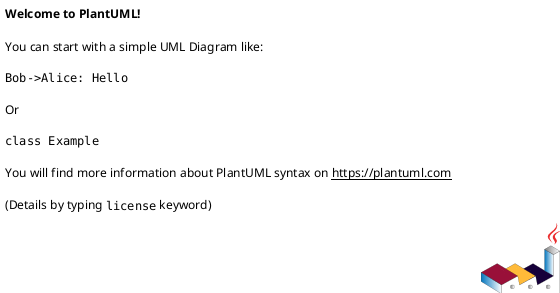

# [Component Name] Specification

> **Spec vs Design**
>
> SPEC answers "what the system does": externally visible behavior, business rules, constraints, and acceptance criteria.
>
> DESIGN answers "how the system works": architecture, modules, data model, interfaces, algorithms, operations, and security.
>
> Do not put implementation details in SPEC. If changing the technology stack would force a rewrite of a paragraph, it belongs in DESIGN.

## 1. Component Purpose

> Help the reader understand what this component is responsible for and what it explicitly does not own.

### 1.1 Core Responsibility

[Describe the component's core business responsibility in one clear sentence.]

### 1.2 Core Inputs

[List external requests, user actions, scheduled triggers, and subscribed messages.]

### 1.3 Core Outputs

[List responses, downstream calls, notifications, reports, and published events.]

### 1.4 Responsibility Boundaries

[List responsibilities that are explicitly out of scope.]

## 2. Domain Terminology

> Define business terms that appear in requirements, code, tests, or user conversations.

**Term**
: Complete business definition.

## 3. Actors and Boundaries

### 3.1 Primary Actors

[List human actors and their responsibilities.]

### 3.2 External Systems

[List upstream callers and downstream dependencies.]

### 3.3 Interaction Context

## 4. DFX Constraints

> Define measurable non-functional constraints before describing capabilities.

### 4.1 Performance

[Latency, throughput, resource usage.]

### 4.2 Reliability

[Availability, recovery, consistency.]

### 4.3 Security

[Authentication, authorization, data protection, audit.]

### 4.4 Maintainability

[Monitoring, logging, supportability.]

### 4.5 Compatibility

[API compatibility, data migration, backward compatibility.]

## 5. Core Capabilities

### 5.1 [Capability Name]

#### 5.1.1 Business Rules

1. **Rule name**: [complete rule]
   - **Acceptance criteria**: [trigger] -> [expected behavior]

#### 5.1.2 Interaction Flow

#### 5.1.3 Exceptional Scenarios

1. **Scenario**: [name]
   - **Trigger**: [condition]
   - **System behavior**: [behavior]
   - **User-visible result**: [error or response]

## 6. Data Constraints

[Describe logical business constraints on domain objects. Do not include database field types or indexes.]
