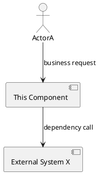
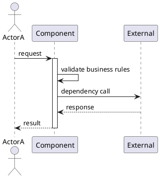

# [Component Name] Specification

## 1. Component Purpose

### 1.1 Core Responsibility

[Describe the component's core business responsibility in one clear sentence.]

### 1.2 Core Inputs

1. [Source A]: [business entity or signal]
2. [Source B]: [business entity or signal]

### 1.3 Core Outputs

1. [Target A]: [business entity, report, response, or event]
2. [Target B]: [notification or downstream request]

### 1.4 Responsibility Boundaries

1. [Explicitly excluded responsibility A]
2. [Explicitly excluded responsibility B]

## 2. Domain Terminology

**Term 1**
: Strict business definition.

**Term 2**
: Strict business definition.
: Optional note, alias, or contrast with similar terms.

## 3. Actors and Boundaries

### 3.1 Primary Actors

1. **Actor A**: [role and responsibility]
2. **Actor B**: [role and responsibility]

### 3.2 External Systems

1. **System X**: [interaction responsibility]
2. **System Y**: [interaction responsibility]

### 3.3 Interaction Context

## 4. DFX Constraints

### 4.1 Performance

1. **Latency**: [measurable threshold]
2. **Throughput**: [measurable threshold]
3. **Resource usage**: [measurable threshold]

### 4.2 Reliability

1. **Availability**: [target]
2. **Failure recovery**: [expected behavior]
3. **Data consistency**: [consistency requirement]

### 4.3 Security

1. **Authentication and authorization**: [requirement]
2. **Data protection**: [requirement]
3. **Auditability**: [requirement]

### 4.4 Maintainability

1. **Monitoring**: [requirement]
2. **Logging**: [requirement]

### 4.5 Compatibility

1. **API compatibility**: [requirement]
2. **Data migration**: [requirement]

## 5. Core Capabilities

### 5.1 [Capability Name]

#### 5.1.1 Business Rules

1. **Rule name**: [complete business rule]
   - **Acceptance criteria**: [trigger] -> [expected behavior]
2. **Rule name**: [complete business rule]
   - **Acceptance criteria**: [trigger] -> [expected behavior]
3. **Prohibited behavior**: [complete prohibited behavior]
   - **Acceptance criteria**: [trigger] -> [expected behavior]

#### 5.1.2 Interaction Flow

#### 5.1.3 Exceptional Scenarios

1. **Scenario**: [name]
   - **Trigger**: [condition]
   - **System behavior**: [behavior]
   - **User-visible result**: [error or response]

## 6. Data Constraints

### 6.1 [Domain Object]

1. **Identifier**: [constraint]
2. **Name**: [constraint]
3. **Type**: [constraint]
