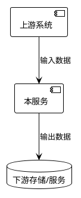

# [组件/服务名称] 周边交互上下文

> 本文档描述本仓库与外部系统的交互全集。它不替代 `SPEC.md` / `spec.md` 和 `DESIGN.md` / `design.md`，仅用于补足上下游、数据流和运维依赖。

## 1. 服务定位

- **核心职责**：[一句话描述本服务职责]
- **部署形态**：[微服务/批处理/SDK/前端应用/其他]
- **所属系统**：[系统名称]

## 2. 上游调用方

| 调用方 | 调用场景 | 接口/入口 | 关键约束 |
|--------|----------|-----------|----------|
| [系统A] | [场景] | [API/消息/任务] | [鉴权、流量、SLA] |

## 3. 下游依赖

| 依赖服务 | 依赖能力 | 调用方式 | 失败影响 | 降级策略 |
|----------|----------|----------|----------|----------|
| [服务B] | [能力] | [HTTP/RPC/消息/DB] | [影响] | [策略] |

## 4. 外部系统与平台依赖

| 系统/平台 | 用途 | 关键配置 | 责任边界 |
|-----------|------|----------|----------|
| [平台C] | [用途] | [配置项] | [谁负责] |

## 5. 数据流向

## 6. 运维与环境依赖

1. **配置项**：[关键配置及来源]
2. **监控指标**：[核心指标]
3. **告警规则**：[关键告警]
4. **容量约束**：[吞吐、存储、资源约束]
5. **发布依赖**：[发布顺序、兼容窗口、回滚要求]

## 7. 相关文档

- 规格文档：[`SPEC.md` / `spec.md`](../SPEC.md)
- 设计文档：[`DESIGN.md` / `design.md`](../DESIGN.md)
- 编码规范：[`guidelines/coding.md`](./guidelines/coding.md)
- 测试规范：[`guidelines/testing.md`](./guidelines/testing.md)

